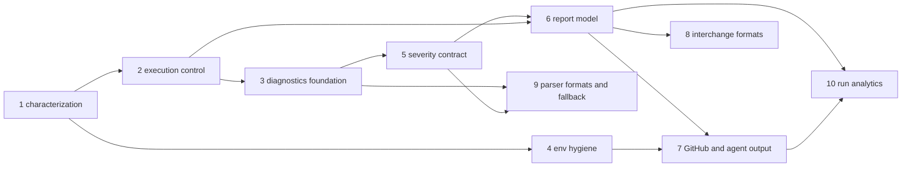

# Plan index: unified tool results — reports, CI annotations, agent output

**Status:** decisions closed by the owner on 2026-09-26; the ten plans this index orders are ready
for implementation in the sequence of §3. This document is the registry: every decision has one
owner plan, and a plan cites decisions by ID instead of restating them.
**Date:** 2026-09-26.
**Related:** `internal/tooling` (executor, verdict), `internal/runner`, `internal/diagnostic`,
`internal/parsermanager`, `internal/uievent`, `internal/cache`, `internal/config`,
`parsers/datamitsu-parsers`, `cmd`, `test/cli`; `docs/plans/2026-09-24-lsp-diagnostics.md` (its
Stage 0 moves here, §7); the wrapper config `@shibanet0/datamitsu-config` (release checkpoints,
§4.4).
**Provenance:** the design was researched on 2026-09-26 against `main` at `65326d6`, reviewed
independently by two other models, and the GitHub code-scanning behaviour it relies on was
measured on a throwaway repository, `datamitsu/sarif-alert-lifecycle-test` (§6).

> **Why this exists.** The core already turns the output of about 95 tools into structured
> diagnostics through WASM parsers, and then shows them only under a failed run in the terminal.
> Everything a CI, an editor, an agent or a report would want — GitHub annotations, SARIF, GitLab
> Code Quality, JUnit, an agent output mode, a machine-readable event stream — is one model and a
> set of renderers away. On the way there, five things the research found have to be fixed first:
> fail-fast is hard-wired at five levels and cannot be turned off; the parser's severity is
> invented in 19 modules because the core has no policy for a finding without a level; a warm
> cache hides findings a tool exits 0 on; per-file results are folded into one; and tools change
> their output format when they see `GITHUB_ACTIONS` or an agent's environment variable.

---

## 0. The idea in one paragraph

When `datamitsu fix|lint|check` runs a tool, the core becomes a full proxy for it: it captures the
output, parses it (a declared WASM parser, then an embedded format-sniffing fallback), resolves
every finding into one model of **what the tool found and what it did**, and renders that model
everywhere — the terminal for a person or an agent, GitHub workflow commands, SARIF, GitLab Code
Quality, JUnit, Checkstyle, reviewdog, a JSON-L event stream, its own JSON — without a single
format-specific branch in the executor. The tool's exit code still decides pass or fail; the
model only adds a per-operation threshold, `failOn`, that can make a run stricter, never looser. A
report is a pure function of one run: nothing is cached, and a run that did not cover everything
says so in a way every consumer can read.

---

## 1. Decision registry

IDs are stable: the plans cite them. "Owner" is the plan that implements the decision; a decision
with no code lands nowhere and is listed as such.

### 1.1 Decisions D1–D22

| ID  | Decision                                                                                                                                                                                                                                                                                                                                                                                                                                                                                                                                                                                                                                                                                                                                                                                                                                                              | Owner                                                               |
| --- | --------------------------------------------------------------------------------------------------------------------------------------------------------------------------------------------------------------------------------------------------------------------------------------------------------------------------------------------------------------------------------------------------------------------------------------------------------------------------------------------------------------------------------------------------------------------------------------------------------------------------------------------------------------------------------------------------------------------------------------------------------------------------------------------------------------------------------------------------------------------- | ------------------------------------------------------------------- |
| D1  | Report settings are CLI flags and `DATAMITSU_*` environment variables, not `datamitsu.config` fields: the whole config is hashed into the cache invalidation key. A config-level `execution.reports`, excluded from that key, may come later.                                                                                                                                                                                                                                                                                                                                                                                                                                                                                                                                                                                                                         | report-model                                                        |
| D2  | `--annotations auto` is the default; `auto` resolves to `github` under `GITHUB_ACTIONS=true` and otherwise to `off` (plan 10 extends `auto` with `azure` and `teamcity` when it ships those writers). Under `--log-format jsonl` `auto` is `off`; only an explicit mode prints annotations there.                                                                                                                                                                                                                                                                                                                                                                                                                                                                                                                                                                     | github-and-agent-output (github), run-analytics (azure, teamcity)   |
| D3  | Tools run in `fix\|lint\|check` do not see `GITHUB_ACTIONS` or the agent markers (list in `internal/toolenv`); they do see `CI` and every other vendor variable; they get `NO_COLOR=1` and no colour hints. A tool that needs a stripped variable names it in `inheritEnv`. `exec` is untouched.                                                                                                                                                                                                                                                                                                                                                                                                                                                                                                                                                                      | tool-env-hygiene                                                    |
| D4  | Finding fingerprints are SHA-256 over the input of R15. Values that leave the process as identifiers and are compared by external systems are cryptographic hashes; internal keys stay XXH3. `CLAUDE.md`'s Hashing Policy, which today lists "fingerprints" under XXH3, is amended in the PR that introduces the finding fingerprint: an identifier that lives in another system's database is not an internal fingerprint.                                                                                                                                                                                                                                                                                                                                                                                                                                           | report-model                                                        |
| D5  | JUnit mapping — see R6.                                                                                                                                                                                                                                                                                                                                                                                                                                                                                                                                                                                                                                                                                                                                                                                                                                               | interchange-formats                                                 |
| D6  | Severity mapping per format is the table of §2.3.                                                                                                                                                                                                                                                                                                                                                                                                                                                                                                                                                                                                                                                                                                                                                                                                                     | interchange-formats (file formats), run-analytics (Azure, TeamCity) |
| D7  | Any finding of any provenance (declared parser, format parser, fallback) blocks the recording of a cache pass; the earlier exemption for heuristic fallback findings is revoked. Cache eligibility follows the **extraction outcome** of an invocation, not the presence of an `outputParser` declaration: `parsed-clean` may record a pass; `parsed-findings`, `parser-unavailable`, `parse-failed` and `truncated` may not; `none` (nothing attempted or recognized) keeps the exit-status rule.                                                                                                                                                                                                                                                                                                                                                                    | diagnostics-foundation                                              |
| D8  | The fallback parser is WASM: format parsers and the sniffer live in the Rust crate, the public module exports them by name, and the core embeds a format-only build. D8a: two build targets (`tools+format` public, `format` embedded). D8b: the core orchestrates and always calls the embedded module for fallback. D8c: the embedded module is committed, built in a `linux/amd64` container from a digest-pinned image, and guarded by a CI byte comparison. D8d: Checkstyle and JUnit XML inputs ship in the first fallback iteration through a hand-written tokenizer (no new crate). D8e: no Git LFS; `.gitattributes` marks `*.wasm binary linguist-generated=true`. D8f: both freshness checks — the CI gate and a Go test against a committed source hash, computed in Go over the listed sources (XXH3, Hashing Policy) with no build script in the crate. | parser-formats-and-fallback                                         |
| D9  | `check` produces one report document with `operations: [fix, lint]`. `--explain=json` keeps its two-document output.                                                                                                                                                                                                                                                                                                                                                                                                                                                                                                                                                                                                                                                                                                                                                  | report-model                                                        |
| D10 | Exit codes are the table of §2.2. Precedence is 1 > 4 > 5.                                                                                                                                                                                                                                                                                                                                                                                                                                                                                                                                                                                                                                                                                                                                                                                                            | execution-control, report-model                                     |
| D11 | No changed-lines-only mode in the core. Touched-file priority for annotations (R10) and `report diff` against a baseline (run-analytics) cover the need; reviewdog and code scanning do the rest.                                                                                                                                                                                                                                                                                                                                                                                                                                                                                                                                                                                                                                                                     | —                                                                   |
| D12 | JSON-L `diagnostic` events — see R9.                                                                                                                                                                                                                                                                                                                                                                                                                                                                                                                                                                                                                                                                                                                                                                                                                                  | report-model                                                        |
| D13 | Global `--fail-on` — see R4.                                                                                                                                                                                                                                                                                                                                                                                                                                                                                                                                                                                                                                                                                                                                                                                                                                          | severity-contract                                                   |
| D14 | Fix-operation changes — see R13.                                                                                                                                                                                                                                                                                                                                                                                                                                                                                                                                                                                                                                                                                                                                                                                                                                      | run-analytics                                                       |
| D15 | A tool that fails without any finding produces one synthetic finding in reports: severity error, no file, provenance `synthetic`, and a structured message (`<tool> exited <code> without parsable findings`) that carries no captured output. JUnit renders it as `<error>`, SARIF as a tool execution notification, annotations as one `::error` without a file. The masked output tail travels only where R11 allows it. The terminal and the editor do not get it.                                                                                                                                                                                                                                                                                                                                                                                                | report-model                                                        |
| D16 | `facts().ci` exposes the CI detection of `internal/cienv` to config JS.                                                                                                                                                                                                                                                                                                                                                                                                                                                                                                                                                                                                                                                                                                                                                                                               | github-and-agent-output                                             |
| D17 | With `--fail-fast=false`, `check` runs lint after a failed fix; the report marks `operations.fix.success=false` and the footer says lint ran after a failed fix.                                                                                                                                                                                                                                                                                                                                                                                                                                                                                                                                                                                                                                                                                                      | execution-control                                                   |
| D18 | `--fail-fast[=true\|false]` on `fix\|lint\|check`, default `true`; env twin `DATAMITSU_FAIL_FAST`; `runtimeconfig.Effective.FailFast`.                                                                                                                                                                                                                                                                                                                                                                                                                                                                                                                                                                                                                                                                                                                                | execution-control                                                   |
| D19 | The terminal shows findings at or above the operation's `failOn`, identically for `--output human` and `--output agent`. There is no separate display threshold (R3).                                                                                                                                                                                                                                                                                                                                                                                                                                                                                                                                                                                                                                                                                                 | severity-contract (terminal), github-and-agent-output (agent mode)  |
| D20 | A parser sets a severity only from a token the tool printed (a level word, a numeric level, a `severity` field, an `errors[]`/`warnings[]` key); otherwise it returns none. The core resolves none to Error when the invocation failed and Warning when it passed. An explicit level is never overridden by the exit code. The `failOn` gate is active only for an invocation whose parser module declares the `severities` descriptor field (an empty vocabulary counts); with an older module the exit code alone decides, and an operation whose `failOn` is not the default gets one warning per run, never silence.                                                                                                                                                                                                                                              | severity-contract                                                   |
| D21 | Wrapper follow-up, after the core ships `failOn`: drop eslint's `--quiet`, set `failOn` per tool. Done in `@shibanet0/datamitsu-config` with the owner's go-ahead, never from this repository.                                                                                                                                                                                                                                                                                                                                                                                                                                                                                                                                                                                                                                                                        | release checkpoint R1                                               |
| D22 | A closing wall-clock line is printed for `check` only. The run-level `done` event (the one granularity plan §11.4 asked for) is emitted for every execution of `fix`, `lint` and `check`, never under `--explain`.                                                                                                                                                                                                                                                                                                                                                                                                                                                                                                                                                                                                                                                    | execution-control                                                   |

### 1.2 Decisions R1–R15

| ID  | Decision                                                                                                                                                                                                                                                                                                                                                                                                                                                                                                                                                                                                                                                                                                                                                                                                                                                                                                                                                                                                                                                             | Owner                                               |
| --- | -------------------------------------------------------------------------------------------------------------------------------------------------------------------------------------------------------------------------------------------------------------------------------------------------------------------------------------------------------------------------------------------------------------------------------------------------------------------------------------------------------------------------------------------------------------------------------------------------------------------------------------------------------------------------------------------------------------------------------------------------------------------------------------------------------------------------------------------------------------------------------------------------------------------------------------------------------------------------------------------------------------------------------------------------------------------- | --------------------------------------------------- |
| R1  | The opt-back-in field is `ToolOperation.inheritEnv: string[]` — host variable names handed to the tool with their host values. Name and value enter the verdict identity and the per-file cache identity, like `env` (the per-file cache is keyed by configuration, and a host value is not configuration). `NO_COLOR` cannot be named in `env` or `inheritEnv`; `NO_COLOR=1` is applied last.                                                                                                                                                                                                                                                                                                                                                                                                                                                                                                                                                                                                                                                                       | tool-env-hygiene                                    |
| R2  | `NO_COLOR=1` is set for every tool invocation of `fix\|lint\|check`.                                                                                                                                                                                                                                                                                                                                                                                                                                                                                                                                                                                                                                                                                                                                                                                                                                                                                                                                                                                                 | tool-env-hygiene                                    |
| R3  | No `--min-severity` and no `DATAMITSU_MIN_SEVERITY`; the display threshold comes from `failOn` only.                                                                                                                                                                                                                                                                                                                                                                                                                                                                                                                                                                                                                                                                                                                                                                                                                                                                                                                                                                 | severity-contract                                   |
| R4  | `--fail-on <error\|warning\|info\|hint>` and `DATAMITSU_FAIL_ON` raise `failOn` for every operation of the run; they never lower it. `runtimeconfig.Effective.FailOn`.                                                                                                                                                                                                                                                                                                                                                                                                                                                                                                                                                                                                                                                                                                                                                                                                                                                                                               | severity-contract                                   |
| R5  | Cache rule C1 as stated by the LSP diagnostics plan: a pass is recorded for a parsed lint operation only when the parser ran and reported no finding of any level. With D7, of any provenance.                                                                                                                                                                                                                                                                                                                                                                                                                                                                                                                                                                                                                                                                                                                                                                                                                                                                       | diagnostics-foundation                              |
| R6  | JUnit: `testsuite` per tool, `testcase` per file; `<failure>` only when the file failed the gate (exit ≠ 0 or a finding at or above `failOn`), findings below the threshold as text in `<system-out>`; `<error>` for a tool failure without findings; `<skipped>` for cancelled and skipped tasks.                                                                                                                                                                                                                                                                                                                                                                                                                                                                                                                                                                                                                                                                                                                                                                   | interchange-formats                                 |
| R7  | A policy refusal known at plan time exits 2 before anything runs. Exit 5 means only "an explicitly requested artifact was not written"; a report is written even when tools failed; a write failure is always printed; writes are atomic; a JSON-L `report` event records each export. `--fail-on-skip` exits 4. A general usage code 2 for cobra flag errors is its own change.                                                                                                                                                                                                                                                                                                                                                                                                                                                                                                                                                                                                                                                                                     | execution-control, report-model                     |
| R8  | Completeness is per tool, from three facts: scope (the selection is the whole repository with no tool filter — a complete unit says nothing about the units the selection left out), execution (every planned invocation of the tool finished), extraction (a parser or the fallback actually ran and recognized the output, nothing truncated — "no parser" is incomplete, and a cache hit counts only when it replays a parsed-clean pass). Narrowing known at plan time (`--tools`, paths, a subdirectory, `--file-scoped`) plus any report that lists findings (JSON, Markdown, JUnit, Code Quality, Checkstyle, rdjsonl; `--tools` narrows the run, not the listed tools' own runs) exits 2 before anything runs unless `--allow-partial`; SARIF is the exception: incomplete tools are omitted from it instead (§6). Incompleteness that arises during the run omits the tool's run from SARIF and is flagged in every other format. A `--report` that lists findings turns fail-fast off; an explicit `--fail-fast=true` with such a report is a usage error. | report-model, interchange-formats                   |
| R9  | `--log-format jsonl` emits a flat `diagnostic` event for every finding at or above the operation's `failOn`; `--events diagnostics=all` emits every finding; `datamitsu lsp` never emits them. The stream announces its capabilities at the start, `tool_run done` carries per-level counters including zero, invocation IDs are unique per task, and the sink reports write errors.                                                                                                                                                                                                                                                                                                                                                                                                                                                                                                                                                                                                                                                                                 | report-model                                        |
| R10 | Annotations are selected once at the end of the process, per GitHub type bucket (10 error, 10 warning, 10 notice): touched files first (diff base from `GITHUB_EVENT_NAME`; `HEAD^1` for `pull_request` when the parent exists, otherwise the priority is off and says so), then round-robin over files, then line, column, source, code, fingerprint. The truncation notice is printed first and counts against the notice bucket (9 + 1). The step summary holds the rest up to its limit (best-effort: a missing or unwritable summary file warns and changes no exit code); the artifact holds everything. Every raw tool output the runner prints is wrapped in `::stop-commands::<token>` with a `crypto/rand` token; the `setup-go`/`setup-node` problem matchers are removed first; the per-job annotation ceiling GitHub may apply is measured on a live run before the renderer merges and written into the documentation.                                                                                                                                 | github-and-agent-output                             |
| R11 | Reports carry no argv and no environment; `Command` leaves the report model. Every text field is passed through value masking: the values of host, app and operation variables whose names look like secrets (`*TOKEN*`, `*SECRET*`, `*PASSWORD*`, `*CREDENTIAL*`, `*_KEY`, ≥ 8 characters) are replaced by `***` in every string field at serialization. Captured tool output — the output tail and any output-derived text — appears only in the own JSON and in JUnit `<error>`, after masking, and never for a tool whose descriptor `category` is `security`; every other renderer and the JSON-L stream get structured text only. The `tool_run` and `error` events and `--explain=json` are audited for argv in the same plan.                                                                                                                                                                                                                                                                                                                                | report-model                                        |
| R12 | A declared module always parses its own tools, whatever its age; the fallback runs only on a trigger (no parser, unknown parser name, parse error, `recognized: false`, a v1 empty answer under a non-zero exit). The core reads response ABI v1 and v2; unknown fields are ignored and a `schemaVersion` above the newest known is read as the newest known. A released v1 module lives in `testdata` and three contract scenarios run against it. An old module is reported in `config show`, `devtools parsers list` and `-v`, never per run. The module's content hash enters the verdict identity.                                                                                                                                                                                                                                                                                                                                                                                                                                                              | parser-formats-and-fallback, diagnostics-foundation |
| R13 | `Changes` of a fix operation are observed with a git snapshot around the operation (`git status --porcelain -z` plus hashes of dirty files, before and after), attributed to tools through the group's disjoint file sets, carry an observation scope and a completeness flag, and are collected after a failure or a cancel too. Per-file `FormatEdits` is fixed in the foundation.                                                                                                                                                                                                                                                                                                                                                                                                                                                                                                                                                                                                                                                                                 | run-analytics                                       |
| R14 | This index and the ten plans of §3, in that order; documents in one PR; implementation in short stacks (§4).                                                                                                                                                                                                                                                                                                                                                                                                                                                                                                                                                                                                                                                                                                                                                                                                                                                                                                                                                         | —                                                   |
| R15 | Fingerprint input: `dmfp1 \0 tool \0 code \0 relPath \0 sha256(line content) \0 ordinal`. The message is not part of it.                                                                                                                                                                                                                                                                                                                                                                                                                                                                                                                                                                                                                                                                                                                                                                                                                                                                                                                                             | report-model                                        |

Registered details that earlier rounds settled and that a plan cites by the row above:

- `failOn` and `--fail-on` are **not** part of the verdict identity or the per-file cache
  identity: under R5 a pass is recorded only for zero findings, which is valid at every threshold
  (plan 3 edits the identity for the module and the parser key, not for the threshold).
- Exit-status precedence and the outcome selection: plan 2 §2.1.
- `ruleId` in SARIF is the finding's `code`, or `<tool>/unknown` when empty (plan 8).
- A `check` whose fix failed under fail-fast reports `operations: [fix, {lint, ran: false}]` and
  `complete: false` (plan 6).
- Annotations are deduplicated by fingerprint before selection (plan 7).
- The v1 module ABI is supported while the latest wrapper release pins it and for two minor
  releases after the wrapper moves (plan 9).
- The Rust toolchain version is one fact in three files (`rust-toolchain.toml`, the embedded
  Dockerfile's digest, `embedded.lock`) checked for agreement in CI (plan 9).
- Documentation says a tool's own JSON is richer than a standard format; prefer a tool parser
  when one exists (plan 9).
- Execution-only `DATAMITSU_*` variables — `FAIL_FAST`, `FAIL_ON`, `REPORT`, `ALLOW_PARTIAL`,
  `EVENTS`, `ANNOTATIONS`, `OUTPUT` — are added to `environExcluded` (they change what a run
  prints, not what the farm contains, and an activated shell must not re-bake its farm because
  one command set them) and are **not** observation-only (config JS may still read them, and the
  config-eval key still hashes them). `CLAUDE.md`'s environment policy gains this third category
  in plan 2, the first plan that adds one.

---

## 2. Invariants every plan holds

### 2.1 Gating and display

- **The tool's exit code gates.** An invocation fails when the process exits non-zero, or when a
  finding at or above the operation's `failOn` exists and the gate is active (D20's guard: the
  parser module declares `severities`). `failOn` adds failures; it never turns a failed process
  into a pass. Default `failOn` is `error`. A finding carries two flags: `reported` (at or above
  the threshold: what the terminal shows and the JSON-L stream emits by default) and `gates` (it
  made the invocation fail: what JUnit turns into a `<failure>`).
- **What is shown is what gates.** The terminal prints findings at or above `failOn`, counts the
  rest, and never prints an empty red frame: a failed invocation whose findings all sit below the
  threshold prints all of them.
- **Fail-fast stays the default.** `--fail-fast=false` runs everything; the exit code is 1 if any
  invocation failed, in both modes.

### 2.2 Exit codes

| Code | Meaning                                                                                                         | Since                                        |
| ---- | --------------------------------------------------------------------------------------------------------------- | -------------------------------------------- |
| 0    | success                                                                                                         | —                                            |
| 1    | a tool failed (exit ≠ 0, or a finding at or above `failOn`), or any error without its own code                  | —                                            |
| 2    | usage: wrong arguments, incompatible flags, a policy refusal known before anything runs (R7, R8)                | `llms` today; general with execution-control |
| 3    | `llms`: unknown or ambiguous page                                                                               | —                                            |
| 4    | the run did not cover what it was asked to (`--require-coverage`, and `--fail-on-skip` after execution-control) | —                                            |
| 5    | an explicitly requested artifact was not written                                                                | report-model                                 |

Precedence when several apply: 1 > 4 > 5; 2 is decided before execution and combines with nothing.

### 2.3 Severity

The core scale is 1 error, 2 warning, 3 info, 4 hint. Renderers map it as follows and never invent
a level a format lacks.

| Core    | GitHub cmd | SARIF `level` | GitLab CQ | JUnit                                               | Checkstyle | rdjson  | Azure   | TeamCity     | Bitbucket | Sonar |
| ------- | ---------- | ------------- | --------- | --------------------------------------------------- | ---------- | ------- | ------- | ------------ | --------- | ----- |
| error   | error      | error         | major     | `<failure>` when it gates, else `<system-out>` text | error      | ERROR   | error   | ERROR        | HIGH      | MAJOR |
| warning | warning    | warning       | minor     | `<failure>` when it gates, else `<system-out>` text | warning    | WARNING | warning | WARNING      | MEDIUM    | MINOR |
| info    | notice     | note          | info      | `<failure>` when it gates, else `<system-out>` text | info       | INFO    | omitted | INFO         | LOW       | INFO  |
| hint    | notice     | note          | info      | `<failure>` when it gates, else `<system-out>` text | info       | INFO    | omitted | WEAK WARNING | LOW       | INFO  |

"Gates" is decided by the operation's effective `failOn` and by whether the gate was active for
that invocation (D20's guard), not by the level's name. The Bitbucket and Sonar columns are
reference values for a writer that does not exist (§5); they are here so a future writer does not
invent its own mapping.

### 2.4 Positions and paths

Rows and columns are 1-based; the core clamps 0 to 1 and treats a missing or inverted end as a
point; `EndCol` is exclusive. Parsers that report 0-based or inclusive positions (spectral,
vacuum, pylint; the `end_col = col + 1` idiom) are corrected in the module, in plan 5's release,
because the core cannot tell a 0-based column 5 from a 1-based one. `File` is absolute and cleaned
inside the core; every export writes paths relative to the git root with `/`; a path outside the
root stays absolute. Columns are counted in the unit the parser declares (`columnUnit`); the
report builder converts them once, while the sources are on disk, into the representations the
renderers need (code points, UTF-8 bytes, UTF-16 units) with a precision marker, so an offline
`report render` never needs the checkout; a column of unknown unit on a non-ASCII line is
marked imprecise and omitted by renderers.

### 2.5 Names and shapes

- Packages: `internal/report` (model, `report.Run`), `internal/report/render/<format>`,
  `internal/textpos`, `internal/toolenv`, `internal/cienv`, `internal/parsermanager/embedded`,
  `internal/report/diff`, `internal/gitutil`.
- The own JSON document is `datamitsu.report/1`; `report render` converts it offline into any
  other format under the same completeness rule.
- Provenance values: `parser`, `format`, `fallback:<format>`, `synthetic`. Extraction outcomes
  of an invocation: `parsed-clean`, `parsed-findings`, `parser-unavailable`, `parse-failed`,
  `truncated`, `none`.
- Shared error codes live in `internal/exitcode` (`Usage = 2`, `Coverage = 4`, `Export = 5`,
  error types implementing `ExitCode() int`) so `cmd` and `internal/runner` agree without an
  import cycle.
- Every new `DATAMITSU_*` variable goes through `internal/env` and `runtimeconfig.Effective`; none
  of them is observation-only; the execution-only ones are in `environExcluded` (§1.2, registered
  details). An invalid value of any of them is a usage error (exit 2) checked in the command
  layer, because `internal/env` getters fall back silently by policy.
- Every new config field ships with validation, both `config.d.ts` copies, the wrapper's d.ts
  fork (in lockstep, with the owner's go-ahead), a `configcache.FormatVersion` bump and a "Recent
  changes" entry in the config-author guide.
- A report is never stored in any cache; `history` and baselines are user files.

---

## 3. Plans and order

| #   | Plan                                                 | Delivers                                                                                                                                                      | Depends on                          |
| --- | ---------------------------------------------------- | ------------------------------------------------------------------------------------------------------------------------------------------------------------- | ----------------------------------- |
| 1   | `completed/2026-09-26-execution-characterization.md` | blackbox tests that freeze today's execution behaviour; the released parser module in `testdata`                                                              | —                                   |
| 2   | `2026-09-26-execution-control.md`                    | D17, D18, D22, cancelled tasks as skipped, run-level `done`, exit codes 2 and 4 (R7)                                                                          | 1                                   |
| 3   | `2026-09-26-diagnostics-foundation.md`               | LSP Stage 0 (positions, `ParseFailed`, C1, C2), `FileResults`, per-file `FormatEdits`, invocation IDs, module hash in the verdict identity (R5, D7, R12 part) | 1, 2                                |
| 4   | `2026-09-26-tool-env-hygiene.md`                     | D3, R1, R2                                                                                                                                                    | 1; before 7; not concurrent with 5  |
| 5   | `2026-09-26-severity-contract.md`                    | module release 1 (`severities`, honest levels, `source`/`code` norm, `url`, `category`, `columnUnit`, `kind`), D20, `failOn`, R4, D19, R3                     | 3                                   |
| 6   | `2026-09-26-report-model.md`                         | `report.Run`, R8, R15, R11, D15, D9, `--report` framework, own JSON, exit 5, R9, D1, D4, the `report render` command with `json` as its first target          | 2, 3, 5                             |
| 7   | `2026-09-26-github-and-agent-output.md`              | `internal/cienv`, D16, D2, R10, step summary, Markdown, `--output agent`                                                                                      | 6, 4                                |
| 8   | `2026-09-26-interchange-formats.md`                  | SARIF first, then JUnit (R6), GitLab CQ, Checkstyle, rdjsonl, `report render`                                                                                 | 6                                   |
| 9   | `2026-09-26-parser-formats-and-fallback.md`          | D8, ABI v2, format keys, embedded module, R12                                                                                                                 | 3, 5; build infrastructure any time |
| 10  | `2026-09-26-run-analytics.md`                        | `history`, `report diff`, `report baseline`, `--baseline`, R13 (`Changes`, `patch`), Azure and TeamCity                                                       | 6, 7                                |

Waves and release checkpoints:

| Wave | Main line             | In parallel               | Checkpoint                                                                                                                   |
| ---- | --------------------- | ------------------------- | ---------------------------------------------------------------------------------------------------------------------------- |
| 1    | 1                     | build infrastructure of 9 |                                                                                                                              |
| 2    | 2                     | 4                         |                                                                                                                              |
| 3    | 3                     |                           |                                                                                                                              |
| 4    | 5                     |                           | **R1**: unstable release of core + module; wrapper PR bumps the module hash, sets `failOn` for eslint, drops `--quiet` (D21) |
| 5    | 6                     | 9 (main part)             |                                                                                                                              |
| 6    | 7 and 8 (SARIF first) |                           | **R2**: the GitHub MVP; the wrapper drops pinact's `GITHUB_ACTIONS: "false"` pin once 4 is released                          |
| 7    | 10                    |                           | **R3**                                                                                                                       |

Why this order, in one line each: 2 before 3 because plan 3's process records and task identity
replace the runner-side derivation of cancelled tasks plan 2 introduces, and both change the
per-file goldens; 3 before 5 because the threshold stays out of the verdict identity only under
C1; 5 before 6 and 8 because the report's gating flags, JUnit's `<failure>` and the fingerprint's
`code` input all depend on the severity contract and the rule-identity norm (a later change to
`code` would turn every alert into "fixed + new"); 5 before 9 because module release 1 carries
the descriptor fields release 2 builds on; 4 before 7 because annotations from tools that saw
`GITHUB_ACTIONS` are read as "clean" by a lenient parser; 6 before 8 because SARIF needs the
completeness rule and the fingerprints.

---

## 4. Delivery

### 4.1 Documents

All eleven documents (this index, the ten plans and the amendment of §7) land in **one PR**. They
cross-reference each other, and their consistency — who owns `FileResults`, the fingerprint input,
the R8 wording — is reviewable only with all of them open.

### 4.2 Implementation stacks

- One short stack per plan (2–4 open dependent PRs), branches `results/<NN>-<plan>/<k>-<slug>`.
  The first PR of a plan is based on the last PR of the plan it depends on by data, otherwise on
  `main`. Never more than two lines open at once (main line and a side line).
- The repository merges by squash. After the bottom PR merges, the next one is moved with
  `git rebase --onto origin/main <old parent tip> <branch>` (or `gh stack sync`), the signatures
  are verified with `git log --show-signature`, and the branch is pushed with `--force-with-lease`
  after re-reading `HEAD` — the owner commits to the same branches in parallel. GitHub's
  server-side cascading rebase produces unsigned commits; the local path keeps the signatures.
- A stack cannot express a dependency on a wrapper PR: GitHub stacks are single-repository. A plan
  that needs a released module and a wrapper bump names the checkpoint and the unblocking
  criterion instead.

### 4.3 What goes in one PR, what must be separate

Together, always: a behaviour change, its tests, the regenerated goldens, the documentation and
`task gen:llms-docs`. Together: a `parsers/` change with the rebuilt `echo.wasm` fixture (through
`task build:parsers:fixture`, which plan 9 adds — `task build:parsers` alone builds into Cargo's
target directory and copies nothing) and the core code that keeps working with the previously
released module in `testdata`. Together: a new
config field with its validation, both `config.d.ts` copies, the `FormatVersion` bump and the
author-guide entry. Together: a breaking-change note in `CLAUDE.md` with the change that breaks.

Separate, always: characterization tests and the first behaviour change; a refactor with no output
change (lower in the stack, proven by a zero golden diff) and the behaviour change on top of it;
the cache-semantics change (C1/C2), which cools every cache once and carries a performance
measurement; each exit-code change; the module contract and the `failOn` gate; a committed
`fallback.wasm` change (at most one per stack, near its top).

Goldens are regenerated in every PR that changes output, from the current binary, and checked with
`go test ./test/cli/ -count=2`; a golden conflict after a rebase is resolved by regenerating, never
by picking a side.

### 4.4 The WASM boundary

1. The core learns to read the new module contract (ABI v2, new descriptor fields) while still
   working with the released v1 module in `testdata`.
2. The Rust PRs ship the whole contract of that release (severity contract in release 1; formats,
   XML and the sniffer in release 2).
3. `release.yml` publishes the module with the core, with its real SHA-256.
4. A `datamitsu-config` PR bumps the module hash and the core version, and verifies the pin with
   `devtools parsers list` — a silent degradation to raw output would keep a plain lint green.
5. Only then does a dependent delivery rely on the new capability for quality. Nothing relies on
   it for correctness.

Until publication, the wrapper can be verified against a local core through the dev-link
`--before-config` loop described in `CONTRIBUTING.md`; that is a test, not the release pin.

---

## 5. Explicitly not done

- No changed-lines-only filtering in the core (D11).
- No `fix --check`: `fix` and `check` change the working tree and are not meant for CI; CI runs
  `lint`, and the documentation says so.
- No HTTP publishers (GitHub Checks API, GitLab notes, Bitbucket Code Insights): files and log
  commands only; reviewdog and the upload actions publish.
- No `--min-severity` (R3) and no `DATAMITSU_TOOL_ENV_PASSTHROUGH` (R1 is config-level).
- No config-level report settings for now (D1).
- No Git LFS for the embedded module (D8e).
- No HTML report, no SonarQube, GitLab SAST, Bitbucket or Gerrit writers unless asked; no MCP
  server; no test-runner parsers (`go test -json`, vitest) as a finding class.
- `exec` stays a transparent runner: no environment hygiene, no parsing, no reports.

---

## 6. Facts measured on GitHub code scanning (2026-09-26)

Measured on `datamitsu/sarif-alert-lifecycle-test` with hand-written SARIF uploads through the REST
API against one commit; every SARIF file and API response is archived in that repository.

| Question                                          | Result                                                                                                                                                                                                                                                                                                                                                                 |
| ------------------------------------------------- | ---------------------------------------------------------------------------------------------------------------------------------------------------------------------------------------------------------------------------------------------------------------------------------------------------------------------------------------------------------------------- |
| Alert lifecycle scope                             | Alerts are closed within the triple **(ref, category, `tool.driver.name`)**. A result missing from the next upload of that triple is `fixed` within a second of processing.                                                                                                                                                                                            |
| A tool absent from an upload to the same category | Its alerts stay open, are not marked stale, and are not touched at all. Omitting an incomplete tool's run from a SARIF file is therefore safe.                                                                                                                                                                                                                         |
| Two runs of one tool in one category in one file  | Rejected at processing: "A delivery cannot contain multiple runs with the same category". Two different tools in one category are accepted; one tool in two categories in one file is accepted. Uniqueness is (category, tool).                                                                                                                                        |
| Category                                          | Taken from `automationDetails.id` up to its last `/`; an id without a slash yields the empty category. Write `datamitsu/`. The `category` input of `upload-sarif` fills in only runs that have no `automationDetails` (`populateRunAutomationDetails` in codeql-action's `upload-lib.ts`, read 2026-09-26), so the category is set in the file (`?category=`, plan 8). |
| Alert merge key                                   | **(ruleId, `partialFingerprints.primaryLocationLineHash`)**. Tool and category are not part of it: the same rule and fingerprint from two tools is one alert with two instances, and instances carry no tool name.                                                                                                                                                     |
| A forgotten configuration                         | Indistinguishable from a live one in the API (`deletable: true`, empty `warning`). `DELETE /analyses/{id}?confirm_delete` erases the analysis and its alerts outright; without `confirm_delete` the request is refused with 400.                                                                                                                                       |
| Tool names                                        | Known names are normalized (`eslint` → `ESLint`, `hadolint` → `Hadolint`); grouping is unaffected.                                                                                                                                                                                                                                                                     |

Consequences: the SARIF renderer writes one run per (category, tool), `automationDetails.id =
"datamitsu/"`, the fingerprint of R15 into `partialFingerprints.primaryLocationLineHash` (and a
copy under `datamitsu/v1`), and omits the run of any tool whose completeness is not established
(R8). Because the tool name is the first fingerprint component, two tools never share an alert.

---

## 7. Amendments to `2026-09-24-lsp-diagnostics.md`

Made in the same PR as this index:

- **Stage 0** is replaced by a reference to `2026-09-26-diagnostics-foundation.md`, which owns
  C1, C2, the cache-semantics key component, `ParseFailed`, the `Resolve` fixes, absolute `File`,
  single-file stamping, the clean-output fixtures and `--no-parse` as a display-only flag (its
  D12, now accepted). The `Files` and `Cached` fields of its Stage 1 and the `WholeUnit`/`UnitDir`
  fields of its Stage 2a (§4.4) move to the foundation plan as well; those stages consume them.
- **D9** of that plan (C1 as a core rule) is closed as accepted (R5 here).
- **Stage 2b**'s per-task identity in the executor callbacks moves to the foundation plan; the
  editor-side stop predicate stays.
- **Stage 3**'s "report found, empty" versus "no report found" ABI distinction is superseded by
  ABI v2 (`recognized`) in `2026-09-26-parser-formats-and-fallback.md`; the parser-coverage items
  (new parsers, `columnUnit` measurements) stay there.
- **§4.5** (`columnUnit` in the descriptor) ships with module release 1 of
  `2026-09-26-severity-contract.md`; the LSP plan consumes it.
