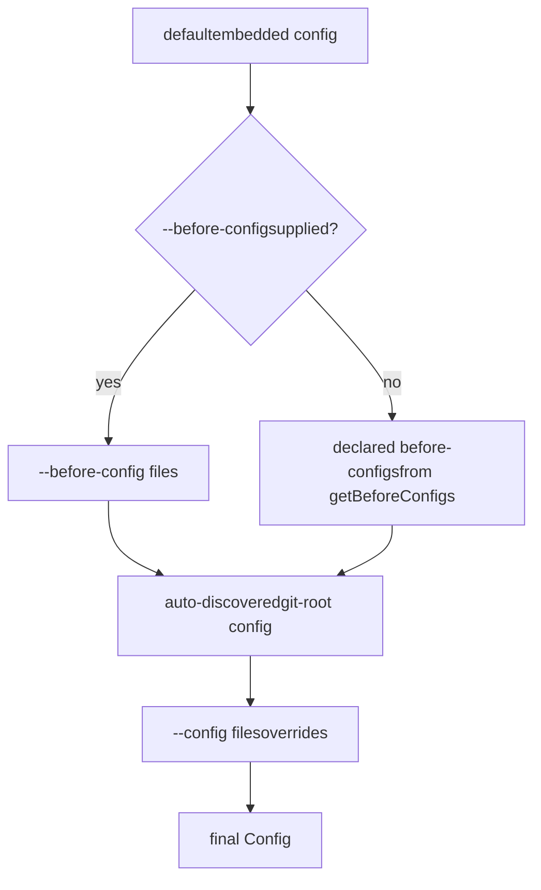

# Quick Start

> Get up and running with datamitsu in minutes

This guide walks you through setting up datamitsu in a project, downloading tools, and running them.

## 1. Create a Configuration File

datamitsu looks for a configuration file at your git root. Create one of:

- `datamitsu.config.ts` (TypeScript — recommended)
- `datamitsu.config.js` (JavaScript)
- `datamitsu.config.mjs` (ES modules)

Here's a minimal example that adds [hadolint](https://github.com/hadolint/hadolint) (a Dockerfile linter):

```typescript
/// <reference path=".datamitsu/datamitsu.config.d.ts" />

// datamitsu.config.ts
function getConfig(prev) {
  return {
    ...prev,
    apps: {
      ...prev.apps,
      hadolint: {
        binary: {
          binaries: {
            linux: {
              amd64: {
                glibc: {
                  url: "https://github.com/hadolint/hadolint/releases/download/v2.12.0/hadolint-Linux-x86_64",
                  hash: "56de6d5e5ec427e17b74fa48d51271c7fc0d61571c37f4a4c87c04f911dc5f94",
                  contentType: "binary",
                },
              },
            },
            darwin: {
              amd64: {
                unknown: {
                  url: "https://github.com/hadolint/hadolint/releases/download/v2.12.0/hadolint-Darwin-x86_64",
                  hash: "911006e5fe41981c319cf4ef331d12bd1c02b594e4a1e9a4b1dbe5fbab0e5b5c",
                  contentType: "binary",
                },
              },
              // arm64: no native ARM64 binary; omit or use x86_64 via Rosetta 2
            },
          },
        },
      },
    },
    tools: {
      ...prev.tools,
      hadolint: {
        name: "Hadolint",
        operations: {
          lint: {
            app: "hadolint",
            args: ["{file}"],
            scope: "per-file",
            globs: ["**/Dockerfile", "**/Dockerfile.*"],
          },
        },
      },
    },
  };
}

globalThis.getConfig = getConfig;
globalThis.getMinVersion = () => "0.0.1";
```

Each binary entry requires a `url` and a `hash` (SHA-256). datamitsu refuses to download any binary without a hash.

## 2. Initialize the Project

Run `init` from your git root to download all configured tools:

```bash
datamitsu init
```

This downloads and verifies binaries, installs runtime-managed apps, and creates any managed config symlinks in `.datamitsu/`.

Use `--all` to also download optional tools:

```bash
datamitsu init --all
```

## 3. Execute a Tool

Run any managed tool directly:

```bash
datamitsu exec hadolint -- Dockerfile
```

The `--` separates datamitsu arguments from the tool's arguments.

## 4. Run Checks

Run all configured lint and fix operations:

```bash
# Run fix then lint in sequence
datamitsu check

# Run only linting
datamitsu lint

# Run only auto-fixes
datamitsu fix
```

## 5. Reconcile Managed Project Configs

Reconciliation writes the project-owned files declared by the config and then
runs `datamitsu fix`. To inspect the changes without either action, use
`--dry-run`:

```bash
datamitsu config reconcile --dry-run
```

Then run the reconciliation:

```bash
datamitsu config reconcile
```

This detects your project type and creates, updates, links, or removes the
appropriate managed configuration files. It is different from `datamitsu init`:
`init` provisions tools and `.datamitsu` links, while reconciliation owns
project configuration files.

### Opt-in to tools one at a time

In a project with many configured tools, the default experience is "everything
runs at once". Pass `--opt-in-tools` to start with **all tools disabled** and turn
them on deliberately:

```bash
datamitsu config reconcile --opt-in-tools
```

As part of reconciliation, this writes a `.datamitsuignore` at your git root
that disables every configured tool via a single catch-all rule. The default
post-reconciliation fix then respects that opt-in state:

```bash
# Generated by `datamitsu config reconcile --opt-in-tools`.
# All configured tools are disabled by default (opt-in model).
# Enable a tool by removing it from the list below (or add "!**/*: <tool>").
**/*: eslint, golangci-lint, hadolint, prettier, shellcheck
```

Enable a tool by **removing its name** from the list (for example, delete
`prettier` to let prettier run). Reconciliation refuses to overwrite an existing
`.datamitsuignore`, so your manual selections are never lost — use
`datamitsu config reconcile --opt-in-tools --dry-run` to preview without writing. See
[Generating an all-disabled file](../reference/ignore-rules.md#generating-an-all-disabled-file).

## Configuration Layers

datamitsu loads config in layers, each extending the previous:



Every config must export `getMinVersion()` (returns the minimum datamitsu version required) and `getConfig(prev)` (receives the previous layer's config and returns a new config that extends or overrides it). A source may also declare hash-pinned remote parents with `getRemoteConfigs()`; they are resolved depth-first immediately before that source. See [Config Loading Order](../guides/configuration.md#config-loading-order) for the full rules.

## Next Steps

- [Core Concepts](./core-concepts.md) — Understand binary management, runtimes, and managed configs
- [Configuration Guide](../guides/configuration.md) — Deep dive into configuration options
- [CLI Commands Reference](../reference/cli-commands.md) — Full command documentation
