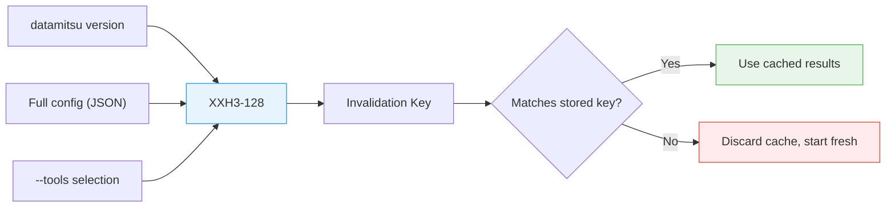
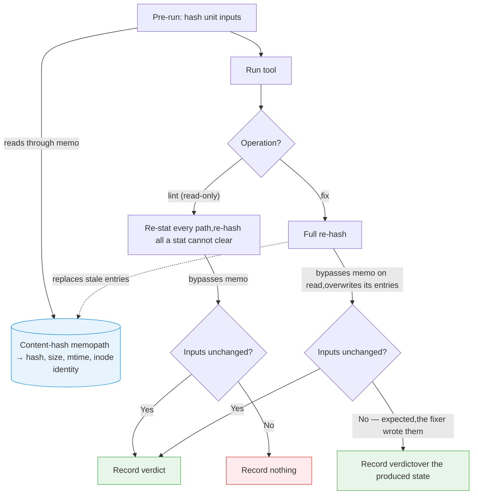

# Caching Strategy

> How datamitsu caches file-level results and unit or repository verdicts, computes XXH3-128 keys, and persists them safely

datamitsu has two execution-cache models. File-granularity operations record a
pass for each exact file content. Unit-granularity operations record a verdict
over a complete project/module input set; repository verdicts use the same model
but are opt-in. This page explains their keys and persistence behavior.

For context on how tasks reach the cache layer, see [Parallel Execution](./execution.md).

## Cache Invalidation Keys

Every project cache has a top-level **invalidation key**: an XXH3-128 hash of
three process inputs. If it changes, both the file entries and stored verdicts
are discarded and rebuilt.



### What goes into the key

| Input                  | What it captures                              | Why it matters                                                               |
| ---------------------- | --------------------------------------------- | ---------------------------------------------------------------------------- |
| **datamitsu version**  | The release version string                    | A new core may change planning, execution, or parsing                        |
| **Full configuration** | The complete `Config` serialized as JSON      | Any effective config change invalidates results                              |
| **--tools selection**  | Selected tool names, sorted deterministically | A subset run must not claim the cache state produced by a different tool set |

### Where `invalidateOn` fits

`invalidateOn` is not part of the top-level key. It adds inputs to the verdict
for a unit- or repository-granularity operation:

```javascript
tools: {
  eslint: {
    operations: {
      lint: {
        app: "eslint",
        args: ["{files}"],
        scope: "per-project",
        granularity: "unit",
        invalidateOn: ["eslint.config.js", ".eslintignore"],
      },
    },
  },
  tsc: {
    operations: {
      lint: {
        app: "typescript",
        args: ["--noEmit"],
        scope: "per-project",
        invalidateOn: ["tsconfig.json"],
      },
    },
  },
},
```

Each path is resolved against the unit and every ancestor up to the git root.
Only existing files become guards; this lets a nested package inherit a root
config without spelling its relative depth. The verdict hashes file contents,
not just names. `invalidateOn` has no effect on per-file cache entries: an
operation whose result depends on shared configuration must use unit or repo
granularity rather than claim that each file is independent.

## Per-File Tracking

Within a valid cache (invalidation key matches), each file is tracked individually with three pieces of data:

| Field           | Description                                         |
| --------------- | --------------------------------------------------- |
| **ContentHash** | XXH3-128 hash of the file's contents                |
| **Lint**        | List of tool names that passed lint on this content |
| **Fix**         | List of tool names that passed fix on this content  |

### Cache hit decision

When the executor considers running a tool on a file, it checks:

1. Does a cache entry exist for this file path?
2. Does the stored ContentHash match the file's current XXH3-128?
3. Is this tool name in the operation's list (Lint or Fix)?

All three must be true for a cache hit. If any check fails, the tool runs.

### Why separate Lint and Fix tracking

Lint and fix are independent operations with different semantics. A file can pass lint without needing a fix, or be fixed without being re-linted yet. Tracking them separately enables precise cache behavior:

**Step-by-step example:**

1. **First run:** `datamitsu fix` runs prettier on `app.ts`
   - prettier reformats the file (contents change)
   - Cache records: ContentHash=`abc123`, Fix=`["prettier"]`, Lint=`[]`

2. **Then:** `datamitsu lint` runs eslint on `app.ts`
   - ContentHash matches (file unchanged since fix) — but eslint is not in Lint list
   - eslint runs and passes
   - Cache records: ContentHash=`abc123`, Fix=`["prettier"]`, Lint=`["eslint"]`

3. **Next run:** `datamitsu lint` again
   - ContentHash matches, eslint is in Lint list — cache hit, eslint skipped

4. **Developer edits `app.ts`:**
   - ContentHash no longer matches — both Lint and Fix lists are effectively invalidated
   - All tools run again on this file

### Fix resets lint cache

When a fix operation modifies a file, the lint cache for that file is reset:

- The fixer changes the file contents, producing a new ContentHash
- The Lint list is cleared to empty
- The Fix list records the successful fixer

This is necessary because the fixer's changes might introduce new lint issues. For example, an auto-formatter might reformat code in a way that triggers a different linter rule. Resetting the lint cache ensures linters always re-check after fixes.

## Unit Verdicts and the Content-Hash Memo

Per-file tracking answers "has this file changed?". A tool whose `granularity` is `unit` — the value
inferred for every `scope: "per-project"` operation — asks a coarser question: "has anything in this
unit changed?" — and the answer is a **verdict**, keyed by a hash over every member of the unit plus
every guard: the ancestor configs and lock files the unit inherits, any config path the operation's
`args` names as an absolute path, and its `invalidateOn` entries resolved against the unit and each
ancestor. The input hash also includes selected inherited environment variables whose names start
with `GO`, `CARGO`, `RUST`, `NODE_`, `NPM_`, `PYTHON`, `PIP_`, `UV_`, `JAVA_`, `TS_`,
`ESLINT_`, `RUFF_`, `TF_`, or `TFLINT_`.

A `repo`-granularity operation gets a verdict too, but only when it opts in with `cache: true`.
`file` granularity and an explicit `cache: false` never produce one.

Only a successful task with **complete unit coverage** may write a verdict. A
narrowed partial task can consume an earlier full verdict when its inputs still
match, but it cannot mint a new whole-unit pass. Verdict hits also have a TTL,
controlled by `DATAMITSU_UNIT_CACHE_TTL` (`1440` minutes by default; `0`
disables verdict caching). This bounds dependencies that the declared guard set
cannot see, such as network state or an undeclared file outside the unit.

Computing a verdict key means reading and hashing the unit. Without reuse, a
package with three thousand files would be read again for every per-project tool,
even though the content does not depend on which tool asks for it.

### The memo

datamitsu keeps a **process-scoped content-hash memo** — a
`path -> (hash, size, modification time, inode identity)` map, shared by every task of a run and safe
under the executor's worker pool. The first tool to need a file reads and hashes it; every later
tool over the same file gets the hash back without touching the disk.

The scope is the _process_, not the run: a one-shot CLI invocation discards the memo when it exits,
while a long-lived `datamitsu lsp` server keeps it across every run it serves. Entries are never
expired on a timer — they are revalidated by `stat` on each use, and a `stat` that cannot clear an
entry is simply a miss. The map is capped so a session-long process cannot grow it without bound;
on reaching the cap it is dropped whole, which costs a re-read and nothing else.

This is a cache of a pure function (bytes → XXH3-128) behind a **validity check**, not an assumption
that files hold still. An entry is only handed out when all of the following are true:

| Condition                                                                      | What it rules out                                                                      |
| ------------------------------------------------------------------------------ | -------------------------------------------------------------------------------------- |
| A fresh `stat` succeeds and reports the same **size**                          | A rewrite that changed the file's length                                               |
| ...and the same **modification time**                                          | Any write the filesystem recorded                                                      |
| ...and the same **inode number and inode-change time**, both actually reported | A same-length rewrite that restored the original mtime (`rsync -a`, `cp -p`, `tar -x`) |
| ...and that mtime was already **2 seconds** old when the bytes were read       | A rewrite inside the mtime tick the read landed in, at the same length                 |

The third condition exists because size and mtime are both restorable: anything that calls
`utimes` can rewrite a file to the same length and put the timestamp back, and a `(size, mtime)`
comparison sees nothing. The inode-change time is not restorable — the write moves it, and the call
that restores the mtime moves it again. The check is only sound when the platform actually reports a
change time, so an **unknown** identity is treated as proving nothing rather than falling back to
`(size, mtime)`: the entry is a miss and the bytes are re-read. Windows is that platform — no change
time is reachable from a path-only stat, so the memo never hits there and every file is hashed as it
was before the memo existed.

The fourth condition is the subtle one, and it is anchored to the **read**, not to the lookup.
Filesystem mtime granularity is coarse — FAT's tick is two seconds — so a file written, hashed, and
rewritten within one tick can present an identical `stat` while holding different bytes. Waiting
does not repair such an entry: the ambiguous write it cannot rule out already happened, and no later
`stat` can see it. An entry taken inside its own tick is therefore never handed out at all, however
long it sits in the map. Every uncertain answer is a miss, and a miss only ever costs a read.

### The post-run probe bypasses the memo

Before running a tool, datamitsu computes the unit's input hash. **After** the tool finishes, it
computes it again, and records the verdict only if the two agree. That second pass is the only thing
standing between "this unit passed" and a lie: it catches inputs that moved underneath the tool while
it ran.

The post-run probe **must not consult the memo**, and does not. The memo was populated by the pre-run
pass over those exact paths; answering the probe from it would compare the pre-run value against
itself, and the check would pass by construction no matter what happened on disk. A tautological
check is worse than no check, because it looks like a check.

The same rule applies to a `fix` operation from both directions. A fixer rewrites files by design —
mtime granularity is exactly the case that bites — so `fix` keeps the **full re-hash** for its second
pass rather than the stat-based probe a read-only `lint` uses, and neither pass reads through the
memo.

A `fix` pass does, however, **write** what it read back into the memo, replacing the pre-fix entries
for those paths. Reading past the memo answers the question honestly; overwriting keeps the answer
honest for everyone downstream. `datamitsu check` runs `fix` and then `lint` in one process, so
entries a fixer has just disproved would otherwise still be there for the next task to be handed —
and they describe bytes that no longer exist.



The read-only probe re-stats every member and guard and re-hashes every path a stat cannot prove
identical: one whose size, mtime, inode number or inode-change time moved, one that cannot be
stat'ed, one that was missing and now exists, one modified inside the current tick, and — on a
platform that reports no change time — every path, unconditionally. It never falls back to assuming
a path was unchanged.

The two operations then read the same answer differently. For a read-only `lint`, a mismatch means
the inputs moved underneath a tool that could not have moved them, so the pass describes a state that
no longer exists and nothing is recorded. For `fix`, a mismatch is the expected outcome — rewriting
those files is the job — so the verdict is recorded against the state the fixer **produced**, not the
one it started from. A `fix` also drops the matching `lint` verdict for that unit, which the rewrite
has just made unsound.

## Cache Invalidation Best Practices

### Declare tool configuration files

For a unit or repository verdict, list extra files that affect the tool in
`invalidateOn`. Files already inside the unit and inherited marker/config/lock
files are included automatically.

```javascript
// BAD: the unit verdict does not name its external config
tools: {
  eslint: {
    operations: {
      lint: {
        app: "eslint",
        args: ["{files}"],
        scope: "per-project",
        granularity: "unit",
      },
    },
  },
},
```

```javascript
// GOOD: the inherited config participates in the unit verdict
tools: {
  eslint: {
    operations: {
      lint: {
        app: "eslint",
        args: ["{files}"],
        scope: "per-project",
        granularity: "unit",
        invalidateOn: ["eslint.config.js"],
      },
    },
  },
},
```

### When to disable caching

Set `cache: false` for tools that are non-deterministic or have side effects:

```javascript
tools: {
  "custom-checker": {
    operations: {
      lint: {
        app: "custom-checker",
        args: ["--check"],
        cache: false, // Output depends on external state
      },
    },
  },
},
```

When `cache: false`, the tool always runs regardless of file state. For
repository granularity the default is already no verdict; `cache: true` is an
explicit claim that the operation is deterministic and the tracked repository
plus its guards form a closed input set.

### Conservative is safer

If a result may depend on sibling files or shared config, prefer unit granularity
and declare the extra guards. Declaring file granularity is a performance claim:
it is correct only when each file's result stands alone. Per-file entries contain
the file content, effective config, datamitsu version, and tool selection, but do
not fold in inherited process environment; use unit granularity or disable the
cache when such an environment value can change the answer.

## Concurrency Model

datamitsu runs tools in parallel (see [Parallel Execution](./execution.md)), which means multiple goroutines read and write the cache simultaneously. The cache uses a layered synchronization strategy to stay consistent without sacrificing performance.

### Read-write locking

Cache lookups (`ShouldRun`) acquire a read lock — multiple goroutines can check the cache concurrently with no blocking. Cache updates (`AfterLint`, `AfterFix`) acquire an exclusive write lock. Hit/miss counters use lock-free atomic operations to avoid contention on the hot path.

### Debounced persistence

Rather than writing to disk after every tool completes, the cache uses a debounce pattern:

1. After a successful tool run, the cache is marked as dirty (atomic flag, non-blocking)
2. A 100ms timer starts (or resets if already running)
3. When the timer fires, the cache writes to disk if still dirty
4. Rapid updates (e.g., a batch of files being fixed) coalesce into a single disk write

This reduces I/O significantly when many files are processed in quick succession.

### Atomic writes

Cache persistence uses the temp-file-and-rename pattern: data is written to a temporary file, then atomically renamed to the final path. This prevents corruption if the process crashes mid-write — the cache file is either the old version or the new version, never a partial write.

Before saving, a process merges entries that another process has already written.
Matching file-content entries union their successful tool lists; conflicting
content hashes are dropped because neither can safely be called newer. Verdicts
keep the latest validation timestamp, while deletions and pruning leave
tombstones so the merge cannot resurrect them. The read-modify-write sequence is
not locked across processes, so an unlucky interleaving can still lose a warm
entry; that costs a later rerun, not an incorrect cache hit.

### Shutdown safety

On process exit, the cache performs a final flush: any pending debounce timer is cancelled and a synchronous save executes if the dirty flag is set. This ensures no results are lost, even if the process exits immediately after the last tool completes.

### Pruning

To prevent unbounded growth, the cache prunes at most once per 24 hours. File
entries whose paths no longer exist are removed, and verdicts not validated for
30 days are aged out. The read path still applies the shorter configurable
verdict TTL; the 30-day limit only bounds unused data on disk.

## Performance Implications

The caching strategy provides compound speedups across repeated runs. XXH3-128 is 10-26x faster than SHA-256 on typical inputs (26x on Intel i9-14900K, 11-14x on Apple M1 Max), making per-file content hashing nearly free even in large monorepos.

- **First run:** Tools execute and complete runs populate file entries or verdicts
- **Unchanged file-granularity input:** Only changed files are rechecked
- **Changed unit input:** The affected unit-wide operation reruns as a whole
- **Changed repository input:** An opted-in repository verdict misses and reruns
- **Config changes:** The top-level key rebuilds the project cache automatically

For wrapper maintainers, the main correctness decision is `granularity`. Use
`invalidateOn` for additional unit/repository inputs and `cache: false` for
non-deterministic or side-effecting file/unit operations. Opt repository verdicts
in only deliberately.

## Cache Storage

The execution cache is stored as a single file per project:

```
~/.cache/datamitsu/cache/projects/{xxh3_128(gitRoot)}/toolstate.msgpack
```

All projects within the same git repository share a single cache file, keyed by the XXH3-128 hash of the git root path. Per-project isolation is achieved through per-file tracking within this file. The msgpack binary format keeps the file compact and fast to read/write.

Tool-specific caches (e.g., TypeScript's `tsbuildinfo`, ESLint's `.eslintcache`) are stored in a separate directory tree:

```
~/.cache/datamitsu/cache/projects/{xxh3_128(gitRoot)}/cache/{relativeProjectPath}/{toolName}/
```

These are managed by the tools themselves via the `{toolCache}` template placeholder — datamitsu just provides the directory path.

Evaluated config chains live in a sibling tree, keyed by the same project identity the source-mode farm uses:

```
~/.cache/datamitsu/cache/config-eval/{projects|configs}/{identity}/{key}.msgpack
```

`projects/` holds repository chains (identified by the git root), `configs/` holds machine-level `--config` chains (identified by the chain itself). The file name is the hash of every input the evaluation is a function of. See [the config-evaluation cache](./startup.md#the-config-evaluation-cache) for the key inputs and the invalidation rules.
