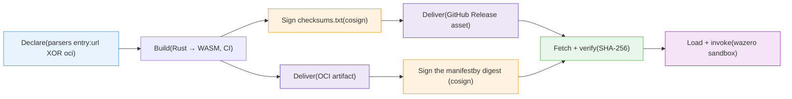
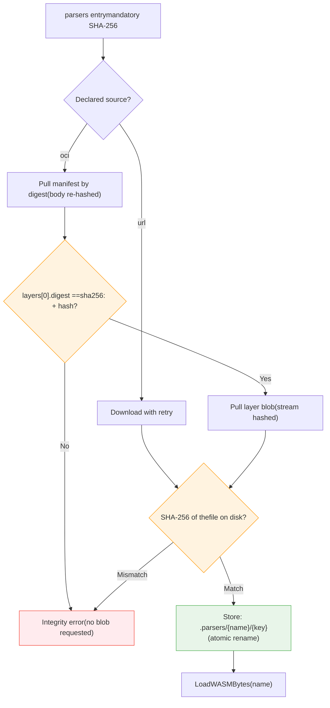
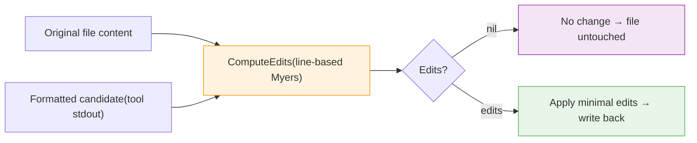

# WASM Output Parsers

> How datamitsu declares, builds, delivers over two channels, verifies, and loads sandboxed Rust→WASM output parsers, and how the line-based diff-in-core powers formatting

datamitsu wraps third-party linters and formatters behind a single CLI. To turn a
tool's free-form text output into structured results, it loads small,
**hash-pinned Rust→WASM modules** — output parsers — into a sandboxed runtime.
This page explains the parser pipeline end to end, and the line-based
**diff-in-core** that the formatting path is built on.

:::info Phase boundary
This is the parser _plumbing_: declare, build, sign, deliver, fetch, load,
invoke. It ships with a trivial `echo` parser that proves the whole pipe; real diagnostic
parsers (hadolint, yamllint, …) arrive in a later phase. The architectural
invariant that governs the design: **a parser extracts only what the tool
actually emitted; the Go core fills defaults.**
:::

## The Architectural Invariant

The dividing line between the WASM module and the Go core is deliberate:

- **The WASM module owns _extraction only_.** It reports exactly what the tool
  emitted. Every diagnostic field but the message is optional — absence means
  "the tool did not provide this", which is information, not an error.
- **The Go core owns _defaults and policy_.** Column fallbacks, severity
  defaults, range completion, and diffing all live in the core, next to the rest
  of datamitsu's shared behavior.

This "raw-with-holes / defaults-in-core" split keeps parsers tiny, dumb, and
trivially auditable, and keeps all judgement calls in one reviewable place.

### File attribution

Which file a diagnostic belongs to has two possible sources, and they compose:

- **The parser**, for formats that name a path per diagnostic (eslint's
  `filePath`). It fills `file` on the raw diagnostic.
- **The core**, otherwise. Most tool formats drop the filename, so the executor
  stamps the file it just linted — but only where the parser left `file` empty.

This ordering is what makes list-taking tools work. A tool given `{files}`
(eslint over a whole project, one invocation, dozens of files) gives the core no
single file to stamp, so a parser that does not report paths yields unattributed
diagnostics. Tools in that class must extract the path.

### Noise tolerance

A tool's JSON rarely arrives alone on stdout. Something else in the process
prints ahead of it (`eslint-plugin-sonarjs` `console.debug`s a pnpm-catalog
warning; node and python wrappers do the same), or the tool appends a human
summary after it — `golangci-lint --output.json.path=stdout` follows its report
with `1 issues:` and a per-linter tally. Under a strict parse, either costs every
diagnostic in the run.

The shared JSON helper therefore parses **leniently**: it finds each document
opener, scans to its balanced close (tracking string literals, so braces inside a
message or a path don't shift the depth), and parses that span. Noise before and
after is ignored. Every candidate span is tried and the best one wins — most
diagnostics first, longest span as the tiebreak — because taking the first span
that merely parses would let a `{}` in the noise shadow the real report, or turn
a JSON log line printed ahead of it into a phantom diagnostic.

A document that never closes contributes nothing. A truncation that still leaves
whole inner elements intact yields those elements, which beats discarding a run's
findings over a cut-off tail.

The core keeps stdout and stderr **apart** whenever a tool declares a parser, in
both per-file and batch execution. Both streams are handed to the module (some
tools report on stderr — `tsc` falls back to it, `cue_fmt` uses it exclusively),
but they arrive as separate buffers, so wrapper noise on one can never interleave
into the other's JSON.

## The Pipeline

A parser travels through six stages, from a config declaration to a result
returned into the core. The two delivery channels sign at opposite ends of the
step: the release asset is signed before it ships (cosign over `checksums.txt`,
which carries the module's hash), while the registry artifact can only be signed
after it is pushed, because what gets signed is the manifest digest the push
returns:



### Declare

A parser is a `parsers` entry in the config — a **hash-pinned data artifact**,
modeled on archives and bundles, _not_ on an app (no runtime, no lockfile,
because it is data, not a process). A tool opts in with
[`tool.outputParser`](../../reference/configuration-api.md#output-parser-outputparser),
a by-name reference into `parsers`. A dangling reference is a config error. See
[Output Parsers in the Configuration API](../../reference/configuration-api.md#output-parsers-parsers).

An entry names **exactly one source** and one mandatory hash:

- `url` — an `https://` download. A local development build of datamitsu
  additionally accepts `file://`, for iterating on a module you just compiled;
  a released binary refuses it outright.
- `oci: { ref, digest }` — an artifact pulled from a registry, pinned by its
  manifest digest.
- `hash` — the module's SHA-256, 64 lowercase hex, **mandatory for both**.

The two sources are **mutually exclusive and there is no fallback chain**.
Declaring both, or neither, fails at config load, before anything touches the
network. A fallback would defeat the point of the second source: an organization
that has removed its `github.com` egress must be able to prove from the config
alone that no code path can reach it. Switching an entry to a registry is what
config layers are for — a downstream layer replaces the entry, keeping the same
`hash`.

### Build

Parsers are a Rust workspace compiled to the `wasm32-unknown-unknown` target as a
freestanding `cdylib`. There is no `wasm-bindgen` — a small **manual-memory ABI**
keeps the artifact small. Each tool is **one module** under `src/tools/<tool>.rs`,
co-locating its parser with its `describe` recipe. A single dispatcher matches on
the tool name, so adding a tool is one `match` arm + one module + one `TOOLS` row.

Parsers are **hand-written**, porting the logic faithfully from the upstream
[none-ls](https://github.com/nvimtools/none-ls.nvim) builtin or
[efm-langserver](https://github.com/mattn/efm-langserver) errorformat for each
tool. The only external crate is **`tinyjson`** (a tiny, zero-dependency JSON
parser) for the JSON-output class — hand-rolling a correct JSON parser is a known
footgun and many tools emit JSON. Text/line parsers add no dependency. The bundled
set covers **~92 tools** — the none-ls diagnostics builtins plus a few ported
directly from their output (`eslint` JSON; `tsc`/`tsgo`; `cspell`; `harper-cli`),
spanning the parsing-difficulty classes — a representative few:

| Tool            | Output shape                               | Class          |
| --------------- | ------------------------------------------ | -------------- |
| `hadolint`      | JSON array of objects                      | structured     |
| `yamllint`      | `file:row:col: [level] msg (rule)` (line)  | simple regex   |
| `dotenv_linter` | `file:row CODE: msg` (no col, no severity) | missing fields |
| `cue_fmt`       | two lines per error (message + location)   | multiline      |
| `echo`          | pipe-test only                             | —              |

The single `.wasm` dispatches all of them by name (`tool.outputParser`). JSON
tools share one `from_json` helper (`tools/json_diag.rs`), so each is a few lines.

### Sign

Two different cosign signatures exist over a published module, and **datamitsu
verifies neither of them**.

- **The release channel signs `checksums.txt`.** CI builds the `.wasm` and hands
  it to the release tooling, so the module's SHA-256 lands in `checksums.txt`;
  the existing cosign `sign-blob` step signs that file (keyless, transparency
  logged). The module is covered transitively, as one line of a signed file.
- **The registry channel signs the artifact manifest.** After the artifact is
  pushed, CI cosign-signs it by digest. That signature covers the manifest, whose
  single layer digest _is_ the module's SHA-256 — the same module, covered by a
  different route.

The datamitsu binary has no sigstore or cosign dependency and consults no
transparency log on any fetch path. Both signatures are for **out-of-band**
verification: a maintainer runs `cosign verify-blob` on `checksums.txt`, or
`cosign verify` on the artifact reference, decides the module is trustworthy, and
writes its SHA-256 into a config. From that point the config's `hash` is the only
trust root the binary has — which is also why the core embeds no per-version WASM
hash, so parsers can update independently of the core binary.

:::warning `signer` is rejected, not ignored
Setting `oci.signer` is a **config error at load**, on a parser's `oci` and on
the bundle's top-level `oci` alike. A field that quietly did nothing would let a
config assert a guarantee this build does not deliver; a loud error is strictly
better. A bundle `signer` previously loaded and only failed later, at seed time —
it now fails at load, before any network. Remove the field; the mandatory `hash`
(and, for a bundle, the pinned digest) is what verifies the bytes.
:::

### Deliver

The built module reaches a machine over one of **two channels**, and a config
entry names exactly one of them.

**GitHub Release asset.** A versioned asset attached to the release
(`datamitsu_parsers_<version>.wasm`), exactly like the binaries, fetched by
`url` and verified against `hash`. Config maintainers take the `url` from the
release asset and the `hash` from the signed `checksums.txt`.

**OCI artifact.** The same bytes published to a registry as a small OCI 1.1
artifact, fetched by `oci.ref` + `oci.digest`. datamitsu publishes its own module
to `ghcr.io/datamitsu/datamitsu-parsers`, and unstable builds to
`ghcr.io/datamitsu/datamitsu-parsers-unstable`. This closes the last hole in the
"mirror one registry and everything works" story: the module used to be the one
artifact that always came from github.com, so an organization could mirror every
binary and still lose diagnostics parsing.

The artifact is deliberately minimal, and its shape is a contract the core
enforces on **every** pull, before it requests any payload:

| Part                | Required value                                                                     |
| ------------------- | ---------------------------------------------------------------------------------- |
| Manifest media type | `application/vnd.oci.image.manifest.v1+json`                                       |
| `artifactType`      | `application/vnd.datamitsu.parsers.v1+wasm`                                        |
| Layers              | exactly one, `application/wasm`, **uncompressed**                                  |
| Layer digest        | `sha256:` + the entry's `hash` — the pivot the whole design rests on               |
| Layer size          | greater than zero and within the module size cap                                   |
| `subject`           | absent — a manifest with one is a referrer (a signature, an SBOM), not the module  |
| Index               | rejected — a wasm module is platform-independent, so there is nothing to select on |

The config blob is the empty-JSON descriptor. That is a **publishing** invariant,
asserted where the artifact is produced, and deliberately _not_ a consumer rule:
the core never fetches the config blob, and turning a producer detail into an
integrity gate would break every already-pinned config the day the publisher
changed. The trust anchor is the layer digest.

Tags are published for humans and for mirroring tools, and to keep the manifest
referenced so a registry does not garbage-collect it. **The core never resolves a
tag.** It cannot: the reference grammar excludes `@` entirely and `:` outside the
port position, so a `:tag` or `@digest` suffix inside `oci.ref` does not even
parse.

Neither channel bundles the module into a wrapper package (npm/Python/Ruby), and
the registry channel is opt-in — an entry that says nothing about `oci` keeps
fetching over https, so a plain install needs no registry access at all.

### Fetch + verify

When the core needs a parser it dispatches on the declared source — never falls
back from one to the other — and both branches end with the same mandatory
SHA-256 in charge of the content. A parser referenced by several tools is
coalesced into a **single** fetch.

The https branch reuses the binary download machinery: download with retry, then
verify. The registry branch fetches the **manifest first**, and that ordering is
the point. The manifest is small, its body is re-hashed against the pinned digest
(the `Docker-Content-Digest` header is never trusted), and the layer-digest check
runs against it. A registry serving a correctly-digested manifest that points at
different content is therefore rejected **before one payload byte is requested**.



On the registry path the hash is checked **three** times: as the manifest pivot,
against the streamed blob, and against the file on disk once it exists. The last
one is logically redundant and kept on purpose — it is the only check that names
the config hash _after_ the bytes have landed, which keeps "the config hash is
verified on every transport" true by reading the code rather than by reasoning
about it.

:::note `--no-oci` does not disable a parser's `oci` source
`--no-oci` / `DATAMITSU_NO_OCI` turns off OCI bundle store **seeding** — an
accelerator that degrades gracefully to fetching artifacts one at a time. A
parser that declares an `oci` source is not an accelerator: it is the only route
to those bytes, so switching it off would leave nothing to fall back to.
`DATAMITSU_OFFLINE` is the single hard network gate, and it refuses a registry
pull exactly as it refuses a download.
:::

#### Store key: content, not source

A module is stored at `{store}/.parsers/{name}/{key}`, where the key is an XXH3
hash of the module's SHA-256 **and nothing else** — not the URL, not the registry
reference. The same module therefore lands in the same directory however it
arrived: a release asset, a registry, a locally built `file://`, or a layer of an
[OCI bundle](../oci-bundles.md).

That is exactly what makes a bundle-seeded module and a registry-pulled module
interchangeable. Seeding lays a `.parsers/` subtree into the store at the path
the bundle's producer computed; at run time the core looks for the module at the
path _it_ computes. If the key mixed in the source, a bundle built from a config
pinning the release URL would land somewhere a consumer pinning their own mirror
never looks — the seed would appear to succeed, the parser would silently be
fetched over the network anyway, and under `DATAMITSU_OFFLINE` parsing would just
degrade to raw tool output. Keying on content alone removes the failure mode: a
bundle producer, a consumer and a mirror agree on the path without republishing
anything.

XXH3 is the correct choice here per the [hashing split](../supply-chain-security.md):
the key is internal and is never compared against a value from outside. The
SHA-256 is what gates the content. The layout is versioned inside the key, so
changing its inputs is a deliberate, named migration rather than a silent
relocation — and a migration costs one re-fetch per module, because the old
directories are simply orphaned.

The practical consequence for mirroring: copy the artifact **by digest** and
change only the host. `crane copy` and friends preserve digests, so the published
`digest` and `hash` stay correct, and everything already seeded for that module
keeps matching.

```javascript
// BAD: the module was rebuilt for the mirror, so both the manifest digest and
// the module hash are new. The pin no longer describes what upstream published,
// and every store directory or bundle layer seeded for it is unreachable.
parsers: {
  echo: {
    oci: { ref: "registry.corp/dm/datamitsu-parsers", digest: "sha256:aaaa…aaaa" },
    hash: "bbbb…bbbb",
  },
}
```

```javascript
// GOOD: the artifact was copied by digest, so only the host changed. The digest
// and the hash are the ones upstream published, and the module resolves to the
// same content-addressed store directory as before.
parsers: {
  echo: {
    oci: { ref: "registry.corp/dm/datamitsu-parsers", digest: "sha256:89ab…4567" },
    hash: "0123…cdef",
  },
}
```

#### The store re-verifies itself

A module already on disk is not trusted just for being there. Its bytes are
re-hashed against the declared SHA-256 on every use, and a mismatch means the
directory is discarded and the module fetched again — whatever put it there. A
`.parsers/` directory is filled by a verified fetch, but also by bundle seeding,
a restored CI cache, an image layer, or a person with a file manager, and only
the first of those has necessarily been checked against the config. The cost is
one hash of a roughly 400 KiB file per prewarm, nowhere near the per-parse path,
and it makes the mandatory hash mean what the policy says it means: nothing is
loaded that was not checked against it.

### Load + invoke

The verified bytes are instantiated into a **wazero** module (pure-Go WASM
runtime, no CGo — consistent with the core). The host drives the memory ABI:
allocate input buffers, write the raw `stdout`/`stderr`/`exit_code`, call the
exported `parse`, then read and free the output buffer. The raw bytes are passed
**whole — never host-line-split** — so multiline output (e.g. `cue_fmt`) is
preserved; the parser decides whether to split. The JSON result deserializes into
nullable Go structs (pointer fields, so a field the tool omitted stays `nil`).

### Introspect

Every module also exports `describe` — a static counterpart to `parse` that takes
no input and returns a JSON **capability manifest**: which tools the module can
parse, how to invoke each (args + stdin), the upstream URL, and the module's
**build-injected version**. The version is baked at compile time like a Go ldflags
`-X` (CI sets `DATAMITSU_PARSERS_VERSION`); the module is the single source of
truth, which is why the `parsers` config entity carries **no `version` field**.

To debug a parser against a real `datamitsu lint` run, pass **`--no-parse`** (or set
`DATAMITSU_NO_PARSE`): the executor skips parsing and shows each tool's raw output,
so you can see exactly what the parser was given. `devtools parsers run` is the
complementary tool for iterating on a parser against piped output.

[`datamitsu devtools parsers list`](../../reference/cli-commands.md#devtools-parsers)
aggregates `describe` across every configured parser into a **deduplicated** view:
distinct modules (by content) are described exactly once, and tools are
deduplicated by name (a tool two different modules claim with diverging identity
is flagged as a conflict). The default rendering is human-readable; `--json` emits
the machine-readable catalog for driving configs and build pipelines, and
`--wasm <path>` describes a local `.wasm` file with no config or network access.

Which source an entry actually resolves to is queryable without touching the
network, which matters once a config is assembled from layers:

```bash
# The effective declaration — source, digest and hash as the core sees them
datamitsu config show | jq '.parsers'

# Every artifact this config pins on the registry side: what must I mirror?
datamitsu store refs --oci-only
```

## diff-in-core (Formatting)

Formatting needs **no parser at all** — it is text in, text out. It is the first
real consumer of the pipeline's sibling piece: a **line-based Myers diff written
in the Go core**.

A formatter that reads stdin and writes stdout is run through the executor's
[stdin → stdout capture mode](../tooling-system.md#formatting-stdin--stdout--diff).
The core then treats the captured stdout as the full new file text and computes a
minimal edit set against the original:



Why diff in the core rather than letting the tool rewrite the file:

- **Minimal, precise edits.** A one-line change in a large file produces a
  one-line edit, not a whole-file rewrite — better for review, version control,
  and incremental work.
- **No-op is truly free.** Identical input and output yield `nil` edits; the file
  (and its mtime) is left untouched.
- **Reusable shape.** Edits are produced as range-based text edits, shaped to
  serve both the CLI apply path now and editor `TextEdit` ranges later, with
  column math done over runes to stay correct on multibyte content.

Because diffing is shared policy, it lives with the defaults in the core — the
same place that will own diagnostic defaults — keeping the WASM modules limited
to pure extraction.

## Trust Model Summary

The two channels differ only in how the bytes are addressed. Everything after
"the bytes exist" is shared.

| Concern                         | Release asset (`url`)                      | OCI artifact (`oci`)                                                                       |
| ------------------------------- | ------------------------------------------ | ------------------------------------------------------------------------------------------ |
| What the config pins            | the module's SHA-256                       | the module's SHA-256 **and** the artifact manifest digest                                  |
| Pre-flight rejection            | none — the payload is fetched, then hashed | the manifest pivot: `layers[0].digest` must be `sha256:` + `hash`, checked before any blob |
| Hash checks per fetch           | once, on the finished file on disk         | three: the manifest pivot, the streamed blob, then the file on disk                        |
| Signature checked by the binary | none                                       | none                                                                                       |
| Signature available out-of-band | cosign over `checksums.txt`                | cosign over the artifact manifest                                                          |
| Credentials sent                | none                                       | `GITHUB_TOKEN`, and only when the reference's host is `ghcr.io`                            |
| Disabled by `--no-oci`          | no                                         | no — that flag governs bundle seeding only                                                 |
| Blocked by `DATAMITSU_OFFLINE`  | yes                                        | yes                                                                                        |

| Shared property    | Mechanism                                                                                                               |
| ------------------ | ----------------------------------------------------------------------------------------------------------------------- |
| Trust root         | the mandatory 64-hex SHA-256 in the config, validated at load before any network                                        |
| Internal cache key | XXH3 over that SHA-256 alone — content-addressed, never used for verification                                           |
| Store integrity    | every module on disk is re-hashed against the declared SHA-256 on each use, and discarded if it does not match          |
| Atomic publish     | the verified temp file is renamed inside its content-addressed directory, so no torn module is observable               |
| Not trusted        | `Docker-Content-Digest`, the registry's TLS identity as a content guarantee, a redirect target, any tag, any annotation |
| Execution sandbox  | wazero (pure-Go WASM), raw bytes in, JSON out — no host filesystem                                                      |

:::caution Mirroring has one hard limit
datamitsu can authenticate to exactly one registry: GHCR, using `GITHUB_TOKEN`,
and only when the reference's own host is `ghcr.io`. There is no docker
`config.json`, no credential helper and no custom CA bundle. A mirror registry
must therefore allow **anonymous pull**; an authenticated private mirror is not
supported yet. This is the same limit the [OCI bundle](../oci-bundles.md) path
has always had, not a new one.
:::

See the [Supply Chain Security](../supply-chain-security.md) guide for the wider
trust model and the [Configuration API](../../reference/configuration-api.md#output-parsers-parsers)
for the `parsers` and `lsp` reference.
