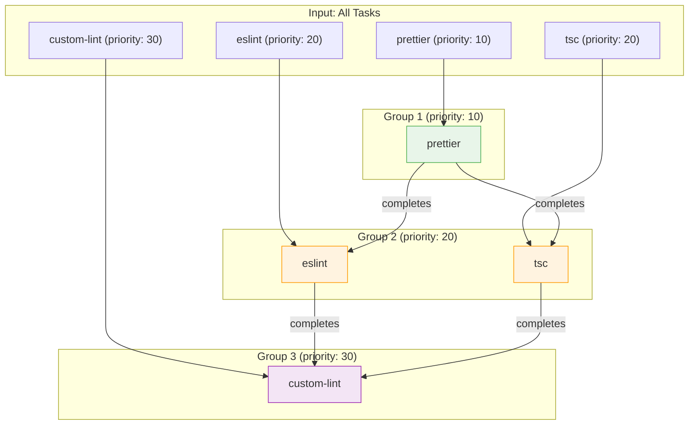
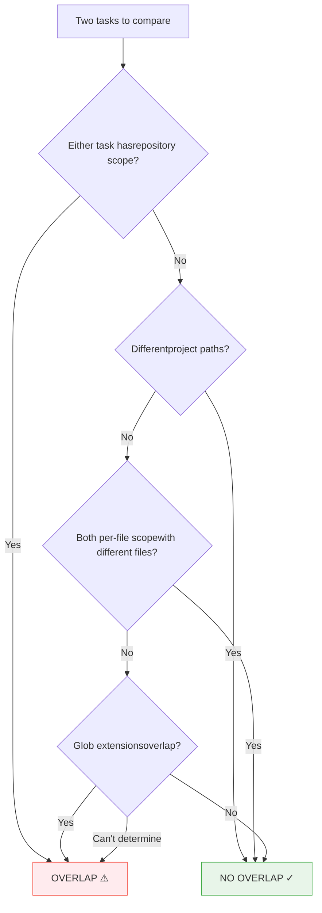

# Task Planning

> How datamitsu groups files into prioritized task batches with overlap detection and CWD-subtree restriction

The planner is the second stage of datamitsu's execution pipeline. It takes the list of discovered files and transforms them into an ordered execution plan — deciding what runs when, what can run in parallel, and what must wait.

## Shared Repository Inventory

The runner performs one gitignore-aware traversal at the git root and sorts the
result. That same immutable inventory feeds the bundled `.datamitsuignore`
fix/lint checks and is seeded into the planner for glob matching, project
detection, unit membership, and narrowing. A `check` run therefore does not walk
the same tree once for fix, again for lint, and again for planning.

`Planner` can still initialize itself with a fallback walk when used outside the
normal runner path. Invalidating a planner discards an earlier seed, so a stale
inventory is never silently reused.

## Skip Detection

As it enumerates tools in stable name order, the planner records three kinds of
**skipped tools** alongside the runnable task groups. A tool is reported as
skipped when, after it is found applicable to the project and operation:

- it sets `skip: true` in config, or
- its backing binary has no build for the current OS/architecture/libc, or
- a narrowed selection needs a wider unit/repository verdict than the active
  widening policy permits.

Plan-time detection makes all three visible in `--explain` and keeps
platform-unsupported apps out of the [pre-install phase](./execution.md#pre-install-phase).
Tools that are merely inapplicable (no matching files, wrong project type, or
disabled by `.datamitsuignore`) remain silent. A not-narrowable skip counts
against `--require-coverage`; only platform skips participate in
`--fail-on-skip`.

## Priority-Based Chunking

Every tool operation has a `priority` value (a number). The planner groups all tasks by priority and creates one **TaskGroup** per unique priority level:



**Execution behavior:**

- Groups execute **sequentially** — Group 1 must finish before Group 2 starts.
- Tasks **within** a group execute **in parallel** across available CPU cores.
- Lower priority numbers run first (priority 10 before priority 20).

This design lets you express ordering constraints. Formatters should run before linters because formatters may change files that linters need to check:

```javascript
export function getConfig(input) {
  return {
    ...input,
    tools: {
      prettier: {
        name: "prettier",
        operations: {
          fix: {
            app: "prettier",
            args: ["--write", "{files}"],
            priority: 10, // Runs first — formats files
            globs: ["**/*.{js,ts,tsx,css,json,md}"],
          },
        },
      },
      eslint: {
        name: "eslint",
        operations: {
          lint: {
            app: "eslint",
            args: ["{files}"],
            priority: 20, // Runs after formatters finish
            globs: ["**/*.{js,ts,tsx}"],
          },
        },
      },
      tsc: {
        name: "tsc",
        operations: {
          lint: {
            app: "tsc",
            args: ["--noEmit"],
            priority: 20, // Same priority as eslint — runs in parallel with it
            globs: ["**/*.{ts,tsx}"],
            scope: "per-project",
          },
        },
      },
    },
  };
}
```

All tasks at the same priority level are placed in one group. Within each group, the executor forms parallel sub-groups of non-overlapping tasks (see next section). Sub-groups run sequentially, but tasks within each sub-group run in parallel. This ensures overlapping tasks never execute concurrently while maximizing parallelism for non-overlapping tasks.

## Overlap Detection

Before running tasks in parallel, the planner checks whether two tasks might operate on the same files. This prevents race conditions where two tools write to the same file simultaneously.

The overlap detection algorithm uses a multi-level approach:



**Key rules:**

1. **Repository-scope tasks always overlap** with everything — they operate on the entire repository.
2. **Different project paths never overlap** — tasks in `packages/frontend/` and `packages/backend/` are guaranteed disjoint.
3. **Per-file tasks with different files never overlap** — each processes exactly one file.
4. **Glob pattern analysis** — the planner extracts file extensions from glob patterns and checks for shared extensions.

### Glob Extension Analysis

The planner extracts extensions from patterns like `*.js`, `**/*.{ts,tsx}`, and checks whether two tools share any extensions:

| Tool A Globs | Tool B Globs    | Overlap?    | Reason                                  |
| ------------ | --------------- | ----------- | --------------------------------------- |
| `**/*.ts`    | `**/*.css`      | No          | Different extensions                    |
| `**/*.ts`    | `**/*.{ts,tsx}` | Yes         | `.ts` shared                            |
| `**/*.ts`    | `**/*.d.ts`     | Yes         | `.ts` is a suffix of `.d.ts`            |
| `Makefile`   | `**/*.go`       | Assumed yes | Can't extract extension from `Makefile` |

The algorithm is **conservative** — when it can't prove two patterns are disjoint, it assumes overlap. This is safer than incorrectly allowing parallel writes to the same file.

### Practical Impact on Configuration

Understanding overlap detection helps you write configurations that maximize parallelism:

```yaml
# These tools will NOT run in parallel due to overlapping extensions:
prettier:
  fix:
    priority: 10
    globs: ["**/*.{js,ts,tsx,css,json,md}"]

stylelint:
  lint:
    priority: 10
    globs: ["**/*.css"] # css overlaps with prettier — placed in separate sub-group

# Better: put stylelint at a different priority, or accept sequential execution
```

```yaml
# These tools CAN run in parallel (different project paths in a monorepo):
# Tool A runs in packages/frontend/, Tool B runs in packages/backend/
# Even with the same globs, they operate on disjoint file sets
```

## CWD-Subtree Restriction

When you run datamitsu from a subdirectory instead of the repository root, that
subtree becomes the initial selection. File-complete work remains inside it;
coarser operations may widen to a containing unit when policy permits. This is
useful in large monorepos where you want to start with only the package you are
working on without silently accepting an incomplete project-wide answer.

**Behavior from different directories:**

```bash
# From repository root — processes everything
~/repo$ datamitsu check
# → Runs all tools on all files across all projects

# From a subdirectory — starts with that subtree as the selection
~/repo$ cd services/api
~/repo/services/api$ datamitsu check
# → File-complete work stays inside services/api/
# → Unit-complete work may widen to the containing project (default policy)
# → Whole-repository work is reported as not narrowable
```

Scope chooses the working directory; granularity decides whether narrowing is
sound:

| Operation shape                        | Behavior from a subdirectory                                                    |
| -------------------------------------- | ------------------------------------------------------------------------------- |
| File-granularity, any compatible scope | Uses only selected matching files                                               |
| Unit-granularity, `per-project` scope  | Runs complete selected/containing units when `widenTo` permits (default `unit`) |
| Repo-granularity, `repository` scope   | Reported not narrowable unless `--widen-to=repo`; then runs the whole repo      |

A repository-scoped operation with `{file}` or `{files}` is normally inferred
as file-granularity, so it can still run once from the git root with a narrowed
file list. Repository **scope** alone is not a reason to skip it.

**Example monorepo:**

```
repo/
├── packages/
│   ├── frontend/   (package.json)
│   ├── backend/    (go.mod)
│   └── shared/     (package.json)
└── services/
    └── api/        (go.mod)
```

```bash
# From repo/packages/ — processes frontend, backend, and shared
~/repo/packages$ datamitsu check

# From repo/packages/frontend/ — processes only frontend
~/repo/packages/frontend$ datamitsu check

# From repo/services/ — processes only the api service
~/repo/services$ datamitsu check
```

The restriction uses path-component-aware containment checks, so sibling paths
with similar prefixes are excluded (`services/api` does not include
`services/api-admin`). For unit work, the nearest detected project containing
the selection can also be retained when the widening policy permits it.

## File-to-Project Assignment

When a tool has `per-project` scope with file globs, the planner needs to decide which project each matched file belongs to. It uses a **nearest-parent algorithm**:

1. Sort all detected projects by path depth (deepest first).
2. For each matched file, walk through the sorted projects.
3. The first project whose path is a parent of the file path wins.
4. Files not under any detected project are assigned to the repository root.

This matters in monorepos with nested projects:

```
repo/
├── packages/
│   ├── frontend/        (package.json)  ← Project A
│   │   └── src/
│   │       └── app.ts                   ← Assigned to Project A
│   └── shared/          (package.json)  ← Project B
│       └── src/
│           └── utils.ts                 ← Assigned to Project B
└── config.ts                            ← Assigned to repo root
```

Each file belongs to exactly one project — its nearest parent. This prevents duplicate processing when projects are nested. The tool then runs once per project with only that project's files, using the project directory as the working directory.
