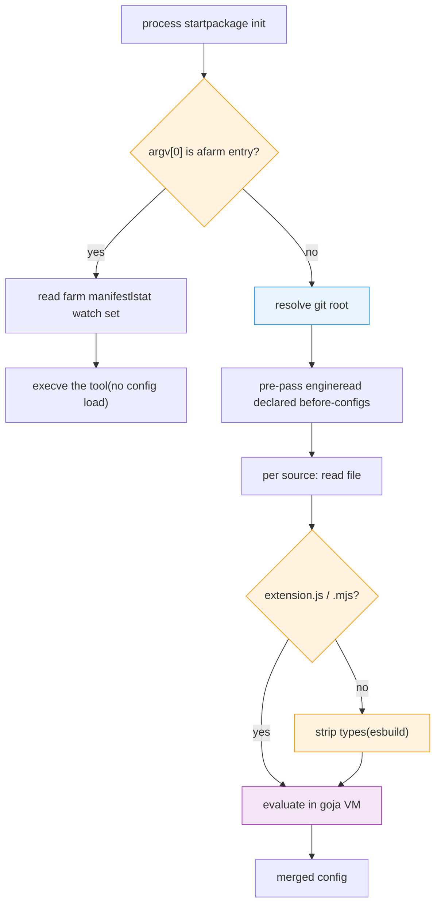

# Startup and Config Load

> What every datamitsu invocation pays before the first tool runs - the config-load cost model, the git-root memo, and how to measure it

Every `datamitsu` CLI invocation does the same work before [file discovery](./discovery.md) even begins: it resolves the repository root, evaluates the JavaScript configuration, and builds the engines that expose datamitsu's APIs to that configuration. This page describes what that costs, which parts are memoized, and how to measure the rest — so an optimization is never undone by a change that looks harmless.

:::note One invocation shape skips all of this

Under [source mode](../source-mode.md), a tool run by bare name execs the same datamitsu binary under the tool's name. That invocation is decided by `argv[0]` in `main`, before the cobra command tree or the UI is built, and in the steady state it never loads a config at all: it reads the farm manifest, stats the watch set, and `syscall.Exec`s the target. Everything below describes the CLI path — which source mode still takes whenever the manifest is stale and a rebake is needed.

:::

## The Load Sequence



Config is assembled from several sources — the embedded default, any declared before-configs, and the project's own `datamitsu.config.{js,mjs,ts}`. Each source gets its own engine and its own JavaScript VM, so anything done per engine is done several times per invocation.

## The Cost Model

Three rules explain nearly all of the remaining startup time.

**Per-engine work is multiplied.** An operation added to engine construction runs once per config source, not once per process. This is the single easiest way to make startup slow again: a 20 ms call added to the engine constructor costs 80 ms on a project with four sources.

**Anything that forks a process dominates.** A `git` subprocess costs roughly 10 ms — comparable to the entire Go process floor. Filesystem walks in pure Go are two to three orders of magnitude cheaper.

**Config evaluation is proportional to source size, not source complexity.** A large before-config is parsed and executed in full whenever it is evaluated, even when it only contributes a handful of entries. On a 2 MB chain that is roughly 30 ms — which is why the evaluated result is cached across processes; see [The Config-Evaluation Cache](#the-config-evaluation-cache) below.

## The Git-Root Memo

The repository root is a pure function of the working directory within one process — datamitsu is short-lived and never changes directory mid-run. It is therefore resolved **once per process** and memoized for the process lifetime, keyed by the directory the lookup started from. Overlapping callers collapse onto a single resolution rather than racing to duplicate it, and failures are cached too, because a directory does not become a repository mid-run.

:::warning Do not resolve the git root per engine
The memo exists because the root was previously resolved once per engine plus once in the loader — ten forked `git` processes per invocation, about half of all startup overhead. If you add a call site, call the memoized helper (`facts.GetGitRoot`, which takes no directory argument and answers for the process working directory); do not shell out to `git rev-parse` directly.
:::

Two helpers resolve the root today. `facts.GetGitRoot` is the memoized one described here, used by the config loader and by every engine construction. `traverser.GetGitRoot` takes an explicit directory and is used by the command handlers (`exec`, `init`, `setup`, `cache`, `lsp`) and the runner; it is not memoized, has no pure-Go path, and ignores `DATAMITSU_FORCE_GIT_SUBPROCESS`. Consolidating the two is follow-up work.

Resolution itself has two paths. The fast path is a pure-Go walk up from the working directory, which reproduces two behaviors a naive walk gets wrong: it reports a _physical_ path with symlinks resolved, and inside a submodule it climbs to the **topmost superproject** rather than stopping at the nearest `.git`. The walk answers only for layouts it can prove and defers to a `git` subprocess for everything else — a bare repository, a repository nested inside another repository's working tree, a separate git directory, an unreadable or malformed `.git` file. A wrong root silently produces wrong project cache keys, so declining is always preferred to guessing.

The superproject climb is gated on a proof rather than on the presence of a `.git` file pointing into a `modules/` directory. Git calls a directory a submodule only while the superproject's **index** records a gitlink (a mode 160000 entry) at that path, and it leaves the submodule's working tree and its `.git` file behind when you check out a branch without it or run `git rm --cached`. In those states `git rev-parse --show-superproject-working-tree` is empty and climbing would answer with a root git disagrees with, so the walk reads both `.gitmodules` and the superproject index and declines unless both name the path. Anything about the index it cannot account for byte for byte — index version 4, whose entry paths are prefix-compressed, an unrecognized entry shape, an implausibly large file — is also a decline.

The walk also declines when the repository config says there is no working tree at the directory holding `.git`. That covers `core.worktree` and the `extensions.worktreeConfig` that lets a per-worktree config set it — the working tree may have moved elsewhere — and `core.bare`, where an otherwise ordinary `.git` directory is marked bare and `git rev-parse --show-toplevel` fails outright with "this operation must be run in a work tree". The `core.bare` check reads the value, not just the key, because `git init` writes `bare = false` into every repository config.

Two further declines reproduce checks git performs that a plain walk up the tree does not have:

- **Ownership.** Git refuses a repository owned by another user ("detected dubious ownership") unless `safe.directory` allows it. The walk declines rather than answering for such a repository, because answering would mean loading and executing a `datamitsu.config.js` that git itself would not touch. Where `safe.directory` _does_ allow it, `git` answers on the fallback path as before.
- **Filesystem boundaries.** Git stops discovery at a mount boundary unless `GIT_DISCOVERY_ACROSS_FILESYSTEM` is set, so a repository above a mount point is not the root for a directory inside it. The walk stops at the same boundary.

Both checks read POSIX ownership and device data, which Windows does not expose. On Windows the walk therefore always declines and `git` resolves the root — correct, but without this page's speedup. `DATAMITSU_STARTUP_TIMINGS=1` shows the difference directly: a declining layout puts `facts.GetGitRoot` back at subprocess cost.

Set `DATAMITSU_FORCE_GIT_SUBPROCESS=1` to skip the walk entirely and always ask `git`. This is the escape hatch for an unforeseen repository layout; it affects the memoized lookup only, not the separate `traverser.GetGitRoot` helper. Both toggles on this page are reported by `datamitsu config runtime` (`startupTimings`, `forceGitSubprocess`).

## Type Stripping Is Skipped for JavaScript

Config sources are run through esbuild to strip TypeScript types — but only when the source may contain them. The decision is made on the **file extension alone**: `.js` and `.mjs` pass through untouched, everything else is stripped.

The rule is deliberately asymmetric. Stripping a file that has no types is wasted work but harmless; skipping a file that _does_ have types hands raw TypeScript to the JavaScript VM and fails far from its cause. So an unrecognized extension always strips. Content sniffing is not used for the same reason — a heuristic that guesses wrong produces a syntax error deep inside the VM.

The embedded default config is the bundler's own JavaScript output, so it skips the pass for the same reason rather than paying an identity transform on every invocation.

Remote and OCI-sourced configs route through the same check. The extension is read from the path component of the source reference only, so a `.js` hostname is not mistaken for a JavaScript file and a query string cannot hide the real extension.

## The Config-Evaluation Cache

Evaluating a 2 MB config chain costs about 30 ms of every invocation: goja parses it, runs its top level, the merged graph is exported out of the VM, and eleven validators run over the result. None of that depends on anything but the inputs, so the **evaluated, validated result** is written to disk and replayed on the next process. Reading and decoding it costs about 2 ms — a 15× reduction on the load, and the largest single saving left in startup.

A JavaScript VM cannot be snapshotted: goja exposes no serialization for a compiled program and no heap snapshot, so only the result can cross a process boundary. That is the whole reason the cache is shaped the way it is.

### What Is in the Key

The key is an XXH3-128 digest — an internal cache key over local files, which is what the hashing policy requires — over inputs chosen so that a hit can only ever be a config a miss would have produced. A key that is too wide costs a miss; a key that is too narrow serves a wrong config silently, so everything a config can observe is folded in:

- The **content hash of every file in the chain, in chain order**. Content, not mtime and size: hashing 2 MB costs a fraction of a millisecond and survives `git checkout`, `git stash` and rebuilds that reset modification times, which mtime does not.
- The **resolved chain shape** — absolute paths in order, `--no-auto-config`, `--skip-remote-config`, and the existence of every auto-config candidate that was _not_ chosen, so creating a higher-priority config invalidates the entry.
- The **whole environment**, sorted.
- Every field of `datamitsuConfigInputs`, the allowlisted values config JS is permitted to branch on.
- The JS-visible [facts](../../reference/configuration-api.md) — os, arch, libc, version, package name, binary path, whether this is a git repository or a monorepo.
- The **working directory and the git root separately**, since setup content receives paths computed relative to the working directory.
- The resolved `.git/HEAD`, because a branch switch can add, delete or change chain files.
- Whether **colors render**, since the `colors` config global emits ANSI escapes only when they are enabled, and that falls back to whether stdout is a terminal — which no environment variable records.
- The **identity of the binary**: its version, a format version for the artifact schema, and — because every local build reports the version `dev` — a hash of the embedded default config plus the executable's size and modification time.

**Why the whole environment and not the `DATAMITSU_*` subset.** Source mode's staleness key hashes `env.Environ()`, which is deliberately narrow. Config JS sees the entire environment through `facts().env`, and real configs branch on `CI`, so a `DATAMITSU_*`-only key would be defeated by `CI` alone — a CI machine and a developer's shell would share one entry. Only the purely observational variables (`DATAMITSU_TRACE`, `DATAMITSU_TRACE_DIR`, and `DATAMITSU_CONFIG_CACHE` itself) are dropped: a key that folded in the trace flag would make the first traced run miss _because_ it was traced, so the instrument would change the measurement it was reaching for. Those same three are hidden from `facts().env`, so config JS cannot branch on a variable the key does not carry — dropping one from the fingerprint while leaving it readable would turn it into a config input no key could distinguish. Source mode's extra exclusions — the activation markers that say which farm a shell is in — deliberately do **not** carry over, because config JS can read them and there is no rebake loop on this side to protect against.

**Why the binary's identity and not just its version.** Validation and merging run in Go, after the JS, and the head of every chain is a config embedded in the binary — so two builds reporting the same version can produce different evaluations. Released builds carry distinct versions, but every local build says `dev`, and a developer rebuilding after editing the embedded config would otherwise be served the previous build's result until the entry expired.

The key is computed after the chain is resolved, because declared before-configs are only known once the auto config has been read. The one file read before that — the auto config — is snapshotted first, and every chain file is re-hashed after evaluation before the artifact is written, so a file edited mid-evaluation reads as stale instead of being stamped fresh.

### Refusing a Config the Artifact Cannot Reproduce

A config that reads the clock or the entropy source is not a pure function of its inputs, and an artifact holding its result would be served forever without ever erroring — the one failure mode with no external symptom. goja routes `new Date()`, `Date()`, `Date.now()` and `Math.random()` through a time source and a random source, so datamitsu installs recording hooks on both. They are transparent: same values, same types, only an observation flag is set. If any engine in the chain trips it, the load evaluates normally and **writes nothing**.

The refusal is deliberately narrow. `new Date(2020, 0, 1)` never reaches the time source, so a config that builds dates from explicit arguments keeps its cache entry.

**Enumeration order is pinned, not refused.** The chained input and `facts()` are Go maps, and goja enumerates a Go map by ranging over it — so `Object.keys(input.tools)`, a spread and `JSON.stringify(facts().env)` would each observe Go's randomized iteration order. A config that turned that order into an ordered output would produce a different result per run, and the first result would then be the one the cache served. Both surfaces are therefore materialized with their map keys in sorted order before JavaScript sees them; the shapes are goja's own (a nil map is still `{}`, a nil pointer still `null`), only the order is fixed. A duplicated environment variable is collapsed the same way on both sides — last occurrence wins, in `facts().env` and in the hashed environment alike — so two environments that read differently cannot hash the same.

Console output is refused for the same reason from the other direction: a hit runs no JavaScript, so a config that called `console.log` would print on the cold run and fall silent on every run afterwards. A config that logs therefore evaluates every time — which is exactly what it did before this cache existed.

Everything else a miss produces is carried in the artifact rather than lost: the config-validation warnings and the remote-config URLs the chain resolved are stored alongside the config and replayed on a hit, so a command's output does not depend on whether a cache happened to be warm.

### The Artifact Store

Artifacts live under `{cache}/config-eval/{namespace}/{key}.msgpack` — in the cache tree, not the store, so deleting it is always safe. The namespace mirrors the source-mode farm identity: a hash of the git root for a repository chain, or the explicit-config identity for a machine-level `--config` chain. There is no working-directory fallback, which would let two directories share one entry.

msgpack rather than JSON: decoding the ~1.8 MB artifact takes 0.8 ms against 7 ms for JSON of the same graph.

Writes go to a temporary file in the same directory, are flushed, and are renamed into place, never written in place. Entries are immutable per key, so reads need no lock and two processes racing to write the same key are harmless. The stored entry is a nested blob covered by a hash recorded in the envelope: a rename is atomic against a concurrent reader but not against a crash, and a file whose tail is zeros would otherwise decode as a structurally valid but silently truncated config that skipped every validator. A decode failure, a truncated file, a payload that does not match its hash, or an unknown format version is a **miss**, never an error — the bad entry is removed and the config is evaluated — so a corrupt cache degrades to the old cost rather than to a broken CLI. Entries unread for 14 days are pruned on the miss path, so garbage collection never costs a hit anything, and a hit refreshes an entry's timestamp at most once an hour so a config in daily use never expires. Age alone bounds only the rate at which the tree grows — the working directory, the environment, `HEAD` and the binary are all key inputs, so a project mints fresh multi-megabyte artifacts far faster than 14 days retires them — so each project (or machine-level chain) also keeps at most its 8 most recently read entries. `datamitsu cache clear` removes the tree.

### When the Cache Is Bypassed

Three paths always evaluate:

- **`datamitsu setup`** is the only caller that uses the returned JavaScript VM, and a hit has no VM to return.
- Anything that needs **evaluated setup content** — `datamitsu config chain-hash` — because that content is a live JavaScript function that cannot be serialized. A hit returns an empty setup layer map rather than a partial one, and the callers that need it are gated out instead.
- Loads that **skip lockfile validation**. That path validates less than every other one, so an artifact it wrote could let a later strict load skip an error it exists to raise.

Setting `DATAMITSU_CONFIG_CACHE=0` turns the cache off entirely — nothing is read and nothing is written, so the tree is never created. The value is reported by `datamitsu config runtime` as `configCache`.

Caching the validated result is sound because the validators are a pure function of the merged config, and a binary that validates differently produces a different key — which is why the binary's identity is in the key and is not optional.

## Measuring Startup

Set `DATAMITSU_STARTUP_TIMINGS=1` to get a per-phase breakdown on stderr. Phases are aggregated by name across the process and reported once:

```bash
DATAMITSU_STARTUP_TIMINGS=1 datamitsu exec actionlint -- --version
```

Reported phases cover the total config load, the before-config pre-pass, each engine construction, each git-root resolution, each type-stripping call, and each config evaluation. A phase whose count is higher than you expect is the signal that something moved into a per-source path.

The repository also ships `scripts/bench-overhead.sh`, which measures launch overhead against a bare `bash -c` spawn so the datamitsu-attributable share is isolated from the process floor.

When comparing numbers, use the **minimum** wall time over at least 40 runs. Medians are contaminated by contention on a loaded machine; the minimum is the closest available estimate of the real cost.
