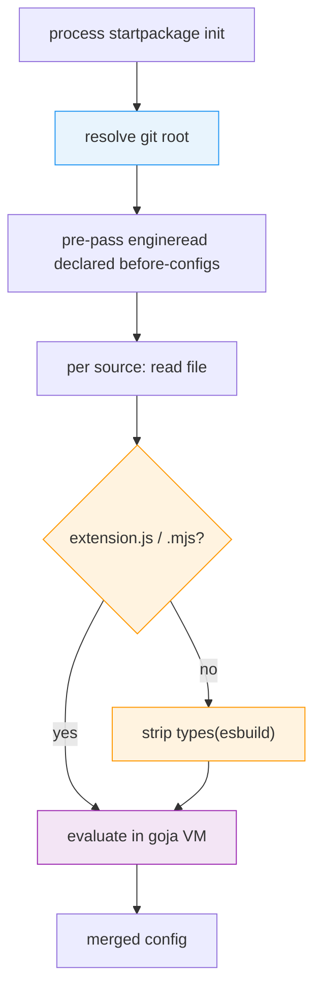

# Startup and Config Load

> What every datamitsu invocation pays before the first tool runs - the config-load cost model, the git-root memo, and how to measure it

Every `datamitsu` invocation does the same work before [file discovery](./discovery.md) even begins: it resolves the repository root, evaluates the JavaScript configuration, and builds the engines that expose datamitsu's APIs to that configuration. This page describes what that costs, which parts are memoized, and how to measure the rest — so an optimization is never undone by a change that looks harmless.

## The Load Sequence



Config is assembled from several sources — the embedded default, any declared before-configs, and the project's own `datamitsu.config.{js,mjs,ts}`. Each source gets its own engine and its own JavaScript VM, so anything done per engine is done several times per invocation.

## The Cost Model

Three rules explain nearly all of the remaining startup time.

**Per-engine work is multiplied.** An operation added to engine construction runs once per config source, not once per process. This is the single easiest way to make startup slow again: a 20 ms call added to the engine constructor costs 80 ms on a project with four sources.

**Anything that forks a process dominates.** A `git` subprocess costs roughly 10 ms — comparable to the entire Go process floor. Filesystem walks in pure Go are two to three orders of magnitude cheaper.

**Config evaluation is proportional to source size, not source complexity.** A large before-config is parsed and executed in full by every invocation, even when it only contributes a handful of entries. This is the dominant remaining cost for projects with a large declared before-config, and it is **not** cached across processes today.

## The Git-Root Memo

The repository root is a pure function of the working directory within one process — datamitsu is short-lived and never changes directory mid-run. It is therefore resolved **once per process** and memoized for the process lifetime, keyed by the directory the lookup started from. Overlapping callers collapse onto a single resolution rather than racing to duplicate it, and failures are cached too, because a directory does not become a repository mid-run.

:::warning Do not resolve the git root per engine
The memo exists because the root was previously resolved once per engine plus once in the loader — ten forked `git` processes per invocation, about half of all startup overhead. If you add a call site, call the memoized helper (`facts.GetGitRoot`, which takes no directory argument and answers for the process working directory); do not shell out to `git rev-parse` directly.
:::

Two helpers resolve the root today. `facts.GetGitRoot` is the memoized one described here, used by the config loader and by every engine construction. `traverser.GetGitRoot` takes an explicit directory and is used by the command handlers (`exec`, `init`, `setup`, `cache`, `lsp`) and the runner; it is not memoized, has no pure-Go path, and ignores `DATAMITSU_FORCE_GIT_SUBPROCESS`. Consolidating the two is follow-up work.

Resolution itself has two paths. The fast path is a pure-Go walk up from the working directory, which reproduces two behaviors a naive walk gets wrong: it reports a _physical_ path with symlinks resolved, and inside a submodule it climbs to the **topmost superproject** rather than stopping at the nearest `.git`. The walk answers only for layouts it can prove and defers to a `git` subprocess for everything else — a bare repository, a repository nested inside another repository's working tree, a separate git directory, an unreadable or malformed `.git` file. A wrong root silently produces wrong project cache keys, so declining is always preferred to guessing.

The superproject climb is gated on a proof rather than on the presence of a `.git` file pointing into a `modules/` directory. Git calls a directory a submodule only while the superproject's **index** records a gitlink (a mode 160000 entry) at that path, and it leaves the submodule's working tree and its `.git` file behind when you check out a branch without it or run `git rm --cached`. In those states `git rev-parse --show-superproject-working-tree` is empty and climbing would answer with a root git disagrees with, so the walk reads both `.gitmodules` and the superproject index and declines unless both name the path. Anything about the index it cannot account for byte for byte — index version 4, whose entry paths are prefix-compressed, an unrecognized entry shape, an implausibly large file — is also a decline.

The walk also declines when the repository config says there is no working tree at the directory holding `.git`. That covers `core.worktree` and the `extensions.worktreeConfig` that lets a per-worktree config set it — the working tree may have moved elsewhere — and `core.bare`, where an otherwise ordinary `.git` directory is marked bare and `git rev-parse --show-toplevel` fails outright with "this operation must be run in a work tree". The `core.bare` check reads the value, not just the key, because `git init` writes `bare = false` into every repository config.

Two further declines reproduce checks git performs that a plain walk up the tree does not have:

- **Ownership.** Git refuses a repository owned by another user ("detected dubious ownership") unless `safe.directory` allows it. The walk declines rather than answering for such a repository, because answering would mean loading and executing a `datamitsu.config.js` that git itself would not touch. Where `safe.directory` _does_ allow it, `git` answers on the fallback path as before.
- **Filesystem boundaries.** Git stops discovery at a mount boundary unless `GIT_DISCOVERY_ACROSS_FILESYSTEM` is set, so a repository above a mount point is not the root for a directory inside it. The walk stops at the same boundary.

Both checks read POSIX ownership and device data, which Windows does not expose. On Windows the walk therefore always declines and `git` resolves the root — correct, but without this page's speedup. `DATAMITSU_STARTUP_TIMINGS=1` shows the difference directly: a declining layout puts `facts.GetGitRoot` back at subprocess cost.

Set `DATAMITSU_FORCE_GIT_SUBPROCESS=1` to skip the walk entirely and always ask `git`. This is the escape hatch for an unforeseen repository layout; it affects the memoized lookup only, not the separate `traverser.GetGitRoot` helper. Both toggles on this page are reported by `datamitsu config runtime` (`startupTimings`, `forceGitSubprocess`).

## Type Stripping Is Skipped for JavaScript

Config sources are run through esbuild to strip TypeScript types — but only when the source may contain them. The decision is made on the **file extension alone**: `.js` and `.mjs` pass through untouched, everything else is stripped.

The rule is deliberately asymmetric. Stripping a file that has no types is wasted work but harmless; skipping a file that _does_ have types hands raw TypeScript to the JavaScript VM and fails far from its cause. So an unrecognized extension always strips. Content sniffing is not used for the same reason — a heuristic that guesses wrong produces a syntax error deep inside the VM.

The embedded default config is the bundler's own JavaScript output, so it skips the pass for the same reason rather than paying an identity transform on every invocation.

Remote and OCI-sourced configs route through the same check. The extension is read from the path component of the source reference only, so a `.js` hostname is not mistaken for a JavaScript file and a query string cannot hide the real extension.

## Measuring Startup

Set `DATAMITSU_STARTUP_TIMINGS=1` to get a per-phase breakdown on stderr. Phases are aggregated by name across the process and reported once:

```bash
DATAMITSU_STARTUP_TIMINGS=1 datamitsu exec actionlint -- --version
```

Reported phases cover the total config load, the before-config pre-pass, each engine construction, each git-root resolution, each type-stripping call, and each config evaluation. A phase whose count is higher than you expect is the signal that something moved into a per-source path.

The repository also ships `scripts/bench-overhead.sh`, which measures launch overhead against a bare `bash -c` spawn so the datamitsu-attributable share is isolated from the process floor.

When comparing numbers, use the **minimum** wall time over at least 40 runs. Medians are contaminated by contention on a loaded machine; the minimum is the closest available estimate of the real cost.
