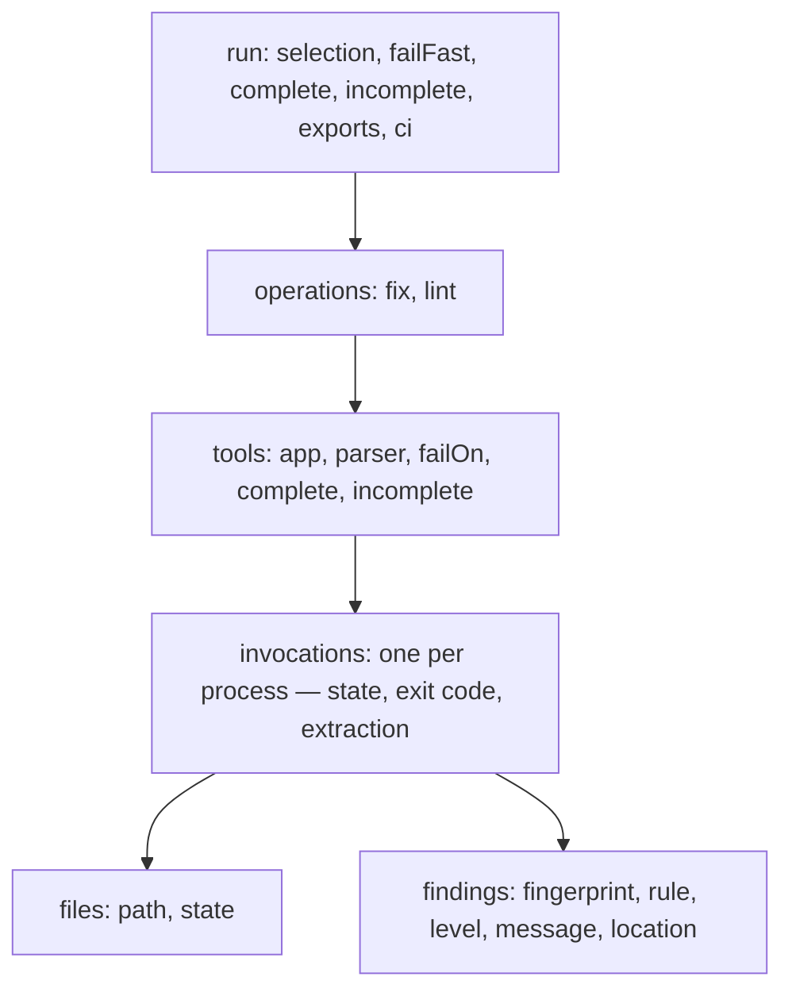
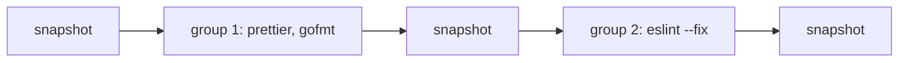

# Reports

> One record of a fix, lint or check run — what it holds, what it never contains, how complete it says it is, and how its findings keep their identity across runs

A report is the record of one `fix`, `lint` or `check` run: which tools ran, on
which files, what they found, and how sure datamitsu is that the list is
complete. Every report format is written from that one record, so two formats of
one run never disagree, and a report is written after a run that failed as well
as after one that passed — the run that fails is the one a pipeline needs to
read.

```bash
datamitsu lint --report json=out/run.json
```

`json` writes datamitsu's own document, `datamitsu.report/1`, which carries
everything the record holds; `markdown` writes the same run for a person — the
tools, the findings the terminal would show and what the run left out; `sarif`
writes it for GitHub code scanning ([Code scanning](#code-scanning)); `junit`,
`codequality`, `checkstyle` and `rdjsonl` write it for the CI systems and
review tools that read test results, code quality reports, Checkstyle and
reviewdog's diagnostics ([Other CI systems](#other-ci-systems)); `history`
appends one line of counts per run to a trend file ([History](#history)). The
flags, the variable twins and the exit codes are in the
[CLI reference](../reference/cli-commands.md#reports).

## What a report holds



- **The run** — what it was asked to cover (`selection`: the whole repository,
  a subdirectory, named files, a `--tools` filter), whether fail-fast was on,
  whether the run is complete, every report it was asked for with its
  status, and the CI job it ran in (`ci`: the `vendor` — empty outside CI —
  and the commit, ref, base branch and pull request number the vendor names,
  as [`facts().ci`](../reference/configuration-api.md#platform-information)
  reads them).
- **Operations** — `fix` and `lint` in the order they ran; `check` writes one
  document holding both. An operation the run never reached is listed with
  `ran: false`. Each lists the tools the planner skipped, with the reason, and
  the tasks the run stopped.
- **Tools** — the app a tool ran as configured (name, kind, pinned version),
  its output parser and the version of the module that read its output, the
  threshold its findings were judged by (`failOn`), and whether that threshold
  was enforced.
- **Invocations** — one per process a task planned: its state (`ran`,
  `cancelled`, `not-started`, `setup-failed`), its exit code, whether and how
  its output was read into findings, the files it answered for and the findings
  it reported. The files a cache answered appear as one `cached` or
  `verdict-hit` invocation of their task.
- **Findings** — the rule, the level, whether it is at or above the threshold
  (`reported`), whether it failed its tool (`gates`) and whether the terminal
  shows it (`shown`, which the annotations, `markdown` and `--output agent`
  follow), the message, where it is — the path relative to the repository
  root, 1-based rows and columns with an exclusive end — and its fingerprint.

Everything is sorted, so one run gives one document byte for byte, and the time
it is stamped with comes from `SOURCE_DATE_EPOCH` when that is set.

## What a report never contains

- **No command line and no environment.** An app is named by its name, kind and
  pinned version; the arguments a tool ran with and the variables it saw stay
  out. (`--explain=json`, a plan for debugging on your own machine, keeps the
  arguments.)
- **No secret the environment names.** Before a report is written, the value of
  every variable — in the environment, and in every app's and operation's `env`
  — whose name contains `TOKEN`, `SECRET`, `PASSWORD` or `CREDENTIAL`, or ends
  in `_KEY`, and that is at least 8 characters long, is replaced by `***`
  wherever it appears. This is best effort: a secret a tool prints that no
  variable holds is not caught.
- **No output of a security tool.** A failed invocation keeps the last 4 KiB of
  its output in the own JSON (`outputTail`), without colour codes and masked —
  except for a tool whose parser module puts it in the `security` category,
  whose output is never kept, nor that of a tool whose parser the run could not
  describe — its module did not load, or does not list it — which may be one.
- **Nothing from a cache.** A report is never stored and never replayed; each is
  written from the run that produced it.

The same holds for the JSON-L stream's events. Under `--verbose` the stream
carries datamitsu's debug log lines too, as `log` events, with what a tool
printed and the arguments it ran with withheld; the console keeps them for the
person who ran the command.

A tool that exits non-zero without a finding its parser could read is not
listed as clean: it gets one `synthetic` finding of level `error` and no
location — `tsc exited 2 without parsable findings`, or
`gitleaks failed (exit 1); output withheld for a security tool` — whose message
carries none of the tool's output.

## How complete a report is

A report that lists no finding for a tool means "clean" only when the tool
covered what the report claims. Every tool is judged on three facts, and each
one that fails adds a reason to its `incomplete` list:

| Fact       | Complete when                                                                                        | Reasons                                                                                                             |
| ---------- | ---------------------------------------------------------------------------------------------------- | ------------------------------------------------------------------------------------------------------------------- |
| scope      | the run covered the whole repository and every task its whole unit                                   | `narrowed-selection`, `partial-unit`                                                                                |
| execution  | every planned task ran to the end                                                                    | `cancelled`, `not-started`, `setup-failed`, `platform-skip`                                                         |
| extraction | every output was read into findings by a parser, or a cache replayed a pass its parser read as clean | `no-extraction`, `parser-unavailable`, `parse-failed`, `truncated`, `unparsed-cache-hit`, `failed-without-findings` |

A complete result in one project says nothing about the projects a narrowed run
left out, which is why scope needs the whole repository. A tool whose output no
parser read — neither a declared one nor the
[fallback](./architecture/parsers.md#three-layers) built into datamitsu — is never
complete (`no-extraction`, or `parse-failed` when a parser was declared): its exit
code says whether it passed, not what it found. Neither is a tool that exited
non-zero while the parser that recognized its output found nothing in it
(`failed-without-findings`): the failure is not in what it printed, and a report
that listed the tool would read it as clean — code scanning would close every
alert the tool had.

A cached pass carries no record of what read the output it stands for, so a
cache hit of a tool without a declared parser is `unparsed-cache-hit` even when
the fallback had read that output clean: warm runs of such a tool are incomplete
until a parser is declared for it.

The run is `complete` when every tool is, every operation ran, and the run left
nothing out: a narrowed selection, a `--tools` filter (the tools it left out are
listed as `selection.excludedTools`; the selected tools can still be complete),
a tool that could not be narrowed, an operation that did not run. A tool
disabled with `skip: true` counts against nothing.

Two rules keep a report from claiming more than it holds:

- **A narrowed run is refused.** A report that lists findings, asked for from
  a run narrowed before it starts — files named, a subdirectory, `--file-scoped`,
  `--tools` — would read as the findings of the repository. The run exits 2
  before anything runs. `--allow-partial` writes it anyway, with every reason in
  the document; it never makes the run complete. `sarif` is written: it leaves
  out every tool whose completeness is not established instead of listing it
  ([Code scanning](#code-scanning)).
- **A report turns fail-fast off.** A run that stopped at the first failing tool
  could not list every finding, so a report runs everything to the end, and a
  report together with an explicit `--fail-fast=true` is refused.

A run can still end up incomplete — a tool cancelled, an output its parser
could not read, a tool without a parser — and a format has to say so. The own
JSON and `markdown` say it themselves, and `sarif` leaves such a tool out. A
format whose shape has no place for the claim — `junit`, `codequality`,
`checkstyle`, `rdjsonl` — is written in full and gets a **completeness
companion** beside it, `<path>.completeness.json`:

```json
{
  "schema": "datamitsu.completeness/1",
  "format": "junit",
  "complete": false,
  "incomplete": [],
  "tools": [
    { "operation": "lint", "name": "eslint", "complete": true, "incomplete": [] },
    { "operation": "lint", "name": "tsc", "complete": false, "incomplete": ["cancelled"] }
  ],
  "exports": []
}
```

Read alone, a report of that format cannot tell a clean run from a tool that did
not cover everything, and a service that compares one run with the last reads a
finding that is missing as fixed. A job checks the companion before it
publishes: `jq -e .complete <path>.completeness.json`. `complete` is true when
every tool the report holds is complete and the run left nothing out; `tools`
names each one, `incomplete` the run-level reasons, and `omitted` counts the
findings the format could not carry, by tool and reason. Every tool that is not
complete also gets one `WARN` line on stderr naming the reports that leave it
out or flag it, and the report's entry in the own JSON's `exports` names its
companion. A report written to stdout has no companion, and its warning says so.

A report left on its path by an earlier run is not deleted: it is the user's
file. A run that is refused, or whose report could not be written, leaves it
there, so a pipeline that uploads the report whatever the outcome removes it
first — then an old report cannot pass for the new one — and fails on the exit
code of the run:

```yaml
- run: rm -f out/run.json
- run: datamitsu lint --report json=out/run.json
- if: always()
  uses: actions/upload-artifact@v4
  with:
    name: datamitsu-report
    path: out/run.json
    if-no-files-found: warn
```

The job fails on the lint step's exit code, and the upload step runs anyway. A
tool failure (1) outranks a report that could not be written (5), so a missing
file on a failed step is reported by the upload, and by the step's own
`error: report json: …` line.

## In GitHub Actions

CI runs `lint`: `fix` and `check` change the working tree, which a pipeline has
no one to review. A job that annotates a pull request, keeps every finding and
fails on the exit code of the run:

```yaml
jobs:
  lint:
    runs-on: ubuntu-latest
    permissions:
      contents: read
    steps:
      - uses: actions/checkout@v5
        with:
          fetch-depth: 2
      - run: rm -f out/run.json
      - run: datamitsu lint --fail-fast=false --report json=out/run.json
      - if: always()
        uses: actions/upload-artifact@v4
        with:
          name: datamitsu-report
          path: out/run.json
          if-no-files-found: warn
```

- **Annotations need nothing.** In a GitHub Actions job the run prints its
  findings as workflow commands, which GitHub shows in the Checks tab and on the
  changed lines of the pull request
  ([GitHub annotations](../reference/cli-commands.md#github-annotations)).
  GitHub keeps ten of each type per step: the findings in the files the pull
  request touched come first, then one per file, and a notice counts the rest
  and names where they are. Several datamitsu commands in one step
  share those ten.
- **The step summary holds the rest.** The run appends its `markdown` report
  to the job's summary page, as much of it as fits in the 1 MiB GitHub takes
  from a step; `json` holds everything.
- **`fetch-depth: 2`** fetches the base branch's tip, the first parent of the
  merge commit a `pull_request` checks out, which is how the run learns which
  files the pull request touched. Without it the order is the same, less that
  priority, and one `info` line says so.
- **`--fail-fast=false`** runs every tool, so the annotations and the report
  cover the whole repository; the report turns fail-fast off by itself.
- **`if: always()`** uploads the report of the run that failed, which is the one
  worth reading; `rm -f` first keeps an old report from passing for the new one.

A tool's own output never becomes an annotation: the run prints it inside a
`::stop-commands::` region, and a tool that would print its own workflow
commands when it sees `GITHUB_ACTIONS` does not see it
([Tool Environment](../reference/tool-environment.md)). The problem matchers of
`actions/setup-go` and `actions/setup-node` still read every line; the only
ones that can match what the run prints are `go` and `eslint-compact`, on a
tool's raw output in their formats, which GitHub then annotates without a
location.

### Code scanning

`--report sarif=<path>` writes the run in SARIF 2.1.0, which GitHub code
scanning keeps as alerts: it shows a finding on the pull request that brings it
in, and closes the alert once a later upload of the tool no longer holds it.

```yaml
jobs:
  lint:
    runs-on: ubuntu-latest
    permissions:
      contents: read
      security-events: write
    steps:
      - uses: actions/checkout@v5
        with:
          fetch-depth: 2
      - run: rm -rf sarif
      - run: datamitsu lint --fail-fast=false --report sarif=sarif/
      # One step per file, each uploaded on its own.
      - if: always() && hashFiles('sarif/datamitsu-1.sarif') != ''
        uses: github/codeql-action/upload-sarif@v4
        with:
          sarif_file: sarif/datamitsu-1.sarif
      - if: always() && hashFiles('sarif/datamitsu-2.sarif') != ''
        uses: github/codeql-action/upload-sarif@v4
        with:
          sarif_file: sarif/datamitsu-2.sarif
```

- **One run per tool, of `lint`.** A file holds one run per tool of the lint
  operation — `check` writes its lint, a `fix` run its fix — because GitHub
  rejects a file with two runs of one tool in one category.
- **A tool that did not cover everything is left out.** An alert is closed when
  the next upload of its tool does not hold it, so a tool whose completeness is
  not established ([How complete a report is](#how-complete-a-report-is)) is
  not written at all, and its alerts stay as they were. The run says so on
  stderr, one line per tool, and the own JSON records it in the report's
  `exports` entry (`omitted`). That holds for a tool that failed without a
  parsable finding too: GitHub closes every alert of a tool whose run holds no
  result, even one whose invocation says it did not succeed. For the same
  reason a narrowed run is not refused: `--tools` writes each selected tool
  that is complete and leaves the others' alerts alone, and named files, a
  subdirectory or `--file-scoped` leave every tool out. GitHub refuses a SARIF
  file without a run, so a report that would hold none is not written at all:
  a file an earlier run left at its path, or its directory's
  `datamitsu-<n>.sarif` files, are removed, the export is recorded as
  `omitted`, a `WARN` line says so, and every alert stays as it is. A tool with
  more than 25 000 results is left out too: GitHub would keep the 5 000 most
  severe and close the alerts of the rest.
- **Twenty tools per file.** GitHub reads at most twenty runs from one file. A
  path that ends in `/` names a directory: `datamitsu-1.sarif`,
  `datamitsu-2.sarif` and so on, twenty tools each, sorted by name, and the
  `datamitsu-<n>.sarif` files an earlier run left there that this one did not
  write are removed. Upload each file in a step of its own: `upload-sarif`
  combines the files of a directory into one upload, which GitHub refuses
  above twenty runs just the same. A configuration of up to twenty tools
  writes `datamitsu-1.sarif` alone, and needs one more step for every twenty
  more. A file, or `-`, for a
  run that plans more than twenty tools exits 2 before anything runs. GitHub
  refuses an upload of more than 10 MB gzipped.
- **The category is in the file.** Every run is written under the category
  `datamitsu` (`automationDetails.id` `datamitsu/`). The upload action's
  `category` input does not change a file that already names one, so a job
  that uploads more than once — a matrix — names its own:
  `--report "sarif=sarif/?category=lint-${{ matrix.os }}"`. Uploads in one
  category replace each other's alerts tool by tool. An alert is one rule at
  one fingerprint, whatever the category: the same finding uploaded under two
  categories is one alert with an instance in each, which stays open until the
  next upload of every one of them leaves it out.
- **Findings keep their alerts.** A result's
  `partialFingerprints.primaryLocationLineHash` is the finding's
  [fingerprint](#fingerprints), the key GitHub matches alerts on from one upload
  to the next; two tools never share one. Columns count code points
  (`columnKind: unicodeCodePoints`) and are left out where the report could not
  convert them. The upload action computes a fingerprint of its own for every
  result and, where it differs from datamitsu's, logs a warning and keeps
  datamitsu's: expect one "Calculated fingerprint … inconsistent" warning per
  result in the upload step's log.
- **What else a run holds.** `ruleId` is the finding's rule, or
  `<tool>/unknown` without one, each rule listed once with its documentation
  link; the tool's app version and official URL; one `invocations` entry per
  process. A finding without a file is a notification of its invocation: code
  scanning shows a result only at a location. A file outside the repository is
  an absolute `file://` URI.

Before turning it on:

- The job needs `security-events: write`. A pull request from a fork gets a
  read-only token and cannot upload.
- A private repository needs GitHub's code scanning licence.
- A tool that is never uploaded again — removed from the configuration,
  renamed (the run is named by the tool's key in the configuration), or skipped
  by a condition — keeps its alerts open. Deleting its analyses
  (`DELETE /repos/{owner}/{repo}/code-scanning/analyses/{id}?confirm_delete`)
  removes them, and their history with them.
- `rm -rf` before the run and `hashFiles` on the upload keep a file an earlier
  step left from passing for this run's, and skip the upload when there is
  nothing to upload: a run refused before it starts (exit 2) writes nothing,
  and neither does one whose every tool is left out. `if: always()` uploads the
  file of a run whose tools failed, which is the one worth reading.

## Other CI systems

Every CI system has a place for what a run found that a log line cannot reach.
Each recipe runs `lint --fail-fast=false`, so every tool runs to the end, and
publishes its report whatever the outcome.

### Test results (JUnit)

`--report junit=<path>` writes the run as JUnit XML, which GitLab, Jenkins,
Azure Pipelines, CircleCI, Buildkite and Bitbucket read as test results. A test
report fails a build on one failed case, so a case fails only where the run
failed:

- **One suite per operation and tool**, named `<operation>/<tool>`, with its
  completeness in `properties`: `complete`, `incomplete`, `cached` (the files a
  cache answered), and the run's `run.complete` and `run.incomplete`. `check`
  gives suites for both operations.
- **One case per file** a tool answered for. A file fails
  (`<failure type="threshold">`) when a finding on it is at or above the
  operation's `failOn` and failed its tool; its findings are the failure's text,
  one per line as `path:row:col: level source(code): message`. Findings below
  the threshold are the case's `<system-out>`, and the file passes. Clean and
  cached files pass, and so does every clean file of a tool that failed.
- **One extra case for each process that failed without such a finding**,
  named after the directory it ran in (`.` for the repository root), with the
  process's ID after it when several of the tool's ran there: a process that
  exited non-zero on findings below the threshold is a `<failure type="exit">`
  listing them — unless a file it answered for already fails on a gating
  finding, which says the same — and one that failed without any is an
  `<error type="exit">`
  carrying the last lines of its output, masked — never a `security` tool's.
  A process that could not be set up is an `<error type="setup">`, and a
  finding without a file is on its process's case too. A failed tsc run over a
  project fails one case, not every file in it.
- **Skipped cases** for what did not run: `cancelled: fail-fast` and
  `not started: fail-fast` for the tasks the run stopped, `not started` for
  one it never reached on its own account (its tool could not be installed),
  `skip: true`,
  `platform-skip` and `narrowed` for the tools the planner skipped, and
  `did not run` for an operation that never started.

The failure count is the number of files that failed the gate, not the number
of findings. A narrowed run refuses the report unless `--allow-partial`, and the
completeness companion is written beside it.

GitLab reads the report from `artifacts:reports:junit`:

```yaml
lint:
  script:
    - rm -rf reports
    - datamitsu lint --fail-fast=false --report junit=reports/junit.xml
  after_script:
    # GitLab reads a test missing from the report as fixed.
    - jq -e .complete reports/junit.xml.completeness.json > /dev/null || rm -f reports/junit.xml
  artifacts:
    when: always
    reports:
      junit: reports/junit.xml
    paths:
      - reports/
```

Every other consumer compares runs or fails builds on what the report lists
too, so each recipe publishes it only when its companion says it is complete.
Jenkins' JUnit plugin is in the recipe under [Checkstyle](#checkstyle).

Azure Pipelines publishes it with `PublishTestResults@2`:

```yaml
steps:
  - script: rm -rf reports
  - script: datamitsu lint --fail-fast=false --report junit=reports/junit.xml
  - script: jq -e .complete reports/junit.xml.completeness.json || rm -f reports/junit.xml
    condition: always()
  - task: PublishTestResults@2
    condition: always()
    inputs:
      testResultsFormat: JUnit
      testResultsFiles: reports/junit.xml
```

CircleCI reads every JUnit file under the directory `store_test_results` names:

```yaml
steps:
  - run: rm -rf reports
  - run: datamitsu lint --fail-fast=false --report junit=reports/datamitsu/junit.xml
  - run:
      when: always
      command: jq -e .complete reports/datamitsu/junit.xml.completeness.json || rm -f reports/datamitsu/junit.xml
  - store_test_results:
      path: reports
```

Buildkite Test Engine takes it through the test collector plugin, which needs
the suite's `BUILDKITE_ANALYTICS_TOKEN`:

```yaml
steps:
  - command: |
      rm -f junit.xml junit.xml.completeness.json
      status=0
      datamitsu lint --fail-fast=false --report junit=junit.xml || status=$?
      jq -e .complete junit.xml.completeness.json || rm -f junit.xml
      exit "$status"
    plugins:
      - test-collector#v1.12.0:
          files: junit.xml
          format: junit
```

Bitbucket Pipelines reads the files it finds under `test-results/` on its own:

```yaml
pipelines:
  default:
    - step:
        script:
          - rm -rf test-results
          - status=0
          - datamitsu lint --fail-fast=false --report junit=test-results/datamitsu.xml || status=$?
          - jq -e .complete test-results/datamitsu.xml.completeness.json || rm -f test-results/datamitsu.xml
          - exit "$status"
```

### Azure Pipelines and TeamCity

Both read commands from the log, so the run needs no step of its own: under
`TF_BUILD` it logs each error and warning as an issue of the task, under
`TEAMCITY_VERSION` it reports each finding as an inspection and each tool that
failed without one as a build problem.

```yaml
# azure-pipelines.yml
steps:
  - checkout: self
    fetchDepth: 0 # the target branch, for touched-file priority
  - script: datamitsu lint --fail-fast=false --report json=$(Build.ArtifactStagingDirectory)/run.json
    displayName: lint
```

```text
# TeamCity command line build step
datamitsu lint --fail-fast=false
```

- **Azure keeps ten issues of each type per task.** Findings in the files the
  pull request touched come first — they are read from
  `origin/<target branch>`, so fetch it — and a plain line says how many did not
  fit and where they are; `info` and `hint` have no issue type and are left out.
  Publish the JSON report as an artifact for the rest.
- **TeamCity keeps everything.** Inspections appear in the build's Inspections
  tab; a finding without a file cannot be an inspection and is counted instead.
- **No tool can issue a command.** Azure runs `##vso[` wherever it appears in a
  line, TeamCity reads `##teamcity[` the same way. datamitsu rewrites both
  prefixes, with a space, in every line of tool output it prints in that mode —
  one space of difference in a raw line — and TeamCity's results block is also
  wrapped in `disableServiceMessages` … `enableServiceMessages`.

### GitLab Code Quality

`--report codequality=<path>` writes GitLab's Code Quality report, the array
GitLab reads from `artifacts:reports:codequality`, merges across a pipeline's
jobs and compares with the target branch's, to show in a merge request what it
brings in and what it fixes:

```yaml
lint:
  script:
    - rm -f gl-code-quality.json junit.xml *.completeness.json
    - datamitsu lint --fail-fast=false --report codequality=gl-code-quality.json --report junit=junit.xml
  after_script:
    # An incomplete report would show every finding it misses as fixed.
    - |
      for companion in *.completeness.json; do
        jq -e .complete "$companion" > /dev/null || rm -f "${companion%.completeness.json}"
      done
  artifacts:
    when: always
    reports:
      codequality: gl-code-quality.json
      junit: junit.xml
    paths:
      - "*.completeness.json"
```

- One issue per finding of the `lint` operation (`check` writes its lint, a
  `fix` run its fix), every level: `check_name` is `<source>/<rule>`,
  `description` the message, `fingerprint` the finding's
  [fingerprint](#fingerprints), unique in the report. `severity` is `major`
  for an error, `minor` for a warning and `info` for info and hints; datamitsu
  never writes `critical` or `blocker`, which no core level means.
  `categories` is `Security` for a `security` tool and `Style` otherwise.
- `location.path` is relative to the repository root. `positions` carries the
  columns in characters where the report could convert them, `lines` the rows
  where it could not. A finding without a file, and one outside the
  repository, cannot be placed and is left out; the companion counts them
  (`omitted`) and one `WARN` line says so.
- GitLab compares the merged report of the merge request's pipeline with the
  target branch's, so a finding a report misses reads as fixed. A tool that is
  not complete is kept, with the findings it has, and the companion says it is
  not; the `after_script` above keeps GitLab from comparing such a report, and
  from reading tests missing from an incomplete JUnit report as fixed.

### Checkstyle

`--report checkstyle=<path>` writes Checkstyle XML: one `<file>` per file, one
`<error>` per finding of the `lint` operation (fix for a `fix` run), every
level, with `line`, `column` (characters, left out where the report could not
convert it), `severity` (`error`, `warning`, and `info` for info and hints),
`message` and `source` (`<source>/<rule>`). A finding without a file, the
`synthetic` finding of a tool that failed without a parsable one included, is
under `<file name="">`; a file outside the repository keeps its absolute path.

Jenkins' Warnings Next Generation plugin reads it, or the SARIF file, and
compares each build with a reference build to tell new findings from fixed
ones — which is why a narrowed run refuses the report and an incomplete tool is
flagged in the companion rather than left out:

```groovy
stage('Lint') {
  steps {
    sh 'rm -rf reports'
    sh 'datamitsu lint --fail-fast=false --report checkstyle=reports/checkstyle.xml --report junit=reports/junit.xml'
  }
  post {
    always {
      script {
        // An incomplete report would show what it misses as fixed.
        if (sh(returnStatus: true, script: 'jq -e .complete reports/checkstyle.xml.completeness.json') == 0) {
          recordIssues tools: [checkStyle(pattern: 'reports/checkstyle.xml')]
        }
        if (sh(returnStatus: true, script: 'jq -e .complete reports/junit.xml.completeness.json') == 0) {
          junit 'reports/junit.xml'
        }
      }
    }
  }
}
```

`recordIssues tools: [sarif(pattern: 'reports/datamitsu-*.sarif')]` reads the
SARIF files of `--report sarif=reports/` instead. Azure Pipelines shows SARIF
files published as the `CodeAnalysisLogs` build artifact in the Scans tab of
the SARIF SAST Scans Tab extension.

### reviewdog

`--report rdjsonl=<path>` writes reviewdog's rdjsonl, one diagnostic per line:
`message`, `location` (the path, and a range whose columns are UTF-8 bytes with
an exclusive end, as reviewdog counts them, left out where the report could not
convert them), `severity` (`ERROR`, `WARNING`, and `INFO` for info and hints),
`source` (the tool, with its app's official URL) and `code` (the rule and its
documentation). A finding without a file is a line without a location.
reviewdog turns it into review comments on the forge it reports to, filtered to
the lines a change touched:

```bash
rm -f rd.jsonl
status=0
datamitsu lint --fail-fast=false --report rdjsonl=rd.jsonl || status=$?
if [ -f rd.jsonl ]; then
  reviewdog -f=rdjsonl -reporter=github-pr-review < rd.jsonl
fi
exit "$status"
```

The run's exit code is kept for the end, so a lint that fails still gets its
comments — the run whose comments matter most — and still fails the job.

reviewdog itself compares nothing between runs, but the rdjsonl stream lists
findings like the other formats, so a narrowed run refuses it and the
companion is written beside it. Suggested fixes are not written.

## Fingerprints

Every finding carries a `fingerprint`, 64 hexadecimal characters that identify
it across runs, so that a service tracking alerts can tell a finding that stayed
from one that was fixed and one that is new:

```text
fingerprint = sha256("dmfp1" NUL tool NUL rule NUL path NUL lineHash NUL ordinal)
lineHash    = sha256(the finding's first line, without trailing whitespace)
ordinal     = position among the tool's findings with the same rule on the same line
```

- **A line inserted above a finding moves its row, not its fingerprint:** the
  line's text is hashed, not its number.
- **A reworded message changes nothing:** the message is not an input.
- **Two findings of one rule on one line stay two:** the ordinal counts them by
  column, across every process of the tool, so how a tool's work was split into
  processes does not change it. A finding two processes both reported is listed
  once.
- **Two tools never share one:** the tool comes first.
- **Paths are relative to the repository root with `/`**, so one finding has one
  fingerprint on Windows and elsewhere.

When the file cannot be read — it was deleted, or lies outside the repository,
which is never read — the row stands in for the line, and `fingerprintBasis` says `row` instead of
`line`; a finding without a file rests on nothing (`none`). The fingerprint is
SHA-256 rather than a faster hash because it is not an internal key: another
system stores it and compares it with the next upload's.

The columns of a finding are the ones its tool printed, in the unit its parser
declares (`unit`: `utf-8`, `utf-16` or `utf-32`). While the file is still on
disk they are converted into code points (`chars`), UTF-8 bytes (`bytes`) and
UTF-16 units (`utf16`), so a report rendered later needs no source. `precision`
is `exact`; `ascii` when no unit was declared but the line is ASCII, where every
unit counts alike; or `unknown` when there was nothing to convert from, and a
consumer that needs another unit then leaves the column out.

A report settles a finding's ordinal once its tool has finished, across all
of the tool's processes. The fingerprint a finding has while its own process is
judged — before the threshold decides — is counted within that process; the two
agree whenever one process reports the findings of a line, which is every tool
that runs once per file and every tool whose findings name the files it was
given.

## Changed files

A `fix` changes the working tree, and whoever reads its result — an agent that
holds the files in memory, a job that commits the fix — has to know which files.
The report records them: a snapshot of the working tree is taken before the
first group of tools that run together and after every group, and each file
whose state moved between two of them is a change, `created`, `modified`,
`deleted` or `reverted` (a dirty file a formatter restored to what the commit
holds).



The tools of one group ran over disjoint files, so a change between two
snapshots belongs to the tool of that group that was given the file — it is
listed on that invocation — and to the operation when none was. A snapshot is
taken after a group that failed or was cancelled too: a formatter may have
written part of its files.

- **What is observed.** Tracked and untracked files under the repository root,
  as `git status` lists them. Ignored files and the contents of submodules and
  nested repositories are not; a rename is a deletion and a creation.
  `changesScope` says so in the report.
- **What "not observed" means.** Without git, outside a repository, or when a
  status fails, `changesObserved` is `false` with the reason — never an empty
  list that would read as "nothing changed". A `lint` operation takes no
  snapshot (`no-fix-task`).
- **For an agent.** `--output agent` prints
  `fix changed 2 files: src/a.ts, src/b.ts` — read those files again before
  editing them — or `fix changes not observed: <reason>`, after which every file
  the fix could have touched has to be read again.
- **For a person.** The Markdown report and the step summary list the changed
  files under the fix operation.

`--report patch=<path>` writes the diffs the formatters that write their result
on stdout applied, in the order they were applied, as one patch `git apply`
takes. A tool that rewrites files itself leaves no patch; its files are among
the changes with `patch: false`.

The snapshot costs one `git status` per group: on a repository of about 1 800
tracked files, 5–8 ms with a fresh index and about 40 ms when every file's
timestamp moved since the index was written.

## Baselines

A project that adopts a linter with hundreds of findings cannot fix them in the
change that adds it. A baseline lets the run fail only on what is new: it holds
the fingerprints of the findings a run reported, and a later run given it
neither reports those findings nor lets them gate.

```bash
datamitsu lint --report json=out/run.json
datamitsu report baseline out/run.json --output .datamitsu-baseline.json
datamitsu lint --baseline .datamitsu-baseline.json
```

Commit the baseline beside the configuration. A finding is matched by its
[fingerprint](#fingerprints), so it stays baselined when lines are inserted
above it and when its message is reworded; it becomes new when its rule, its
file or the text of its line changes. A baseline made from an incomplete run —
narrowed, a tool cancelled or unread — holds fewer fingerprints: it is written
with a warning and suppresses fewer findings, never more.

**A baseline cannot silence an exit code.** The tool's exit code still gates: a
tool that exits non-zero fails the run whatever the baseline holds, and its
frame shows the baselined findings it failed on. ESLint, golangci-lint and most
linters exit 1 on the findings they print, so for a baseline to make the run
fail only on new findings, the tool has to exit 0 on findings and leave the
decision to the threshold: add its exit-zero flag to the operation's `args` —
`--exit-zero` for Ruff, Flake8 and Pylint, `--issues-exit-code=0` for
golangci-lint — and keep the operation's
[`failOn`](../reference/configuration-api.md#failing-on-findings-failon). The
threshold gates only where the tool's parser module declares the severity
contract; elsewhere a tool that exits 0 passes whatever it found.

**Baselines rot.** A committed baseline hides its findings for as long as it
exists. Regenerate it on purpose — after a sweep that fixed some of them, so it
stops hiding them — never on a schedule, which would bake every new finding in.
`report diff` against the current run shows what it still hides:

```bash
datamitsu report diff .datamitsu-baseline-run.json out/run.json --format markdown
```

A baseline takes a run's own JSON as well, so keeping the run a baseline was
made from lets `report diff` compare it with any later run.

## Comparing two runs

`datamitsu report diff <before.json> <after.json>` compares two own reports by
fingerprint, tool by tool: `new`, `unchanged`, `moved` (another row), `fixed`,
`unknown` and `unobserved`. A finding that disappeared is `fixed` only when the
second run covered the whole repository and the tool was complete in it; when
the tool was cancelled, narrowed or unread it is `unknown`, with the reasons,
because the second run did not look. A tool only one run holds is `unobserved`.
`--format markdown` writes it for a pull request comment. See
[`report diff`](../reference/cli-commands.md#report-diff).

## Rendering a report later

`datamitsu report render` reads a run's own JSON and writes it in a format,
offline, through the same renderers and the same completeness rule:

```bash
datamitsu report render --input out/run.json --format json --output -
```

The document holds everything a renderer needs — the columns in every unit
were converted while the files were on disk — so this works on another machine,
without the checkout, and after the sources changed, and every format comes out
byte for byte as the run wrote it, completeness companion included. A pipeline
can therefore write the own JSON once and publish it in whatever formats its
consumers read:

```bash
datamitsu lint --fail-fast=false --report json=out/run.json
datamitsu report render --input out/run.json --format sarif --output out/sarif/
datamitsu report render --input out/run.json --format codequality --output out/gl-code-quality.json
```

A document of a narrowed run is refused for a format that lists findings unless
`--allow-partial`, as the run would have been — `sarif` is written, without its
incomplete tools — and a document without its completeness fields is read as
incomplete. A companion is written beside `--output`, never on stdout.

## History

A report answers what is wrong now. `history` answers how the numbers move:
each run appends one line to a file you name, `datamitsu.history/1`, and a trend
is whatever you build from those lines — a spreadsheet, a chart, a CI job that
compares the last two.

```bash
datamitsu lint --report history=.datamitsu-history/lint.jsonl
```

A line holds counts and durations, never a finding, a path or the paths a run
was given, so the file can be kept, shared and committed:

```json
{
  "schema": "datamitsu.history/1",
  "startedAt": "2026-09-28T10:00:00Z",
  "datamitsu": { "version": "0.4.0", "configuration": "my config" },
  "ci": { "vendor": "github", "sha": "3f2a…", "ref": "refs/heads/main" },
  "selection": { "mode": "all", "fileScoped": false, "toolsFiltered": false },
  "complete": true,
  "failFast": false,
  "operations": [
    {
      "name": "lint",
      "ran": true,
      "success": true,
      "durationMs": 7900,
      "tools": [
        {
          "name": "eslint",
          "runs": 3,
          "cached": 120,
          "failed": 0,
          "complete": true,
          "incomplete": [],
          "findings": { "error": 0, "warning": 4, "info": 0, "hint": 0 }
        }
      ]
    }
  ]
}
```

(shown indented; the file holds each entry on one line). `runs` counts the
processes a tool ran, `cached` the files a cache answered, `failed` the
invocations that failed, and `findings` every finding by level, whether or not
it was shown.

- **The file is yours.** It is written only where you name it — never under
  datamitsu's cache — created on the first run, and never rewritten: each run
  adds its line in one append, which a local file system keeps whole beside
  another run appending to the same file; on a network file system that is
  best effort.
- **A narrowed run writes it too.** A line lists no finding, so it cannot pass
  for the findings of the repository: its `selection` and `complete` say what
  the run covered, and `--allow-partial` is not needed. For the same reason it
  leaves fail-fast as it is — a line of a run that stopped at the first failure
  says `failFast: true` and `complete: false`.
- **Compare like with like.** Counts of a narrowed or incomplete run are not
  the repository's. A tool without a parser of its own is complete on a cold
  run and `unparsed-cache-hit` on a warm one, where the cache replayed a pass
  no parser read: that is the cache at work, not a regression, which the
  tool's `incomplete` reasons tell apart.

## Findings as they happen

Under `--log-format jsonl` the same findings arrive as `diagnostic` events, one
per finding, once its tool has finished — by default those at or above the
operation's `failOn`, every one with `--events diagnostics=all`. Each carries
the finding's fingerprint, the same one the report holds. See
[Run events](../reference/cli-commands.md#run-events).
