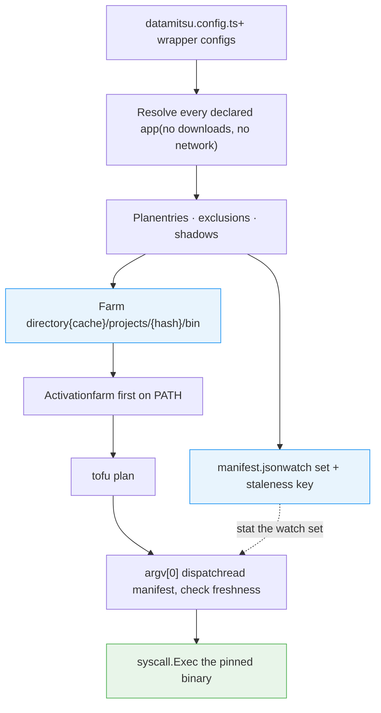

# Source Mode

> Put a project's declared toolchain on PATH for the current shell, so every tool runs at the version the repository pins — with lazy downloads and invisible branch switching

Source mode makes the project's declared toolchain available as ordinary commands on `PATH`. After activation `tofu`, `terragrunt` and `prettier` are the versions **this repository pins**, not whatever happens to sit in `/usr/local/bin`.

```bash
eval "$(datamitsu source bash)"      # bash / zsh
tofu plan                            # the pinned version, not the system one
```

Activation is a per-shell act. It downloads nothing, costs a manifest read when the farm is already current, and is safe to put in a shell rc file or a tmux profile.

## Activating

```bash
# bash / zsh
eval "$(datamitsu source bash)"
eval "$(datamitsu source zsh)"
```

```fish
# fish
datamitsu source fish | source
```

The emitted code does three things and nothing else: it exports `DATAMITSU_ROOT` and `DATAMITSU_FARM`, it puts the farm directory first on `PATH` (removing any earlier copy of itself, so re-activating never duplicates the entry), and it flushes the shell's command hash table. That is the entire contract — stdout carries shell code and nothing else, so the output is always safe to `eval`.

```bash
$ datamitsu source bash
export DATAMITSU_ROOT=$'/home/you/infra'
export DATAMITSU_FARM=$'/home/you/.cache/datamitsu/cache/projects/02982286cbc2c265e43806925d7f4907/bin'
__datamitsu_path=":$PATH:"
__datamitsu_path="${__datamitsu_path//:"$DATAMITSU_FARM":/:}"
__datamitsu_path="${__datamitsu_path#:}"
__datamitsu_path="${__datamitsu_path%:}"
PATH="$DATAMITSU_FARM${__datamitsu_path:+:$__datamitsu_path}"
export PATH
unset __datamitsu_path
hash -r
```

Warnings — tools not downloaded yet, system binaries the farm shadows — go to **stderr**, never into the stream being evaluated. A repository's own config JS can `console.log`; that output is redirected to stderr too, so a config cannot inject text into your shell.

Source mode requires a project. Run it inside a repository whose git root holds a `datamitsu.config.{js,mjs,ts}`, or name one explicitly with the global `--config` flag. Outside a project it exits non-zero and writes nothing to stdout, rather than silently activating the small built-in default config.

## How it works



### The farm

Activation bakes a **farm**: one directory holding one entry per declared app, plus the manifest describing it.

```text
~/.cache/datamitsu/cache/projects/{XXH3-128(gitRoot)}/
  bin/
    tofu         -> {abs path to datamitsu}
    terragrunt   -> {abs path to datamitsu}
    prettier     -> {abs path to datamitsu}
    tflint       -> {abs path to datamitsu}     # not downloaded yet
  manifest.json
  lock
```

Every entry is a symlink to the datamitsu binary itself — a **shim**. When the shell execs `tofu`, datamitsu starts, sees it was invoked under a farm name, reads the manifest, and `syscall.Exec`s the real target. One process, not two: signals, exit codes and stdin/stdout wiring are the target's, and your argv is passed through **verbatim** (unlike `datamitsu exec`, which needs a `--` separator because cobra parses the flags first).

The farm is baked atomically into a sibling temp directory and renamed into place, under a per-root advisory lock, so ten tmux panes activating at once cannot observe a half-built directory.

### Branch switching is invisible

This is the property that shapes the whole design. Inside an already-activated shell:

```bash
git checkout v2 && tofu version    # runs v2's pinned tofu
git checkout v1 && tofu version    # runs v1's pinned tofu
```

No re-activation, no prompt hook. That matters because a prompt hook — how `mise activate` and direnv work — fires when a prompt renders, and the line above renders no prompt between the two commands. The hook would never run and the **old binary would execute silently, exiting 0 with plausible output**. The same applies inside `make`, inside a git hook, and inside `tmux new-window 'tofu plan'`.

Instead, the shim revalidates on every invocation. The manifest carries a **watch set**: every file in the config chain (including `pnpm-lock.yaml` and any declared before-configs) with its mtime, size and existence, plus `.git/HEAD`. Comparing them is a handful of `lstat` calls — microseconds — not a config load. `.git/HEAD` is load-bearing rather than belt-and-braces: a branch that _deletes_ `datamitsu.config.ts` leaves no mtime to compare, and `HEAD` is rewritten by a checkout but not by a commit, so it causes no spurious re-bakes.

When the comparison fails, the shim takes the lock, re-bakes once, and execs the new target.

### Downloads are lazy

Activation downloads nothing, even for tools that have never been fetched. A declared app that is not in the store yet gets a farm entry marked not-installed; the first time you actually run it, the shim installs it, re-resolves, and execs. Subsequent invocations take the steady-state path.

This is why activation is cheap enough for a shell rc file: a repository declaring a hundred tools costs the same at activation time as one declaring three.

Activation also skips the config load entirely when the baked manifest still matches the tree — the same freshness comparison the shim makes — and renders the shell code from the manifest it reads back. Only an activation that finds a changed tree pays a full resolve. Passing `--config` explicitly always re-resolves: the manifest's watch set describes the config chain that baked it, and it cannot speak for a file it has never seen.

### A declared name never falls through

If a name is declared for this project but cannot be resolved for the current tree, the shim **exits 127** naming the app, the root, and `datamitsu source status`. It never searches the rest of `PATH`.

That is deliberate and it is the single most important failure-mode decision in the feature. The alternative — falling through to a stale `/usr/local/bin/terragrunt` — exits 0 and prints plausible output, which is strictly worse than not shipping source mode at all. For the same reason, a farm baked for a different repository is never used implicitly: `cd` into a repository you have never activated and a tool name exits 127 telling you to run `datamitsu source` there. Baking it implicitly would mean evaluating that repository's JavaScript merely because you typed a tool name; explicit activation is the act of trust.

### What is deliberately excluded

Some declared names never become farm entries. They appear in `datamitsu source status` under `excluded` **with a reason** — a name that silently does not appear would be undebuggable.

| Excluded                                   | Reason                                                                                                                           |
| ------------------------------------------ | -------------------------------------------------------------------------------------------------------------------------------- |
| `shell` apps                               | A shell app resolves its command through the **inherited** `PATH`. Shimming one would make it call itself, recursively, forever. |
| `sudo`, `su`, `doas`, `sudoedit`           | Privilege boundaries are not something a project config gets to redefine.                                                        |
| `sh`, `bash`, `zsh`, `fish`, `dash`, `env` | Shimming the interpreter that runs the shim is a loop.                                                                           |
| `ssh`, `scp`, `sftp`, `git`                | Too load-bearing to redirect from a repository's own config.                                                                     |
| `datamitsu`                                | A shimmed `datamitsu` turns the shim's own installer spawn into an infinite `exec` loop.                                         |

App names themselves are validated as filesystem entries: `^[A-Za-z0-9][A-Za-z0-9._-]{0,63}$`, no path separators, no Windows reserved device names, and no two names that differ only by case (macOS filesystems would collapse them into one file).

## Inspecting the farm

`datamitsu source status` is the first command to run when a tool is missing or resolves to the wrong version.

```bash
$ datamitsu source status
root:     /home/you/infra
farm:     /home/you/.cache/datamitsu/cache/projects/02982286cbc2c265e43806925d7f4907/bin
manifest: /home/you/.cache/datamitsu/cache/projects/02982286cbc2c265e43806925d7f4907/manifest.json (fresh)

entries (4):
  prettier    shim  installed
  terragrunt  shim  installed
  tflint      shim  not installed
  tofu        shim  installed

excluded (1):
  rustfmt  shell apps resolve through the inherited PATH

shadowed (2):
  terragrunt  /usr/local/bin/terragrunt
  tofu        /opt/homebrew/bin/tofu
```

The manifest state is one of `fresh`, `stale`, `missing` or `unreadable`. All three non-fresh states mean the same re-bake, but they tell you very different things: `missing` is "never activated here" — the state the shim reports as exit 127 — while `unreadable` is a corrupted farm.

`--json` emits the same information as one document and writes no human text to stdout; warnings still go to stderr. `status` resolves and reports — it never downloads and never re-bakes, so it can be used to observe a broken farm rather than silently repairing the thing it is meant to describe.

## `which` shows the farm, not the store

```bash
$ which tofu
/home/you/.cache/datamitsu/cache/projects/02982286cbc2c265e43806925d7f4907/bin/tofu
```

Every farm entry points at the datamitsu binary, so `which`, `type -a` and `command -v` all report the farm path and tell you nothing about which version will actually run. There is no way around this: the indirection is exactly what makes branch switching work, and a direct symlink into the store — which `which` would resolve usefully — has nowhere to put the freshness check.

`datamitsu source status` prints the real target for every entry, and `--json` carries it in the `command` field. That is the answer to "which binary is this actually going to run".

## The performance contract

Honest numbers, measured on an Apple M1 Max against a 111-app config:

| Situation                                               | Cost                                                                |
| ------------------------------------------------------- | ------------------------------------------------------------------- |
| Activation, farm already current                        | **~15 ms**. Reads the manifest back; downloads nothing.             |
| Activation, after a config change or branch switch      | **~110 ms**, once. One full config load, then back to ~15 ms.       |
| Steady-state tool invocation                            | **~10–12 ms** on top of the tool's own startup.                     |
| First invocation after a config change or branch switch | **~145 ms**, once. One full config load, then back to steady state. |
| First invocation of a tool never downloaded             | The download, once.                                                 |

The ~10–12 ms is the shim process itself, and it is paid by every tool regardless of kind. An earlier design gave installed `binary` apps a direct store symlink for a genuine 0 ms — that was withdrawn, because a symlink runs none of datamitsu's code and therefore keeps executing the previous branch's version after a checkout, silently. The 10 ms buys the guarantee that the version you get is the version the repository pins.

The per-invocation freshness check itself is not the cost: it is a handful of `lstat` calls and does not appear above process startup at all.

## When re-baking is not automatic

The staleness check compares the config chain's **files**. A config that decides what it produces from something other than those files can change its answer without changing anything the check can see.

The known hole is `facts().env`: config JS receives the whole environment, so a config that branches on a variable outside datamitsu's own `DATAMITSU_*` namespace will not invalidate the farm when that variable changes.

```bash
datamitsu source refresh --force
```

`--force` re-bakes unconditionally and is the documented escape hatch for exactly that case. Plain `datamitsu source refresh` re-bakes only when the tree actually changed, exits 0 either way, prints its summary to stderr, and downloads nothing — so it is safe to call from the same shell function that runs the activation.

:::note
Closing this hole soundly needs read-instrumentation inside the JavaScript VM, so datamitsu can fingerprint the variables a config actually read rather than guessing. That is deliberately deferred; `--force` is the answer until then.
:::

## See also

- [`source` command reference](/docs/reference/cli-commands#source) — every flag, in detail
- [Binary Management](/docs/guides/binary-management) — how the content-addressed store makes two branches' versions coexist
- [Supply Chain Security](/docs/guides/supply-chain-security) — the hash verification that happens at download time, not on this path
