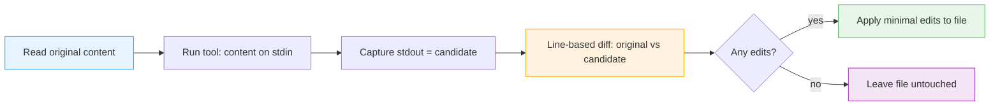

# Tooling System

> Understanding the fix, lint, and check operations in datamitsu

datamitsu orchestrates your development tools (linters, formatters, type checkers) through a unified system. You define tool operations in your configuration, and datamitsu handles file discovery, task planning, parallel execution, and output formatting.

:::tip Deep Dive
For a deep dive into task planning and execution, see [Architecture](./architecture/index.md).
:::

## Operations

datamitsu supports three operations that you run through CLI commands:

| Command           | Operation | Purpose                                           |
| ----------------- | --------- | ------------------------------------------------- |
| `datamitsu fix`   | fix       | Auto-fix code issues (formatting, import sorting) |
| `datamitsu lint`  | lint      | Report code issues without modifying files        |
| `datamitsu check` | check     | Run fix then lint in sequence                     |

`datamitsu check` is the most common command -- it fixes what it can, then reports remaining issues. If fix fails, lint is skipped.

## Defining Tools

Tools are defined in the `tools` record of your configuration. Each tool has a name and operations:

```javascript
const tools = {
  eslint: {
    name: "ESLint",
    projectTypes: ["npm-package"],
    operations: {
      fix: {
        app: "eslint",
        args: ["--fix", "{files}"],
        scope: "per-project",
        globs: ["**/*.{js,ts,jsx,tsx}"],
      },
      lint: {
        app: "eslint",
        args: ["{files}"],
        scope: "per-project",
        globs: ["**/*.{js,ts,jsx,tsx}"],
      },
    },
  },
  "golangci-lint": {
    name: "golangci-lint",
    projectTypes: ["golang-package"],
    operations: {
      lint: {
        app: "golangci-lint",
        args: ["run", "--timeout", "5m"],
        scope: "repository",
        globs: ["**/*.go"],
      },
    },
  },
};
```

## Scopes

Tools operate at different scopes depending on how they process files:

### Per-Project Scope (with file batching)

The tool runs once per detected project and receives a batch of matching file paths. datamitsu discovers files (by extension), groups them by project, and passes them to the tool:

```javascript
prettier: {
  name: "Prettier",
  operations: {
    fix: {
      app: "prettier",
      args: ["--write", "{files}"],
      scope: "per-project",
      globs: ["**/*.{js,ts,css,md}"],
    },
    lint: {
      app: "prettier",
      args: ["--check", "{files}"],
      scope: "per-project",
      globs: ["**/*.{js,ts,css,md}"],
    },
  },
}
```

The `{files}` placeholder expands to the list of matching files.

### Per-Project Scope (without file lists)

The tool runs once per detected project directory, without receiving file lists:

```javascript
tsc: {
  name: "TypeScript",
  projectTypes: ["npm-package"],
  operations: {
    lint: {
      app: "tsc",
      args: ["--noEmit"],
      scope: "per-project",
      globs: ["**/*.{ts,tsx}"],
    },
  },
}
```

In a monorepo, this runs `tsc` separately in each directory that has a `package.json`.

### Repository Scope

The tool runs once from the git root, regardless of monorepo structure:

```javascript
"golangci-lint": {
  name: "golangci-lint",
  projectTypes: ["golang-package"],
  operations: {
    lint: {
      app: "golangci-lint",
      args: ["run"],
      scope: "repository",
      globs: ["**/*.go"],
    },
  },
}
```

## Exclude Patterns

Use `excludeGlobs` to remove files from a tool's matched set. The patterns use doublestar syntax (`*`, `**`, `?`, `[...]`, `{alt1,alt2}`) — the same as `globs`. The `!` negation prefix is not supported; use `excludeGlobs` instead.

```javascript
prettier: {
  name: "Prettier",
  operations: {
    fix: {
      app: "prettier",
      args: ["--write", "{files}"],
      scope: "per-project",
      globs: ["**/*.{js,ts,css,md}"],
      excludeGlobs: ["**/*.generated.*", "**/vendor/**"],
    },
  },
}
```

Filtering order: `globs` (include) → `excludeGlobs` (exclude) → subdirectory scope restriction → `.datamitsuignore` (per-tool disable).

`globs` is optional. Omit it for tools that handle their own file discovery (e.g. `golangci-lint run`, `eslint .`) — the tool runs without a file list. `excludeGlobs` only narrows the set of files datamitsu matches via `globs`; it has no effect when `globs` is empty, because the tool, not datamitsu, decides which files to read.

## Template Placeholders

Tool operation arguments support placeholders that datamitsu resolves before execution:

| Placeholder   | Description                            |
| ------------- | -------------------------------------- |
| `{file}`      | Single file path (per-file scope)      |
| `{files}`     | Expands to separate arguments per file |
| `{root}`      | Git repository root                    |
| `{cwd}`       | Per-project working directory          |
| `{toolCache}` | Per-project, per-tool cache directory  |

See the [Template Placeholders reference](/docs/reference/template-placeholders) for detailed usage.

## Per-Operation Environment Variables

Each operation can set environment variables:

```javascript
operations: {
  lint: {
    app: "golangci-lint",
    args: ["run"],
    scope: "per-project",
    globs: ["**/*.go"],
    env: {
      "GOLANGCI_LINT_CACHE": "{toolCache}",
    },
  },
}
```

Environment variables are merged in layers: OS env -> color hints -> app env -> operation env. Later layers override earlier ones.

## Parallel Execution

datamitsu runs tools in parallel across projects. The maximum number of parallel workers is controlled by `DATAMITSU_MAX_PARALLEL_WORKERS` (default: `max(4, floor(NumCPU * 0.75))`, capped at 16).

## Fail-Fast Behavior

When a tool fails, datamitsu immediately cancels all remaining tasks:

1. The failing tool's error is captured
2. A cancellation signal is sent to prevent new tasks from starting
3. Already-running processes are cleaned up via process group signals
4. Only the independent failure is shown -- cascading cancellations are filtered out

This means you see the actual error without noise from tasks that were cancelled as a side effect.

## Output Handling

datamitsu follows a single-print-layer rule:

- Tool executors capture all stdout/stderr silently into results
- The runner is the only component that prints output to the user
- Failed tools show a structured error block with: tool name, scope, directory, command, exit code, and captured output

## Formatting (stdin → stdout → diff)

Most fix tools mutate files in place. A **formatter** that reads a document on
standard input and writes the formatted result to standard output uses a
different contract: datamitsu feeds the file content in, captures the formatted
output, computes a **minimal line-based diff** in the core, and applies only the
changed lines back to the file.

Opt in with two operation fields:

- `input: "stdin"` — pipe the target file's content to the tool's standard input
- `output: "stdout"` — capture the tool's stdout (kept apart from stderr) as the
  candidate new file content

```javascript
// BAD: a stdin/stdout formatter routed through the default in-place vehicle.
// It never receives the file, and its formatted output is swallowed into the
// report instead of being written back.
const tools = {
  shfmt: {
    name: "shfmt",
    operations: {
      fix: { app: "shfmt", args: ["{file}"], scope: "per-file" },
    },
  },
};

// GOOD: feed content on stdin, capture stdout, let the core diff + apply.
const tools = {
  shfmt: {
    name: "shfmt",
    operations: {
      fix: {
        app: "shfmt",
        args: [], // tool reads stdin, writes the formatted document to stdout
        scope: "per-file",
        input: "stdin",
        output: "stdout",
      },
    },
  },
};
```

The flow per file:



Key properties:

- **Minimal edits.** Changing one line in a 2000-line file touches only that
  line, not the whole file.
- **No-op is free.** If the formatted output equals the original, there are no
  edits and the file (including its mtime) is left untouched.
- **Diff lives in the core**, not the tool — the same diff-in-core contract is
  reused by the editor formatting path later.

The diff itself is documented under
[WASM Output Parsers → diff-in-core](./architecture/parsers.md#diff-in-core-formatting).

## Filtering

You can narrow what datamitsu processes:

### By Tool

Run only specific tools:

```bash
datamitsu check --tools eslint,prettier
```

### By Scope

Run only file-scoped tools:

```bash
datamitsu check --file-scoped
```

### By Directory

When you run datamitsu from a subdirectory, it automatically restricts scope:

- Repository-scope tasks are skipped entirely
- Per-project tasks run only for projects within the subdirectory
- Per-file tasks process only files within the subdirectory

## Explain Mode

Use `--explain` to see what datamitsu would run without executing anything:

```bash
datamitsu check --explain
```

This shows the planned tasks, matched files, and commands that would be executed.

## Ignore Rules

You can disable specific tools for certain files or directories using `.datamitsuignore` files or config-defined ignore rules. See the [Ignore Rules reference](/docs/reference/ignore-rules) for details.

## Monorepo Support

datamitsu is designed for monorepos with multiple projects. Each project gets:

- Its own tool execution with isolated working directory
- Its own cache namespace at `~/.cache/datamitsu/projects/{hash}/cache/{projectPath}/{toolName}/`
- Independent results and error reporting

See the [Core Concepts](/docs/getting-started/core-concepts#monorepo-support) page for more on monorepo architecture.

## Bundled Operations

datamitsu includes built-in lint and fix operations for its own file formats:

- `.datamitsuignore` files are automatically formatted during fix operations
- `.datamitsuignore` files are validated during lint operations (unknown tool names produce warnings)

These bundled operations run before your configured tools.
