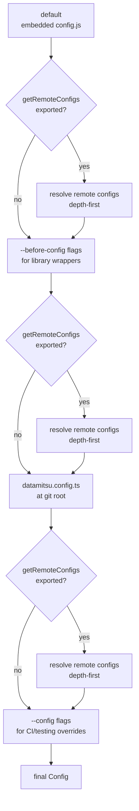

# Core Concepts

datamitsu is built around five core concepts: binary management, runtime management, managed configs, the tooling system, and configuration layers.

## Binary Management

datamitsu downloads, verifies, and caches tool binaries per platform. Every binary must have a SHA-256 hash — datamitsu refuses to download anything without one.

Binaries are cached at `~/.cache/datamitsu/store/.bin/{name}/{configHash}` and reused across runs. The cache key is derived from the binary info, OS, and architecture, so changing a version or hash automatically downloads the new version.

Supported archive formats include: `tar.gz`, `tar.xz`, `tar.bz2`, `tar.zst`, `zip`, and raw binaries.

### App Types

datamitsu supports five types of applications:

| Type     | Description                                 | Example Tools                       |
| -------- | ------------------------------------------- | ----------------------------------- |
| `binary` | Self-managed binaries with URLs and hashes  | golangci-lint, hadolint, shellcheck |
| `uv`     | Python packages via managed UV runtime      | yamllint, ruff                      |
| `fnm`    | npm packages via FNM-managed Node.js + PNPM | eslint, prettier, spectral          |
| `jvm`    | JVM applications via managed JDK            | openapi-generator-cli               |
| `shell`  | Shell commands with custom environment      | custom scripts                      |

## Runtime Management

For tools that need a language runtime (Python, Node.js, Java), datamitsu manages the runtime itself. This provides complete isolation — each app gets its own environment with pinned dependencies.

### How Runtimes Work

1. **Managed mode** — datamitsu downloads the runtime binary (UV, FNM, or JDK) with hash verification
2. **System mode** — Uses a runtime already installed on your system

Each runtime-managed app gets an isolated directory at `~/.cache/datamitsu/store/.apps/{runtime}/{app}/{hash}/`. The hash includes the runtime config, app config, OS, and architecture, so any change produces a fresh environment.

### Runtime Types

- **UV** (Python) — Downloads UV, optionally pins a Python version, creates an isolated project environment with `pyproject.toml` + `uv sync`
- **FNM** (Node.js) — Downloads FNM, installs a specific Node.js version, downloads PNPM from npm registry, runs `pnpm install` in isolated app directories
- **JVM** (Java) — Downloads Temurin JDK, extracts the full JDK tree, downloads JAR files with hash verification, executes via `java -jar`

### Lock Files

FNM and UV apps support lock files (`pnpm-lock.yaml` and `uv.lock`) for reproducible installations. Lock file content can be embedded in config using brotli compression.

Generate a lock file:

```bash
datamitsu config lockfile <appName>
```

## Managed Configs

datamitsu can distribute configuration files from runtime-managed apps to your project via symlinks in a `.datamitsu/` directory at your git root.

Apps declare what files they expose through `Links`:

```typescript
"eslint-config": {
  fnm: {
    packageName: "@company/eslint-config",
    binPath: "node_modules/.bin/eslint",
    version: "1.0.0",
  },
  links: {
    "eslint-config": "dist/eslint.config.js",
  },
}
```

After running `datamitsu init`, a symlink is created at `.datamitsu/eslint-config` pointing to the file inside the app's install directory. Your project configs can then reference it:

```typescript
// eslint.config.ts
import config from "./.datamitsu/eslint-config";
export default config;
```

The `tools.Config.linkPath()` and `tools.Path.forImport()` JS APIs help generate correct relative paths in config files.

## Tooling System

datamitsu runs **fix** and **lint** operations on your code. Tools are configured with glob patterns, scope, and commands.

### Scopes

- **per-file** — Tool runs once per matched file (e.g., `hadolint {file}`)
- **per-project** — Tool runs once per detected project in a monorepo (e.g., `eslint {files}`)
- **repository** — Tool runs once from git root (e.g., `golangci-lint` with `scope: repository`)

### Operations

```typescript
const tools = {
  eslint: {
    name: "ESLint",
    operations: {
      fix: {
        app: "eslint",
        args: ["--fix", "{files}"],
        scope: "per-project",
        globs: ["**/*.{ts,tsx,js,jsx}"],
      },
      lint: {
        app: "eslint",
        args: ["{files}"],
        scope: "per-project",
        globs: ["**/*.{ts,tsx,js,jsx}"],
      },
    },
    projectTypes: ["npm-package"],
  },
};
```

### Template Placeholders

Tool arguments support placeholders that resolve at execution time:

| Placeholder   | Resolves To                           |
| ------------- | ------------------------------------- |
| `{file}`      | Single file path (per-file scope)     |
| `{files}`     | Separate arguments per file           |
| `{root}`      | Git repository root                   |
| `{cwd}`       | Per-project working directory         |
| `{toolCache}` | Per-project, per-tool cache directory |

### Ignore Rules

Use `.datamitsuignore` files to disable specific tools for matching file patterns:

```
vendor/**/*: golangci-lint, gofmt
*.generated.ts: eslint, prettier
```

## Configuration Layers

datamitsu loads configuration in layers, each receiving the previous result:



Each config file must export `getMinVersion()` (minimum datamitsu version, checked before loading) and `getConfig(prev)` (receives the previous layer and returns a new config). This enables inheritance and progressive customization while ensuring version compatibility.

### Remote Configs

Any config can declare parent configs it inherits from:

```typescript
/// <reference path=".datamitsu/datamitsu.config.d.ts" />

function getRemoteConfigs() {
  return [
    {
      url: "https://example.com/shared-base.ts",
      hash: "abcdef1234567890abcdef1234567890abcdef1234567890abcdef12345678",
    },
  ];
}
globalThis.getRemoteConfigs = getRemoteConfigs;
```

Remote configs require a SHA-256 hash (mandatory) and are cached locally; cache validity is determined by hash match (no TTL).

## Monorepo Support

datamitsu is designed for monorepos. It detects project boundaries by looking for markers like `package.json`, `go.mod`, `Cargo.toml`, and `pyproject.toml`.

Each project gets:

- **Isolated cache** at `~/.cache/datamitsu/projects/{hash}/cache/{projectPath}/{toolName}/`
- **Scoped tool execution** in the project's working directory
- **Independent configuration** via managed config links

When running from a subdirectory, datamitsu restricts its scope to projects within that subtree.

## Next Steps

- [Configuration Guide](../guides/configuration.md) — Deep dive into config files and options
- [Binary Management Guide](../guides/binary-management.md) — Managing tool binaries in detail
- [Runtime Management Guide](../guides/runtime-management.md) — UV, FNM, and JVM runtimes
