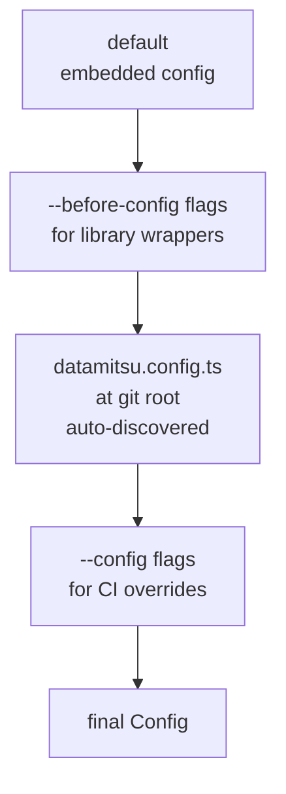

# Quick Start

This guide walks you through setting up datamitsu in a project, downloading tools, and running them.

## 1. Create a Configuration File

datamitsu looks for a configuration file at your git root. Create one of:

- `datamitsu.config.ts` (TypeScript — recommended)
- `datamitsu.config.js` (JavaScript)
- `datamitsu.config.mjs` (ES modules)

Here's a minimal example that adds [hadolint](https://github.com/hadolint/hadolint) (a Dockerfile linter):

```typescript
/// <reference path=".datamitsu/datamitsu.config.d.ts" />

// datamitsu.config.ts
function getConfig(prev) {
  return {
    ...prev,
    apps: {
      ...prev.apps,
      hadolint: {
        binary: {
          binaries: {
            linux: {
              amd64: {
                url: "https://github.com/hadolint/hadolint/releases/download/v2.12.0/hadolint-Linux-x86_64",
                hash: "56de6d5e5ec427e17b74fa48d51271c7fc0d61571c37f4a4c87c04f911dc5f94",
                contentType: "binary",
              },
            },
            darwin: {
              amd64: {
                url: "https://github.com/hadolint/hadolint/releases/download/v2.12.0/hadolint-Darwin-x86_64",
                hash: "911006e5fe41981c319cf4ef331d12bd1c02b594e4a1e9a4b1dbe5fbab0e5b5c",
                contentType: "binary",
              },
              // arm64: no native ARM64 binary; omit or use x86_64 via Rosetta 2
            },
          },
        },
      },
    },
    tools: {
      ...prev.tools,
      hadolint: {
        name: "Hadolint",
        operations: {
          lint: {
            app: "hadolint",
            args: ["{file}"],
            scope: "per-file",
            globs: ["**/Dockerfile", "**/Dockerfile.*"],
          },
        },
      },
    },
  };
}

globalThis.getConfig = getConfig;
globalThis.getMinVersion = () => "0.0.1";
```

Each binary entry requires a `url` and a `hash` (SHA-256). datamitsu refuses to download any binary without a hash.

## 2. Initialize the Project

Run `init` from your git root to download all configured tools:

```bash
datamitsu init
```

This downloads and verifies binaries, installs runtime-managed apps, and creates any managed config symlinks in `.datamitsu/`.

Use `--all` to also download optional tools:

```bash
datamitsu init --all
```

## 3. Execute a Tool

Run any managed tool directly:

```bash
datamitsu exec hadolint -- Dockerfile
```

The `--` separates datamitsu arguments from the tool's arguments.

## 4. Run Checks

Run all configured lint and fix operations:

```bash
# Run fix then lint in sequence
datamitsu check

# Run only linting
datamitsu lint

# Run only auto-fixes
datamitsu fix
```

## 5. Set Up Project Configs

Generate configuration files (like `.gitignore` entries, lefthook configs, etc.) for your project type:

```bash
datamitsu setup
```

This detects your project type and generates appropriate configuration files.

## Configuration Layers

datamitsu loads config in layers, each extending the previous:



Every config must export `getMinVersion()` (returns the minimum datamitsu version required) and `getConfig(prev)` (receives the previous layer's config and returns a new config that extends or overrides it).

## Next Steps

- [Core Concepts](./core-concepts.md) — Understand binary management, runtimes, and managed configs
- [Configuration Guide](../guides/configuration.md) — Deep dive into configuration options
- [CLI Commands Reference](../reference/cli-commands.md) — Full command documentation
