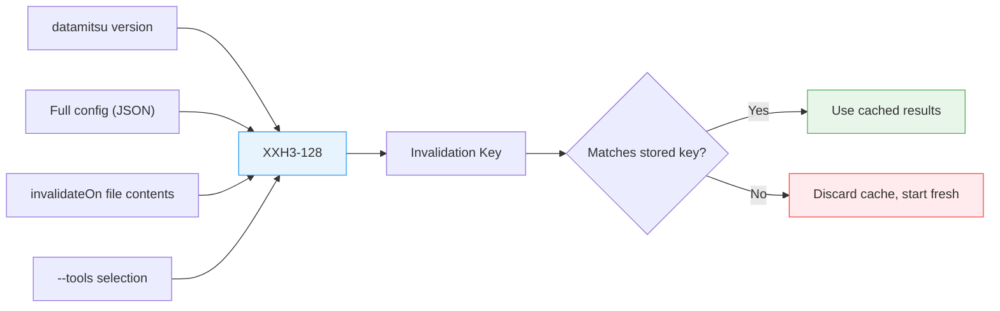

# Caching Strategy

datamitsu caches the results of lint and fix operations at the per-file level. When a file hasn't changed and the configuration is the same, tools that already passed are skipped entirely. This page explains how cache keys are built, how per-file tracking works, and how the cache stays consistent under parallel execution.

For context on how tasks reach the cache layer, see [Parallel Execution](./execution.md).

## Cache Invalidation Keys

Every cache is identified by a single **invalidation key** — an XXH3-128 hash computed from four inputs. If any input changes, the entire project cache is discarded and rebuilt from scratch.



### What goes into the key

| Input                  | What it captures                                                                       | Why it matters                                                                     |
| ---------------------- | -------------------------------------------------------------------------------------- | ---------------------------------------------------------------------------------- |
| **datamitsu version**  | The release version string                                                             | A new datamitsu version may change tool behavior or output parsing                 |
| **Full configuration** | The entire `Config` struct serialized as JSON                                          | Any change to tools, operations, runtimes, or project types invalidates results    |
| **invalidateOn files** | Contents of config files referenced by tools (e.g., `.eslintrc.json`, `tsconfig.json`) | Tool behavior depends on these files — if they change, cached results may be stale |
| **--tools selection**  | Tool names passed via `--tools` flag (sorted)                                          | Running a subset of tools produces different cache state than running all tools    |

### How invalidateOn files work

Each tool operation can declare files that affect its behavior:

```javascript
tools: {
  eslint: {
    operations: {
      lint: {
        app: "eslint",
        args: ["."],
        invalidateOn: ["eslint.config.js", ".eslintignore"],
        cache: true,
      },
    },
  },
  tsc: {
    operations: {
      lint: {
        app: "typescript",
        args: ["--noEmit"],
        invalidateOn: ["tsconfig.json"],
        cache: true,
      },
    },
  },
},
```

During invalidation key calculation, files are processed deterministically: tool names sorted alphabetically, then file paths sorted within each tool. The actual file contents are hashed — not just the paths. If a declared file doesn't exist, a `(missing)` marker is hashed instead, so adding or removing a config file also invalidates the cache.

## Per-File Tracking

Within a valid cache (invalidation key matches), each file is tracked individually with three pieces of data:

| Field           | Description                                         |
| --------------- | --------------------------------------------------- |
| **ContentHash** | XXH3-128 hash of the file's contents                |
| **Lint**        | List of tool names that passed lint on this content |
| **Fix**         | List of tool names that passed fix on this content  |

### Cache hit decision

When the executor considers running a tool on a file, it checks:

1. Does a cache entry exist for this file path?
2. Does the stored ContentHash match the file's current XXH3-128?
3. Is this tool name in the operation's list (Lint or Fix)?

All three must be true for a cache hit. If any check fails, the tool runs.

### Why separate Lint and Fix tracking

Lint and fix are independent operations with different semantics. A file can pass lint without needing a fix, or be fixed without being re-linted yet. Tracking them separately enables precise cache behavior:

**Step-by-step example:**

1. **First run:** `datamitsu fix` runs prettier on `app.ts`
   - prettier reformats the file (contents change)
   - Cache records: ContentHash=`abc123`, Fix=`["prettier"]`, Lint=`[]`

2. **Then:** `datamitsu lint` runs eslint on `app.ts`
   - ContentHash matches (file unchanged since fix) — but eslint is not in Lint list
   - eslint runs and passes
   - Cache records: ContentHash=`abc123`, Fix=`["prettier"]`, Lint=`["eslint"]`

3. **Next run:** `datamitsu lint` again
   - ContentHash matches, eslint is in Lint list — cache hit, eslint skipped

4. **Developer edits `app.ts`:**
   - ContentHash no longer matches — both Lint and Fix lists are effectively invalidated
   - All tools run again on this file

### Fix resets lint cache

When a fix operation modifies a file, the lint cache for that file is reset:

- The fixer changes the file contents, producing a new ContentHash
- The Lint list is cleared to empty
- The Fix list records the successful fixer

This is necessary because the fixer's changes might introduce new lint issues. For example, an auto-formatter might reformat code in a way that triggers a different linter rule. Resetting the lint cache ensures linters always re-check after fixes.

## Cache Invalidation Best Practices

### Declare tool configuration files

Always list files that affect a tool's behavior in `invalidateOn`. Without this, changing a config file won't invalidate cached results, leading to stale passes.

```javascript
// BAD: missing invalidateOn — cache won't bust when eslint config changes
tools: {
  eslint: {
    operations: {
      lint: {
        app: "eslint",
        args: ["."],
        cache: true,
      },
    },
  },
},
```

```javascript
// GOOD: eslint config changes automatically invalidate cache
tools: {
  eslint: {
    operations: {
      lint: {
        app: "eslint",
        args: ["."],
        invalidateOn: ["eslint.config.js"],
        cache: true,
      },
    },
  },
},
```

### When to disable caching

Set `cache: false` for tools that are non-deterministic or have side effects:

```javascript
tools: {
  "custom-checker": {
    operations: {
      lint: {
        app: "custom-checker",
        args: ["--check"],
        cache: false, // Output depends on external state
      },
    },
  },
},
```

When `cache: false`, the tool always runs regardless of file state.

### Conservative is safer

If you're unsure whether a file affects a tool's behavior, include it in `invalidateOn`. The worst case is unnecessary re-runs (correct but slower). The alternative — a missing entry — risks stale cached results (incorrect but fast).

## Concurrency Model

datamitsu runs tools in parallel (see [Parallel Execution](./execution.md)), which means multiple goroutines read and write the cache simultaneously. The cache uses a layered synchronization strategy to stay consistent without sacrificing performance.

### Read-write locking

Cache lookups (`ShouldRun`) acquire a read lock — multiple goroutines can check the cache concurrently with no blocking. Cache updates (`AfterLint`, `AfterFix`) acquire an exclusive write lock. Hit/miss counters use lock-free atomic operations to avoid contention on the hot path.

### Debounced persistence

Rather than writing to disk after every tool completes, the cache uses a debounce pattern:

1. After a successful tool run, the cache is marked as dirty (atomic flag, non-blocking)
2. A 100ms timer starts (or resets if already running)
3. When the timer fires, the cache writes to disk if still dirty
4. Rapid updates (e.g., a batch of files being fixed) coalesce into a single disk write

This reduces I/O significantly when many files are processed in quick succession.

### Atomic writes

Cache persistence uses the temp-file-and-rename pattern: data is written to a temporary file, then atomically renamed to the final path. This prevents corruption if the process crashes mid-write — the cache file is either the old version or the new version, never a partial write.

### Shutdown safety

On process exit, the cache performs a final flush: any pending debounce timer is cancelled and a synchronous save executes if the dirty flag is set. This ensures no results are lost, even if the process exits immediately after the last tool completes.

### Pruning

To prevent unbounded growth from deleted files, the cache periodically prunes entries. On load, if more than 24 hours have passed since the last prune, entries pointing to files that no longer exist on disk are removed. This keeps the cache size proportional to the actual repository.

## Performance Implications

The caching strategy provides compound speedups across repeated runs. XXH3-128 is 10-26x faster than SHA-256 on typical inputs (26x on Intel i9-14900K, 11-14x on Apple M1 Max), making per-file content hashing nearly free even in large monorepos.

- **First run:** All tools execute. Cache is populated with per-file results
- **Unchanged files:** Immediate cache hit — only an XXH3-128 hash comparison, no tool execution
- **Partial changes:** Only modified files are re-checked. In a large monorepo with thousands of files, a single-file edit means only that file's tools re-run
- **Config changes:** The invalidation key detects config drift and rebuilds the cache automatically — no manual `cache clear` needed

For wrapper maintainers: caching is transparent to end users. The main tuning points are `invalidateOn` declarations (ensuring correctness) and the `cache` flag (opting out for non-deterministic tools).

## Cache Storage

The execution cache is stored as a single file per project:

```
~/.cache/datamitsu/cache/projects/{xxh3_128(gitRoot)}/toolstate.msgpack
```

All projects within the same git repository share a single cache file, keyed by the XXH3-128 hash of the git root path. Per-project isolation is achieved through per-file tracking within this file. The msgpack binary format keeps the file compact and fast to read/write.

Tool-specific caches (e.g., TypeScript's `tsbuildinfo`, ESLint's `.eslintcache`) are stored in a separate directory tree:

```
~/.cache/datamitsu/cache/projects/{xxh3_128(gitRoot)}/cache/{relativeProjectPath}/{toolName}/
```

These are managed by the tools themselves via the `{toolCache}` template placeholder — datamitsu just provides the directory path.
