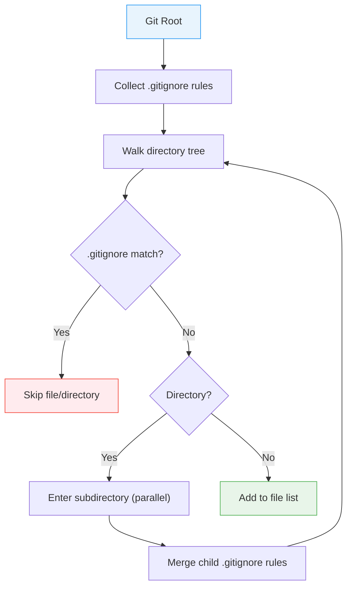

# File Discovery & Project Detection

File discovery is the first stage of datamitsu's execution pipeline. It walks the repository tree to find files that match tool glob patterns, while project detection identifies independent project boundaries within monorepos. Together they determine _what_ files exist and _where_ projects live before the [planner](./planner.md) decides what to do with them.

## .gitignore-Aware Traversal

The file walker respects `.gitignore` rules at every directory level. This means datamitsu never processes files your version control system ignores — `node_modules/`, `dist/`, `.venv/`, build artifacts, and any other ignored paths are automatically excluded.

### How It Works

The walker starts at the git root and recursively descends into subdirectories. At each level, it:

1. Checks for a `.gitignore` file and merges its rules with the parent's rules
2. Skips `.git` directories and symlinks (avoiding circular references)
3. Processes subdirectories in parallel (up to 8 concurrent goroutines)
4. Collects matching files in a thread-safe accumulator



### Why It Matters

- **No wasted work:** Ignored directories like `node_modules/` (which can contain hundreds of thousands of files) are skipped entirely, not entered and then filtered
- **Correct behavior:** The same files your `git status` sees are the files datamitsu processes — no surprising lint errors from generated code or vendored dependencies
- **Cascading rules:** A `.gitignore` in a subdirectory extends (not replaces) the parent's rules, matching how git itself handles ignore patterns

## Project Auto-Detection

In monorepos with multiple packages, tools need to know which project each file belongs to. datamitsu detects projects by looking for **marker files** — files whose presence indicates a project root.

### Marker-Based System

Each project type is defined by a list of marker glob patterns:

```javascript
export function getConfig(input) {
  return {
    ...input,
    projectTypes: {
      typescript: {
        markers: ["package.json"],
        description: "Node.js / TypeScript project",
      },
      golang: {
        markers: ["go.mod"],
        description: "Go module",
      },
      python: {
        markers: ["pyproject.toml"],
        description: "Python project",
      },
    },
  };
}
```

The detector walks the entire file list and matches each path against the marker patterns. Every directory containing a matching marker becomes a detected project location. A single repository can contain dozens of detected projects across multiple types.

### How Tools Use Project Types

Tools declare which project types they apply to via the `projectTypes` field. When the planner creates tasks, it only assigns a tool to projects that match:

```javascript
tools: {
  tsc: {
    projectTypes: ["typescript"],
    operations: {
      lint: {
        app: "typescript",
        args: ["--noEmit"],
        scope: "per-project",
        globs: ["**/*.ts", "**/*.tsx"],
        priority: 20,
      },
    },
  },
  "golangci-lint": {
    projectTypes: ["golang"],
    operations: {
      lint: {
        app: "golangci-lint",
        args: ["run"],
        scope: "per-project",
        globs: ["**/*.go"],
        priority: 20,
      },
    },
  },
},
```

With this configuration in a monorepo:

- `tsc` runs only in directories containing `package.json`
- `golangci-lint` runs only in directories containing `go.mod`
- Neither tool wastes time in projects it doesn't apply to

### What Happens When Markers Are Missing

If a tool specifies `projectTypes: ["typescript"]` but no `package.json` exists anywhere in the repository, that tool simply produces zero tasks. No error, no warning — the tool is silently skipped because there are no matching projects.

This is intentional: a shared configuration can define tools for many project types, and only the relevant ones activate based on what the repository actually contains.

### Monorepo Example

Consider this repository structure:

```
repo/
├── packages/
│   ├── frontend/
│   │   ├── package.json      ← typescript project detected
│   │   └── src/
│   ├── api/
│   │   ├── go.mod             ← golang project detected
│   │   └── main.go
│   └── shared/
│       ├── package.json      ← typescript project detected
│       └── src/
└── services/
    └── worker/
        ├── pyproject.toml     ← python project detected
        └── main.py
```

datamitsu detects four projects:

| Project              | Type       | Tools that apply      |
| -------------------- | ---------- | --------------------- |
| `packages/frontend/` | typescript | eslint, tsc, prettier |
| `packages/shared/`   | typescript | eslint, tsc, prettier |
| `packages/api/`      | golang     | golangci-lint         |
| `services/worker/`   | python     | ruff, mypy            |

Each tool runs independently in its project directory with isolated cache paths — see [Caching Strategy](./caching.md) for details on per-project cache isolation.

## How Discovery Feeds the Pipeline

The output of file discovery and project detection flows directly into the [planner](./planner.md):

1. **File list** — all non-ignored files in the repository, used to match tool glob patterns
2. **Project locations** — detected project directories and their types, used to scope per-project tools
3. **CWD restriction** — when running from a subdirectory, both file list and project locations are filtered to the current subtree (see [CWD-Subtree Restriction](./planner.md#cwd-subtree-restriction))

This separation of concerns means the planner never touches the filesystem directly — it works purely with the pre-collected file list and project map provided by the discovery stage.
