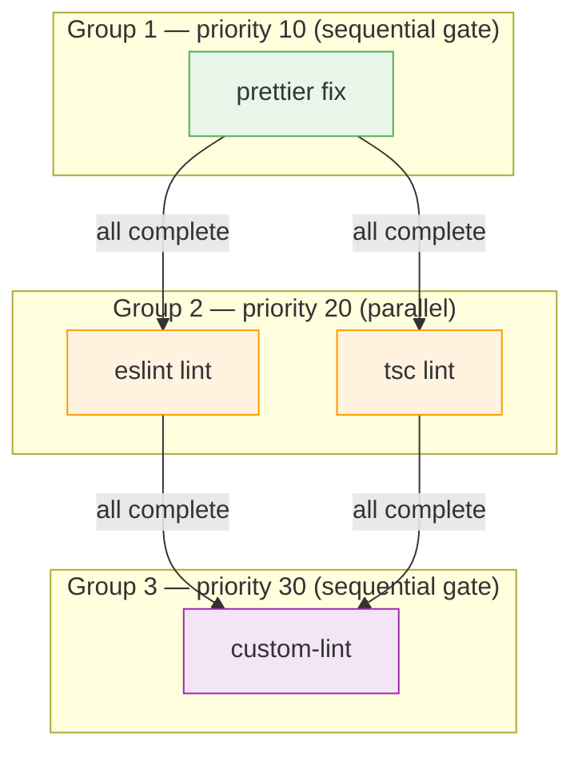

# Parallel Execution

The executor is the third stage of datamitsu's execution pipeline. It takes the ordered task groups from the [planner](./planner.md) and runs them — sequentially between groups, in parallel within groups — while enforcing fail-fast behavior so errors surface immediately.

## Two-Layer Execution Model

Execution follows a two-layer structure:

1. **Outer layer (sequential):** Task groups execute one after another, ordered by priority. Group 1 must fully complete before Group 2 starts.
2. **Inner layer (parallel):** Within each group, non-overlapping tasks run concurrently across available CPU cores.



### Why This Design

The two-layer model balances two competing goals:

- **Correctness:** Formatters must finish before linters run, because formatters change files that linters check. Sequential groups enforce this ordering.
- **Performance:** Independent tools at the same priority level (like eslint and tsc checking different file types) can safely run at the same time. Parallel execution within groups exploits this.

A fully sequential approach would be too slow in large monorepos. A fully parallel approach would produce incorrect results when tools depend on each other's output.

## Fail-Fast Semantics

When any task fails, datamitsu cancels all remaining work immediately rather than continuing to run tools that are likely to fail or produce misleading results.

The mechanism works in three steps:

1. **Failure detected:** A task in the current group exits with a non-zero status.
2. **Context cancelled:** The executor calls the context cancellation function, signaling all in-flight and pending tasks.
3. **Cleanup:** Running tasks receive the cancellation signal. Tasks that haven't started yet skip execution immediately.

### FailureReason Classification

Not all failures are equal. The executor classifies each failed task:

| FailureReason   | Meaning                                           | Shown to User? |
| --------------- | ------------------------------------------------- | -------------- |
| **Independent** | The tool failed on its own merit (real failure)   | Yes            |
| **Cancelled**   | The task was terminated by another task's failure | No             |

This distinction is critical for usable error output. If eslint fails and causes tsc to be cancelled, the user sees only the eslint error — not a confusing cascade of cancellation messages. The runner filters out cancelled results when displaying output, so you only see the root cause.

**Example scenario:**

```
Group 2 contains: eslint (checking .ts files), tsc (checking .ts files)
Both start in parallel.

1. eslint finds errors → exits with code 1 → marked as Independent failure
2. Context cancelled
3. tsc receives cancellation → marked as Cancelled
4. User sees: only eslint errors (tsc result hidden)
```

## Tool Ordering Best Practices

Priority values directly control the execution order. Here's a recommended pattern for a typical JavaScript/TypeScript project:

```javascript
export function getConfig(input) {
  return {
    ...input,
    tools: {
      // Priority 10: Formatters run first
      // They modify files, so everything else must wait
      prettier: {
        name: "prettier",
        operations: {
          fix: {
            app: "prettier",
            args: ["--write", "{files}"],
            priority: 10,
            globs: ["**/*.{js,ts,tsx,css,json,md}"],
          },
        },
      },

      // Priority 20: Type checking and linting run after formatting
      // These read files but don't modify them, so they can run in parallel
      tsc: {
        name: "tsc",
        projectTypes: ["typescript"],
        operations: {
          lint: {
            app: "tsc",
            args: ["--noEmit"],
            priority: 20,
            globs: ["**/*.{ts,tsx}"],
            scope: "per-project",
          },
        },
      },
      eslint: {
        name: "eslint",
        operations: {
          lint: {
            app: "eslint",
            args: ["{files}"],
            priority: 20,
            globs: ["**/*.{js,ts,tsx}"],
          },
        },
      },

      // Priority 30: Custom checks that depend on lint passing
      "custom-check": {
        name: "custom-check",
        operations: {
          lint: {
            app: "custom-check",
            args: ["{files}"],
            priority: 30,
            globs: ["**/*.ts"],
          },
        },
      },
    },
  };
}
```

**Why this order matters with fail-fast:**

- If prettier fails at priority 10, eslint and tsc never run — there's no point linting unformatted code.
- If eslint fails at priority 20, custom-check at priority 30 never starts — it would likely fail too.
- tsc and eslint share `.ts`/`.tsx` extensions, so at the same priority they run in separate sequential sub-groups within that group. Overlapping tools always run sequentially — the executor enforces this automatically.

**Common mistakes:**

- Putting formatters and linters at the same priority: formatters modify files, so linters might see stale content if they run simultaneously.
- Putting all tools at different priorities: this forces fully sequential execution, losing parallelism between independent tools.

## Progress Tracking

The executor reports progress differently depending on the environment:

**Interactive terminal (non-CI):**

- A live progress bar shows task completion across the current group.
- Per-file progress updates the bar as each file is processed.
- The bar disappears when the group completes.

**CI environment:**

- No progress bar (CI terminals don't support carriage return rewriting).
- A start message is printed when each tool begins: `Starting prettier...`
- Percentage milestones are printed at 25% intervals to indicate liveness.
- Final results appear after all groups complete.

The environment is detected automatically. CI mode activates when the `CI` environment variable is set (a convention followed by GitHub Actions, GitLab CI, Jenkins, and most CI systems). Datamitsu never sets `CI=true` itself — it respects whatever the system provides.

### Concurrency Control

The number of parallel tasks is controlled by `DATAMITSU_MAX_PARALLEL_WORKERS`. The default is dynamic based on CPU count:

```
max(4, floor(NumCPU * 0.75)), capped at 16
```

On an 8-core machine, this means 6 parallel workers. On a 2-core machine, the minimum of 4 still applies. You can override this for CI environments where you want more or fewer workers:

```bash
# Use more workers on a beefy CI runner
DATAMITSU_MAX_PARALLEL_WORKERS=12 datamitsu check

# Use fewer workers to reduce memory pressure
DATAMITSU_MAX_PARALLEL_WORKERS=2 datamitsu check
```

### Batch Chunking

When a tool operates on many files, the executor may need to split them into multiple batches to stay within command-line length limits (OS-imposed limits on argument length). Each batch runs as a separate process, and batches within the same task run in parallel.

This is transparent to tool configuration — you don't need to handle batching yourself. The executor automatically chunks the file list and merges results.
