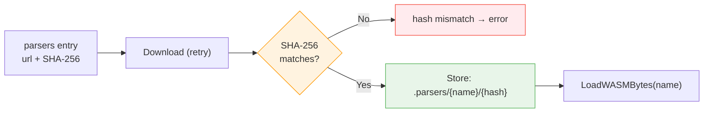
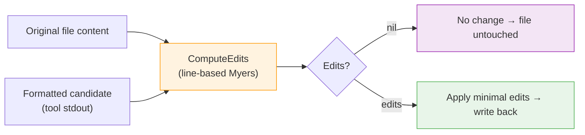

# WASM Output Parsers

datamitsu wraps third-party linters and formatters behind a single CLI. To turn a
tool's free-form text output into structured results, it loads small,
**signed Rust→WASM modules** — output parsers — into a sandboxed runtime. This
page explains the parser pipeline end to end, and the line-based **diff-in-core**
that the formatting path is built on.

:::info Phase boundary
This is the parser _plumbing_: declare → build → sign → deliver → load → invoke.
It ships with a trivial `echo` parser that proves the whole pipe; real diagnostic
parsers (hadolint, yamllint, …) arrive in a later phase. The architectural
invariant that governs the design: **a parser extracts only what the tool
actually emitted; the Go core fills defaults.**
:::

## The Architectural Invariant

The dividing line between the WASM module and the Go core is deliberate:

- **The WASM module owns _extraction only_.** It reports exactly what the tool
  emitted. Every diagnostic field but the message is optional — absence means
  "the tool did not provide this", which is information, not an error.
- **The Go core owns _defaults and policy_.** Column fallbacks, severity
  defaults, range completion, and diffing all live in the core, next to the rest
  of datamitsu's shared behavior.

This "raw-with-holes / defaults-in-core" split keeps parsers tiny, dumb, and
trivially auditable, and keeps all judgement calls in one reviewable place.

## The Pipeline

A parser travels through six stages, from a config declaration to a result
returned into the core:

### Declare

A parser is a `parsers` entry in the config — a **url + hash data artifact**,
modeled on archives and bundles, _not_ on an app (no runtime, no lockfile,
because it is data, not a process). A tool opts in with
[`tool.outputParser`](../../reference/configuration-api.md#output-parser-outputparser),
a by-name reference into `parsers`. A dangling reference is a config error. See
[Output Parsers in the Configuration API](../../reference/configuration-api.md#output-parsers-parsers).

### Build

Parsers are a Rust workspace compiled to the `wasm32-unknown-unknown` target as a
freestanding `cdylib`. There is no `wasm-bindgen` — a small **manual-memory ABI**
keeps the artifact small. Each tool is **one module** under `src/tools/<tool>.rs`,
co-locating its parser with its `describe` recipe. A single dispatcher matches on
the tool name, so adding a tool is one `match` arm + one module + one `TOOLS` row.

Parsers are **hand-written**, porting the logic faithfully from the upstream
[none-ls](https://github.com/nvimtools/none-ls.nvim) builtin or
[efm-langserver](https://github.com/mattn/efm-langserver) errorformat for each
tool. The only external crate is **`tinyjson`** (a tiny, zero-dependency JSON
parser) for the JSON-output class — hand-rolling a correct JSON parser is a known
footgun and many tools emit JSON. Text/line parsers add no dependency. The bundled
set covers **~88 tools** ported from the none-ls diagnostics builtins, spanning the
parsing-difficulty classes — a representative few:

| Tool            | Output shape                               | Class          |
| --------------- | ------------------------------------------ | -------------- |
| `hadolint`      | JSON array of objects                      | structured     |
| `yamllint`      | `file:row:col: [level] msg (rule)` (line)  | simple regex   |
| `dotenv_linter` | `file:row CODE: msg` (no col, no severity) | missing fields |
| `cue_fmt`       | two lines per error (message + location)   | multiline      |
| `echo`          | pipe-test only                             | —              |

The single `.wasm` dispatches all of them by name (`tool.outputParser`). JSON
tools share one `from_json` helper (`tools/json_diag.rs`), so each is a few lines.

### Sign

CI builds the `.wasm` and hands it to the release tooling so its **SHA-256 lands
in `checksums.txt`**. The existing cosign step signs `checksums.txt` — so the
WASM hash is automatically covered by the existing signature. The core verifies
the signature and trust root; it does **not** embed a per-version WASM hash, so
parsers can update independently of the core binary.

### Deliver

The built module ships two ways: attached to the GitHub Release, and inside a
platform-independent npm wrapper package. A release-time **parser manifest**
(`{ name → { url, hash, version } }`) — itself covered by the signed
`checksums.txt` — is what config maintainers import to obtain each parser's
url + hash.

### Download + verify

When the core needs a parser, the parser-artifact manager reuses the binary
download machinery: download with retry, **SHA-256 verify** against the config's
mandatory `hash`, then store the module content-addressed under
`{store}/.parsers/{name}/{hash}`. The store key is an XXH3 hash (internal cache
key), while verification is SHA-256 (external integrity) — the standard
[hashing split](../supply-chain-security.md). A parser referenced by several
tools is coalesced into a **single download**.

### Load + invoke

The verified bytes are instantiated into a **wazero** module (pure-Go WASM
runtime, no CGo — consistent with the core). The host drives the memory ABI:
allocate input buffers, write the raw `stdout`/`stderr`/`exit_code`, call the
exported `parse`, then read and free the output buffer. The raw bytes are passed
**whole — never host-line-split** — so multiline output (e.g. `cue_fmt`) is
preserved; the parser decides whether to split. The JSON result deserializes into
nullable Go structs (pointer fields, so a field the tool omitted stays `nil`).

### Introspect

Every module also exports `describe` — a static counterpart to `parse` that takes
no input and returns a JSON **capability manifest**: which tools the module can
parse, how to invoke each (args + stdin), the upstream URL, and the module's
**build-injected version**. The version is baked at compile time like a Go ldflags
`-X` (CI sets `DATAMITSU_PARSERS_VERSION`); the module is the single source of
truth, which is why the `parsers` config entity carries **no `version` field**.

[`datamitsu devtools parsers list`](../../reference/cli-commands.md#devtools-parsers)
aggregates `describe` across every configured parser into a **deduplicated** view:
distinct modules (by content) are described exactly once, and tools are
deduplicated by name (a tool two different modules claim with diverging identity
is flagged as a conflict). The default rendering is human-readable; `--json` emits
the machine-readable catalog for driving configs and build pipelines, and
`--wasm <path>` describes a local `.wasm` file with no config or network access.

## diff-in-core (Formatting)

Formatting needs **no parser at all** — it is text in, text out. It is the first
real consumer of the pipeline's sibling piece: a **line-based Myers diff written
in the Go core**.

A formatter that reads stdin and writes stdout is run through the executor's
[stdin → stdout capture mode](../tooling-system.md#formatting-stdin--stdout--diff).
The core then treats the captured stdout as the full new file text and computes a
minimal edit set against the original:

Why diff in the core rather than letting the tool rewrite the file:

- **Minimal, precise edits.** A one-line change in a large file produces a
  one-line edit, not a whole-file rewrite — better for review, version control,
  and incremental work.
- **No-op is truly free.** Identical input and output yield `nil` edits; the file
  (and its mtime) is left untouched.
- **Reusable shape.** Edits are produced as range-based text edits, shaped to
  serve both the CLI apply path now and editor `TextEdit` ranges later, with
  column math done over runes to stay correct on multibyte content.

Because diffing is shared policy, it lives with the defaults in the core — the
same place that will own diagnostic defaults — keeping the WASM modules limited
to pure extraction.

## Trust Model Summary

| Concern             | Mechanism                                                             |
| ------------------- | --------------------------------------------------------------------- |
| Artifact integrity  | Mandatory SHA-256 `hash` per `parsers` entry, verified on download    |
| Signature coverage  | WASM SHA-256 is in the cosign-signed `checksums.txt`                  |
| Independent updates | Core verifies the signature/trust root, not a pinned per-version hash |
| Internal cache key  | XXH3 content-addressed store path (never used for verification)       |
| Execution sandbox   | wazero (pure-Go WASM), raw bytes in, JSON out — no host filesystem    |

See the [Supply Chain Security](../supply-chain-security.md) guide for the wider
trust model and the [Configuration API](../../reference/configuration-api.md#output-parsers-parsers)
for the `parsers` and `lsp` reference.
