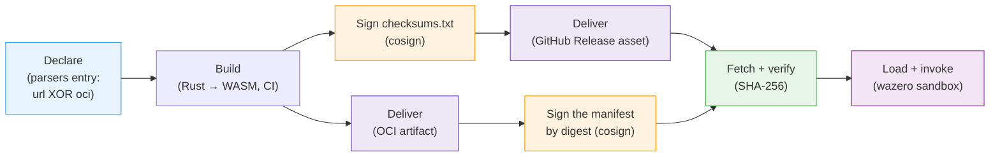
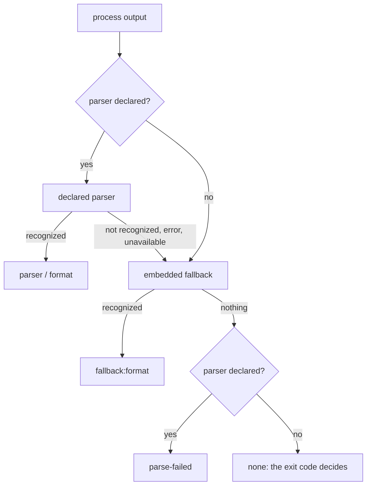
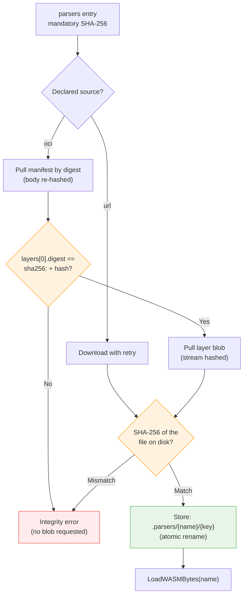
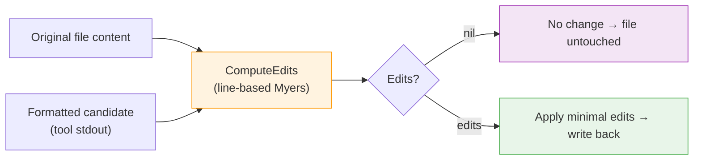

# WASM Output Parsers

datamitsu wraps third-party linters and formatters behind a single CLI. To turn a
tool's free-form text output into structured results, it loads small,
**hash-pinned Rust→WASM modules** — output parsers — into a sandboxed runtime.
This page explains the parser pipeline end to end, and the line-based
**diff-in-core** that the formatting path is built on.

The architectural invariant that governs the design: **a parser extracts only
what the tool actually emitted; the Go core fills defaults.**

## The Architectural Invariant

The dividing line between the WASM module and the Go core is deliberate:

- **The WASM module owns _extraction only_.** It reports exactly what the tool
  emitted. Every diagnostic field but the message is optional — absence means
  "the tool did not provide this", which is information, not an error.
- **The Go core owns _defaults and policy_.** Column fallbacks, severity
  defaults, range completion, and diffing all live in the core, next to the rest
  of datamitsu's shared behavior.

This "raw-with-holes / defaults-in-core" split keeps parsers tiny, dumb, and
trivially auditable, and keeps all judgement calls in one reviewable place.

### File attribution

Which file a diagnostic belongs to has two possible sources, and they compose:

- **The parser**, for formats that name a path per diagnostic (eslint's
  `filePath`). It fills `file` on the raw diagnostic.
- **The core**, otherwise. Most tool formats drop the filename, so when a process
  was handed exactly one file — a per-file run, or a list-taking tool whose
  `{files}` held one path — the executor stamps that file on every diagnostic the
  parser left without one.

This ordering is what makes list-taking tools work. A tool given `{files}`
(eslint over a whole project, one invocation, dozens of files) gives the core no
single file to stamp, and neither does a tool given no file at all (`tsc` reads
`tsconfig.json`), so a parser that does not report paths yields unattributed
diagnostics there. Tools in that class must extract the path.

Whatever spelling the tool printed, the core makes the path **absolute**, against
the working directory of the process that printed it, and cleans it: `./a.ts`,
`a.ts` and `/repo/pkg/a.ts` from a process run in `/repo/pkg` name one file. The
terminal shows a path relative to the failure frame's `Cwd`, and one outside it in
full, since `../../x` reads worse than the path it came from.

### Positions

Every position the core hands on follows one contract, whatever the tool printed:

| Field            | Contract                                                                     |
| ---------------- | ---------------------------------------------------------------------------- |
| `row`, `col`     | 1-based; missing or `0` becomes `1`                                          |
| `endRow`         | 1-based; missing means the start row                                         |
| `endCol`         | 1-based and **exclusive**: the span stops before the column it names         |
| a partial end    | an end row without an end column gives a point at the start                  |
| an end before it | an end that precedes the start, after the rules above, becomes a point there |

A point is an end equal to the start. Several tools print `0` for "no position"
(trivy, reek, npm-groovy-lint), which is why `0` is read as `1` rather than kept.

What the core cannot do is tell a 0-based positive column from a 1-based one, or
an inclusive end from an exclusive one: column 5 is column 5 either way. The
module corrects them, and the descriptor-schema-2 release audited every parser
for it: spectral, pylint, selene, cmake-lint, djlint, erb-lint, npm-groovy-lint,
ltrs and write-good read 0-based columns and add 1; actionlint, vale, mlint and
rubocop print the last column of a span and have 1 added to make the end
exclusive; and a parser no longer invents an end — or a start column — its tool
did not print. The module's `POSITIONS` table (`src/contract.rs`) records, per
parser, what its tool prints, and a new parser cannot be added without its row. A
configuration pinned to an older module keeps the positions that module reported.

Columns are counted in the unit the tool uses, which the descriptor declares as
`columnUnit` where it was measured on a line holding multi-byte characters and a
tab (every measured tool counts a tab as one column):

| Tool          | Version measured | Unit                   |
| ------------- | ---------------- | ---------------------- |
| actionlint    | 1.7.12           | `utf-8` (bytes)        |
| golangci-lint | 2.13.1           | `utf-8` (bytes)        |
| cspell        | 10.0.1           | `utf-16` (code units)  |
| eslint        | 10.9.0           | `utf-16` (code units)  |
| tsc           | 7.0.2            | `utf-16` (code units)  |
| harper-cli    | 2.8.0            | `utf-32` (code points) |
| protolint     | 0.57.0           | `utf-32` (code points) |
| vale          | 3.18.0           | `utf-32` (code points) |
| yamllint      | 1.38.0           | `utf-32` (code points) |

Every other parser declares none. checkmake and dotenv-linter print no column,
and dclint and hadolint print column 1 for every finding, so no measurement can
tell their unit.

### Levels

The core's scale has four levels: error, warning, info and hint. From descriptor
schema 2 a module declares, for every tool, the level words that tool prints —
its `severities` vocabulary, which the parser maps onto that scale. An empty
vocabulary says the tool prints no level at all. A module at schema 1 declares
nothing, and [`devtools parsers list`](../../reference/cli-commands.md#devtools-parsers)
shows no `levels` for its tools.

A parser sets a level only from a token the tool printed: a level word, a numeric
level, a `severity` field, or a key that is one (`errors[]`, `warnings[]`). It
reads the level through its vocabulary, so a level the tool never printed has no
way in: not one the parser's author thought fitting for every finding, not an
error for text on stderr or for output that would not decode. A finding without
a token has no level. The module's contract test holds every parser to this over
its samples and its recorded fixtures, and the
[parser catalogue](../../reference/parser-catalog.md) lists each vocabulary.

The core resolves a finding without a level from the exit code of the process
that printed it: **error when the tool failed, warning when it passed**. For a
tool with no level vocabulary the exit code is the only thing it says about
seriousness, so a checkmake finding under a failed run shows as an error and the
same finding under a passing run as a warning. A level the tool printed is never
changed by the exit code; a value outside the 1–4 scale counts as none.

A schema-1 module predates the rule: more than twenty of its parsers set a level
the tool never printed — "warning" for every finding of markdownlint, codespell or
golangci-lint, "error" for every finding of knip, kube-linter or cue — and its
golangci-lint and tfsec parsers dropped the level those tools do print. A
configuration pinned to it keeps those levels.

### Rule identity

`source` names the tool; `code` names the rule, whenever the tool prints one, and
nothing else — a rule is part of a finding's identity, and a location or a message
in it would split one finding into many. golangci-lint's `code` is the linter that
reported the issue (`errcheck`, `govet`); a linter's own rule id, when it prints
one, stays in the message. `url` carries the rule's documentation where the tool
prints a link (tfsec, dclint, buildifier, reek, …).

### Extraction outcomes

"No diagnostics" is only an answer when a parser actually read the output. Every
process a tool runs therefore records an **extraction outcome** next to its exit
code:

| Outcome              | When                                                                               | Lint pass cached        |
| -------------------- | ---------------------------------------------------------------------------------- | ----------------------- |
| `parsed-clean`       | the parser ran without error and returned no diagnostic                            | yes                     |
| `parsed-findings`    | the parser returned at least one diagnostic                                        | for the files it spared |
| `parser-unavailable` | the module did not load, or its `describe` does not list the declared key          | no                      |
| `parse-failed`       | the module returned an error, or neither it nor the fallback recognized the output | no                      |
| `truncated`          | a stream or the findings exceeded a [parse cap](#parse-caps)                       | no                      |
| `none`               | no parser declared, and the [fallback](#three-layers) recognized nothing           | on success              |

The last column is the [caching rule](./caching.md#a-lint-pass-means-nothing-to-report):
a cached lint pass is replayed as "nothing to report", so it is recorded only where
the parser said so.

A module answers a parser key it does not know with an empty list, which would
read as a clean run, so the core checks the key against the module's `describe`
before it parses. An unknown key is not a configuration error: checking it needs
the module, and loading a configuration never touches the network.

When any process of a task is `parse-failed` or `parser-unavailable`, the task
reports `ParseFailed`: its missing diagnostics mean "unknown", not "none". The
run warns once, after its last operation, however many invocations hit the same problem:

- `output parser failed for <tool>: <first error>`, once per tool;
- `parser module "<module>" could not be loaded, so <n> tool(s) that use it ran without parsing`,
  once per module, with the cause and a pointer to
  [`datamitsu devtools parsers prefetch`](../../reference/cli-commands.md#devtools-parsers);
- `parser module "<module>" has no parser "<key>", so the output of <tools> is not parsed`,
  once per key.

Whether a tool passed is decided by its exit code and, when a module at
descriptor schema 2 parsed its output, by its operation's
[`failOn`](../../reference/configuration-api.md#failing-on-findings-failon): a
finding at or above it fails a tool that exited 0. The extraction outcome decides
what the cache may record.

### Parse caps

What one process's output costs to parse is bounded, twice:

| Cap                                                                         | Default         | Over it                                   |
| --------------------------------------------------------------------------- | --------------- | ----------------------------------------- |
| `maxParseInputBytes` (`DATAMITSU_MAX_PARSE_INPUT_BYTES`), per stream        | 8 MiB (8388608) | the parser reads the first bytes up to it |
| `maxFindingsPerProcess` (`DATAMITSU_MAX_FINDINGS_PER_PROCESS`), per process | 10000           | the findings after it are dropped         |

A process over either records `truncated`, with the findings it kept: they are
shown and they gate as any finding does, but no pass is cached and a report marks
the tool incomplete. Both are runtime configuration, shown by
[`datamitsu config runtime`](../../reference/cli-commands.md#config-runtime); a
value that is not a positive integer stops `fix`, `lint` and `check` with exit 2
before anything runs.

### Noise tolerance

A tool's JSON rarely arrives alone on stdout. Something else in the process
prints ahead of it (`eslint-plugin-sonarjs` `console.debug`s a pnpm-catalog
warning; node and python wrappers do the same), or the tool appends a human
summary after it — `golangci-lint --output.json.path=stdout` follows its report
with `1 issues:` and a per-linter tally. Under a strict parse, either costs every
diagnostic in the run.

The shared JSON helper therefore parses **leniently**: it finds each document
opener, scans to its balanced close (tracking string literals, so braces inside a
message or a path don't shift the depth), and parses that span. Noise before and
after is ignored. Every candidate span is tried and the best one wins — most
diagnostics first, longest span as the tiebreak — because taking the first span
that merely parses would let a `{}` in the noise shadow the real report, or turn
a JSON log line printed ahead of it into a phantom diagnostic.

A document that never closes contributes nothing. A truncation that still leaves
whole inner elements intact yields those elements, which beats discarding a run's
findings over a cut-off tail.

The core keeps stdout and stderr **apart** whenever a tool declares a parser, in
both per-file and batch execution. Both streams are handed to the module (some
tools report on stderr — `tsc` falls back to it, `cue_fmt` uses it exclusively),
but they arrive as separate buffers, so wrapper noise on one can never interleave
into the other's JSON.

Both buffers reach the module without their ANSI control sequences (the `ESC [`
sequences that set a colour, move the cursor or erase a line). A tool that colours its output even into a pipe
would otherwise put an escape between a line parser and the position or level it
reads. The failure frame still shows what the tool printed.

## The Pipeline

A parser travels through six stages, from a config declaration to a result
returned into the core. The two delivery channels sign at opposite ends of the
step: the release asset is signed before it ships (cosign over `checksums.txt`,
which carries the module's hash), while the registry artifact can only be signed
after it is pushed, because what gets signed is the manifest digest the push
returns:


```mermaid
graph LR
    A["Declare<br/>(parsers entry:<br/>url XOR oci)"] --> B["Build<br/>(Rust → WASM, CI)"]
    B --> C1["Sign checksums.txt<br/>(cosign)"]
    C1 --> D1["Deliver<br/>(GitHub Release asset)"]
    B --> D2["Deliver<br/>(OCI artifact)"]
    D2 --> C2["Sign the manifest<br/>by digest (cosign)"]
    D1 --> E["Fetch + verify<br/>(SHA-256)"]
    C2 --> E
    E --> F["Load + invoke<br/>(wazero sandbox)"]

    style A fill:#e8f4fd,stroke:#2196f3
    style C1 fill:#fff3e0,stroke:#ff9800
    style C2 fill:#fff3e0,stroke:#ff9800
    style D1 fill:#ede7f6,stroke:#673ab7
    style D2 fill:#ede7f6,stroke:#673ab7
    style E fill:#e8f5e9,stroke:#4caf50
    style F fill:#f3e5f5,stroke:#9c27b0
```

### Declare

A parser is a `parsers` entry in the config — a **hash-pinned data artifact**,
modeled on archives and bundles, _not_ on an app (no runtime, no lockfile,
because it is data, not a process). A tool opts in with
[`tool.outputParser`](../../reference/configuration-api.md#output-parser-outputparser),
a by-name reference into `parsers`. A dangling reference is a config error. See
[Output Parsers in the Configuration API](../../reference/configuration-api.md#output-parsers-parsers).

An entry names **exactly one source** and one mandatory hash:

- `url` — an `https://` download. A local development build of datamitsu
  additionally accepts `file://`, for iterating on a module you just compiled;
  a released binary refuses it outright.
- `oci: { ref, digest }` — an artifact pulled from a registry, pinned by its
  manifest digest.
- `hash` — the module's SHA-256, 64 lowercase hex, **mandatory for both**.

The two sources are **mutually exclusive and there is no fallback chain**.
Declaring both, or neither, fails at config load, before anything touches the
network. A fallback would defeat the point of the second source: an organization
that has removed its `github.com` egress must be able to prove from the config
alone that no code path can reach it. Switching an entry to a registry is what
config layers are for — a downstream layer replaces the entry, keeping the same
`hash`.

### Build

Parsers are a Rust workspace compiled to the `wasm32-unknown-unknown` target as a
freestanding `cdylib`. There is no `wasm-bindgen` — a small **manual-memory ABI**
keeps the artifact small. Each tool is **one module** under `src/tools/<tool>.rs`,
co-locating its parser with its `describe` recipe. A single dispatcher matches on
the tool name, so adding a tool is one `match` arm + one module + one `DESCRIPTORS` row.

Parsers are **hand-written**, porting the logic faithfully from the upstream
[none-ls](https://github.com/nvimtools/none-ls.nvim) builtin or
[efm-langserver](https://github.com/mattn/efm-langserver) errorformat for each
tool. The only external crate is **`tinyjson`** (a tiny, zero-dependency JSON
parser) for the JSON-output class — hand-rolling a correct JSON parser is a known
footgun and many tools emit JSON. Text/line parsers add no dependency. The bundled
set covers **~95 tools** — the none-ls diagnostics builtins plus a few ported
directly from their output (`eslint` JSON; `tsc`/`tsgo`; `cspell`; `harper-cli`;
`knip`, `droast` and `dclint` JSON),
spanning the parsing-difficulty classes — a representative few:

| Tool            | Output shape                               | Class          |
| --------------- | ------------------------------------------ | -------------- |
| `hadolint`      | JSON array of objects                      | structured     |
| `yamllint`      | `file:row:col: [level] msg (rule)` (line)  | simple regex   |
| `dotenv_linter` | `file:row CODE: msg` (no col, no severity) | missing fields |
| `cue_fmt`       | two lines per error (message + location)   | multiline      |
| `echo`          | pipe-test only                             | —              |

The single `.wasm` dispatches all of them by name (`tool.outputParser`). JSON
tools share one `from_json` helper (`src/json_diag.rs`), so each is a few lines.

## Three layers

Every output of `fix`, `lint` and `check` passes through up to three parsers, in
turn, until one recognizes it:

1. **The declared parser** — the tool's `outputParser`, a tool parser or a
   [format parser](#format-parsers) of the module the configuration pins. An
   answer that recognized the output decides, found or clean. A parser key the
   module does not list, or a module that did not load, is `parser-unavailable`:
   warned once per run and never cached, and the output still goes on to the
   fallback so its findings are not lost.
2. **The fallback** — the sniffer of the [module the binary embeds](#the-embedded-fallback),
   when no parser was declared, or the declared one failed, did not recognize the
   output, or (an array-answering module) answered with nothing under a non-zero
   exit. The first standard format it recognizes reads the output. The core never
   runs a declared module's own `fallback` key: the fallback is always the
   binary's.
3. **Nothing** — output no parser recognized. With a parser declared it is
   `parse-failed`: warned once per run, never cached, and the tool is incomplete in
   a report. Without one it is `none`: the exit code decides, as it always did, and
   a failed run is reported with one synthetic finding.


```mermaid
flowchart TD
    O[process output] --> D{parser declared?}
    D -- yes --> P[declared parser]
    P -- recognized --> R1[parser / format]
    P -- not recognized, error, unavailable --> F[embedded fallback]
    D -- no --> F
    F -- recognized --> R2[fallback:format]
    F -- nothing --> N{parser declared?}
    N -- yes --> PF[parse-failed]
    N -- no --> NO[none: the exit code decides]
```

A process records what read its findings — its **provenance**: `parser` (a tool
parser), `format` (a declared format parser) or `fallback:<format>` (the format the
fallback recognized); reports carry it per invocation and per finding. When the
fallback reads what a declared parser did not, the run warns once: `declared parser
"<key>" of module "<module>" did not recognize the output of <tool>; the fallback
parsed it as <format>`. Its findings gate like any other — the embedded module sets
levels only from what the tool printed — and block a cached pass like any other.

The fallback reads a stdout-mode formatter's stderr only: its stdout is the file's
new content, which no parser ever reads. Every other tool's stdout and stderr are
captured apart, parser declared or not, so progress written to stderr never lands
inside a document on stdout; empty output is not read at all. One rule applies to the **line** formats it recognizes (`gcc`, `msvc`,
`github-annotations`, `azure-logissue`) and to no structured one: a line naming a
path that is not a file on disk — relative to the process's working directory, or
absolute — is not a match, so prose that happens to look like `path:1:2:` is not a
finding. When no line survives, the fallback recognized nothing.

`datamitsu devtools parsers sniff <file>` shows what the fallback makes of a
captured output, before a tool's format flag is declared as its format key.

## Format parsers

Many tools print a standard format on request. The module carries one parser per
such shape, dispatched by key like a tool parser, so a tool without a parser of its
own is parsed by naming the format its flag selects:

| Key                  | Recognizes                                                                    |
| -------------------- | ----------------------------------------------------------------------------- |
| `sarif`              | a JSON object with `version` and a `runs` array                               |
| `codeclimate`        | a JSON array whose every element has `check_name` and `location.path`         |
| `eslint-json`        | a JSON array whose every element has `filePath` and a `messages` array        |
| `json`               | a JSON array whose every element has `message` and `line` (none-ls's default) |
| `checkstyle-xml`     | a document whose root is `<checkstyle>`                                       |
| `junit-xml`          | a document whose root is `<testsuites>` or `<testsuite>`                      |
| `github-annotations` | a line `::error …::message` (also `warning`, `notice`)                        |
| `azure-logissue`     | a line `##vso[task.logissue type=…;…]message`                                 |
| `msvc`               | a line `path(line,col): error CODE: message`                                  |
| `gcc`                | a line `path:line:col: level: message`, or `path:line: message`               |

A structured format is recognized by its envelope, whatever it holds: a SARIF log
without a result, an ESLint report whose files have no message, a `<checkstyle/>`
without a file are recognized and clean. A bare `[]` or `{}` has no envelope and is
not, nor is a document cut off before it closes, JSON or XML: its findings may be
missing. An XML root counts only where it opens a line or follows the XML
declaration, so a message that quotes `<checkstyle/>` is not a document. A line
format is recognized when one line matches. Each parser reads stdout, and stderr
when stdout does not hold its format; noise around a document is skipped as it is
for the tool parsers. The [parser catalog](../../reference/parser-catalog.md#format-parsers)
names the flag of each tool that prints each shape.

A **declared** parser — a tool's or a format's — that found something recognized
the output. One that found nothing did not when the output holds findings in a
standard format (the tool printed another format than the parser reads, and the
fallback reads it); otherwise it recognized the output when its own format was
there — its envelope, or for a JSON tool parser any JSON document — or when the
run exited 0: a clean run may print nothing, or a summary no format describes. What
remains, a failed run whose output held nothing either parser reads, is not
recognized.

The key `fallback` is the **sniffer**: it tries the formats in the order of the
table and answers with the first that recognizes the output, named by its format.
It recognizes only what a format matched, exit code or not — it guesses, and a guess
needs evidence.

### The embedded fallback

The binary carries one module of its own: the format parsers and the sniffer,
built from the same crate without the tool parsers (the crate's `format` feature
alone, about 180 KiB). The core serves it under the module name `embedded`, beside
the declared ones — compiled once, pooled, described like them — and runs its
`fallback` key on output no declared parser recognized; it never runs a declared
module's `fallback`, so the fallback's version is always the binary's. `embedded`
is reserved: a `parsers` entry may not take the name, and no `outputParser` may
name it. `datamitsu devtools parsers list --embedded` describes it,
`devtools parsers run <key> --embedded` runs one of its parsers, and
`devtools parsers sniff <file>` shows which format its sniffer reads in a captured
output.

The module's content key — an XXH3 of its bytes — is part of the per-file cache
key and of the unit verdict identity: every development build reports the version
`dev`, and a pass recorded over what one build's fallback parsed must not be
replayed by a build whose fallback parses differently.

The bytes are committed as `internal/parsermanager/embedded/fallback.wasm`, and
two checks keep them honest:

- **A CI job rebuilds them and compares, byte for byte.** `task
build:parsers:embedded` builds the module in a `linux/amd64` container from a
  digest-pinned `rust` image, as the caller's user, with a separate target
  directory and the cargo home, the toolchain's sources and the workspace
  remapped to fixed paths; built twice on one machine, or natively with the same
  flags, it gives the same SHA-256. The Rust release is one fact in three files —
  `parsers/rust-toolchain.toml`, `parsers/embedded.lock` and the image digest in
  `parsers/embedded.Dockerfile` — and the build refuses to run when they disagree
  or when the image's `rustc -vV` names another release. The job
  (`Embedded Parser Module` in `pr-checks.yml`) runs the same build and, when the
  result differs from the committed module, uploads it as the
  `embedded-fallback-wasm` artifact and fails.
- **A Go test compares the sources with the fingerprint committed beside the
  module.** `parsers/datamitsu-parsers/embedded-sources.txt` lists every file the
  build reads; `fallback.wasm.sources` holds their XXH3 fingerprint (sorted paths,
  each `path NUL length NUL bytes NUL`, CRLF read as LF), written by
  `go run ./internal/parsermanager/embedded/cmd/sourcehash`. A listed source that
  changed without a rebuild fails `go test` with "embedded module is stale", with
  no Rust needed to notice; a change to a tool parser does not, since the tool
  parsers are not in the build. The test also fails when a file the build
  compiles is missing from the list.

To change a format parser: edit the crate, run `task build:parsers:embedded`
(Docker), and commit the module with its `fallback.wasm.sources`. Without Docker,
push the source change, download the `embedded-fallback-wasm` artifact of the
failed job, commit it as `fallback.wasm`, and run the `sourcehash` command. A
Rust upgrade changes the toolchain file, the lock, the digest and the module in
one change.

The two XML formats are read by a tokenizer written for them (start and end tags,
attributes, text, CDATA, the predefined entities and character references; no
namespaces, no DTD), so the module keeps `tinyjson` as its only dependency.

A tool's own format is usually richer than a standard one, and its parser reads it
without a conversion in between. Prefer a tool's parser when the module has one, a
format key when the tool prints a standard shape; the line formats carry only a
file, a line, a column, a level and the text.

### Sign

Two different cosign signatures exist over a published module, and **datamitsu
verifies neither of them**.

- **The release channel signs `checksums.txt`.** CI builds the `.wasm` and hands
  it to the release tooling, so the module's SHA-256 lands in `checksums.txt`;
  the existing cosign `sign-blob` step signs that file (keyless, transparency
  logged). The module is covered transitively, as one line of a signed file.
- **The registry channel signs the artifact manifest.** After the artifact is
  pushed, CI cosign-signs it by digest. That signature covers the manifest, whose
  single layer digest _is_ the module's SHA-256 — the same module, covered by a
  different route.

The datamitsu binary has no sigstore or cosign dependency and consults no
transparency log on any fetch path. Both signatures are for **out-of-band**
verification: a maintainer runs `cosign verify-blob` on `checksums.txt`, or
`cosign verify` on the artifact reference, decides the module is trustworthy, and
writes its SHA-256 into a config. From that point the config's `hash` is the only
trust root the binary has for a declared module, which is why the core pins no
module version of its own: the public module updates independently of the core
binary. The one module the binary does carry, the
[embedded fallback](#the-embedded-fallback), is part of the binary and versioned
with it — it is not a distribution channel, and no configuration's module ever
comes from it.

:::warning `signer` is rejected, not ignored
Setting `oci.signer` is a **config error at load**, on a parser's `oci` and on
the bundle's top-level `oci` alike. A field that quietly did nothing would let a
config assert a guarantee this build does not deliver; a loud error is strictly
better. A bundle `signer` previously loaded and only failed later, at seed time —
it now fails at load, before any network. Remove the field; the mandatory `hash`
(and, for a bundle, the pinned digest) is what verifies the bytes.
:::

### Deliver

The built module reaches a machine over one of **two channels**, and a config
entry names exactly one of them.

**GitHub Release asset.** A versioned asset attached to the release
(`datamitsu_parsers_<version>.wasm`), exactly like the binaries, fetched by
`url` and verified against `hash`. Config maintainers take the `url` from the
release asset and the `hash` from the signed `checksums.txt`.

**OCI artifact.** The same bytes published to a registry as a small OCI 1.1
artifact, fetched by `oci.ref` + `oci.digest`. datamitsu publishes its own module
to `ghcr.io/datamitsu/datamitsu-parsers`, and unstable builds to
`ghcr.io/datamitsu/datamitsu-parsers-unstable`. This closes the last hole in the
"mirror one registry and everything works" story: the module used to be the one
artifact that always came from github.com, so an organization could mirror every
binary and still lose diagnostics parsing.

The artifact is deliberately minimal, and its shape is a contract the core
enforces on **every** pull, before it requests any payload:

| Part                | Required value                                                                     |
| ------------------- | ---------------------------------------------------------------------------------- |
| Manifest media type | `application/vnd.oci.image.manifest.v1+json`                                       |
| `artifactType`      | `application/vnd.datamitsu.parsers.v1+wasm`                                        |
| Layers              | exactly one, `application/wasm`, **uncompressed**                                  |
| Layer digest        | `sha256:` + the entry's `hash` — the pivot the whole design rests on               |
| Layer size          | greater than zero and within the module size cap                                   |
| `subject`           | absent — a manifest with one is a referrer (a signature, an SBOM), not the module  |
| Index               | rejected — a wasm module is platform-independent, so there is nothing to select on |

The config blob is the empty-JSON descriptor. That is a **publishing** invariant,
asserted where the artifact is produced, and deliberately _not_ a consumer rule:
the core never fetches the config blob, and turning a producer detail into an
integrity gate would break every already-pinned config the day the publisher
changed. The trust anchor is the layer digest.

Tags are published for humans and for mirroring tools, and to keep the manifest
referenced so a registry does not garbage-collect it. **The core never resolves a
tag.** It cannot: the reference grammar excludes `@` entirely and `:` outside the
port position, so a `:tag` or `@digest` suffix inside `oci.ref` does not even
parse.

Neither channel bundles the module into a wrapper package (npm/Python/Ruby), and
the registry channel is opt-in — an entry that says nothing about `oci` keeps
fetching over https, so a plain install needs no registry access at all.

### Fetch + verify

When the core needs a parser it dispatches on the declared source — never falls
back from one to the other — and both branches end with the same mandatory
SHA-256 in charge of the content. A parser referenced by several tools is
coalesced into a **single** fetch.

The https branch reuses the binary download machinery: download with retry, then
verify. The registry branch fetches the **manifest first**, and that ordering is
the point. The manifest is small, its body is re-hashed against the pinned digest
(the `Docker-Content-Digest` header is never trusted), and the layer-digest check
runs against it. A registry serving a correctly-digested manifest that points at
different content is therefore rejected **before one payload byte is requested**.


```mermaid
graph TD
    P["parsers entry<br/>mandatory SHA-256"] --> K{"Declared source?"}
    K -->|"url"| H["Download with retry"]
    K -->|"oci"| M["Pull manifest by digest<br/>(body re-hashed)"]
    M --> C{"layers[0].digest ==<br/>sha256: + hash?"}
    C -->|"No"| X["Integrity error<br/>(no blob requested)"]
    C -->|"Yes"| B["Pull layer blob<br/>(stream hashed)"]
    H --> V{"SHA-256 of the<br/>file on disk?"}
    B --> V
    V -->|"Mismatch"| X
    V -->|"Match"| S["Store: .parsers/{name}/{key}<br/>(atomic rename)"]
    S --> L["LoadWASMBytes(name)"]

    style C fill:#fff3e0,stroke:#ff9800
    style V fill:#fff3e0,stroke:#ff9800
    style X fill:#ffebee,stroke:#f44336
    style S fill:#e8f5e9,stroke:#4caf50
```

On the registry path the hash is checked **three** times: as the manifest pivot,
against the streamed blob, and against the file on disk once it exists. The last
one is logically redundant and kept on purpose — it is the only check that names
the config hash _after_ the bytes have landed, which keeps "the config hash is
verified on every transport" true by reading the code rather than by reasoning
about it.

:::note `--no-oci` does not disable a parser's `oci` source
`--no-oci` / `DATAMITSU_NO_OCI` turns off OCI bundle store **seeding** — an
accelerator that degrades gracefully to fetching artifacts one at a time. A
parser that declares an `oci` source is not an accelerator: it is the only route
to those bytes, so switching it off would leave nothing to fall back to.
`DATAMITSU_OFFLINE` is the single hard network gate, and it refuses a registry
pull exactly as it refuses a download.
:::

#### Store key: content, not source

A module is stored at `{store}/.parsers/{name}/{key}`, where the key is an XXH3
hash of the module's SHA-256 **and nothing else** — not the URL, not the registry
reference. The same module therefore lands in the same directory however it
arrived: a release asset, a registry, a locally built `file://`, or a layer of an
[OCI bundle](../oci-bundles.md).

That is exactly what makes a bundle-seeded module and a registry-pulled module
interchangeable. Seeding lays a `.parsers/` subtree into the store at the path
the bundle's producer computed; at run time the core looks for the module at the
path _it_ computes. If the key mixed in the source, a bundle built from a config
pinning the release URL would land somewhere a consumer pinning their own mirror
never looks — the seed would appear to succeed, the parser would silently be
fetched over the network anyway, and under `DATAMITSU_OFFLINE` parsing would just
degrade to raw tool output. Keying on content alone removes the failure mode: a
bundle producer, a consumer and a mirror agree on the path without republishing
anything.

XXH3 is the correct choice here per the [hashing split](../supply-chain-security.md):
the key is internal and is never compared against a value from outside. The
SHA-256 is what gates the content. The layout is versioned inside the key, so
changing its inputs is a deliberate, named migration rather than a silent
relocation — and a migration costs one re-fetch per module, because the old
directories are simply orphaned.

The practical consequence for mirroring: copy the artifact **by digest** and
change only the host. `crane copy` and friends preserve digests, so the published
`digest` and `hash` stay correct, and everything already seeded for that module
keeps matching.

```javascript
// BAD: the module was rebuilt for the mirror, so both the manifest digest and
// the module hash are new. The pin no longer describes what upstream published,
// and every store directory or bundle layer seeded for it is unreachable.
parsers: {
  echo: {
    oci: { ref: "registry.corp/dm/datamitsu-parsers", digest: "sha256:aaaa…aaaa" },
    hash: "bbbb…bbbb",
  },
}
```

```javascript
// GOOD: the artifact was copied by digest, so only the host changed. The digest
// and the hash are the ones upstream published, and the module resolves to the
// same content-addressed store directory as before.
parsers: {
  echo: {
    oci: { ref: "registry.corp/dm/datamitsu-parsers", digest: "sha256:89ab…4567" },
    hash: "0123…cdef",
  },
}
```

#### The store re-verifies itself

A module already on disk is not trusted just for being there. Its bytes are
re-hashed against the declared SHA-256 on every use, and a mismatch means the
directory is discarded and the module fetched again — whatever put it there. A
`.parsers/` directory is filled by a verified fetch, but also by bundle seeding,
a restored CI cache, an image layer, or a person with a file manager, and only
the first of those has necessarily been checked against the config. The cost is
one hash of a roughly 400 KiB file per prewarm, nowhere near the per-parse path,
and it makes the mandatory hash mean what the policy says it means: nothing is
loaded that was not checked against it.

### Load + invoke

The verified bytes are instantiated into a **wazero** module (pure-Go WASM
runtime, no CGo — consistent with the core). The host drives the memory ABI:
allocate input buffers, write the raw `stdout`/`stderr`/`exit_code`, call the
exported `parse`, then read and free the output buffer. The raw bytes are passed
**whole — never host-line-split** — so multiline output (e.g. `cue_fmt`) is
preserved; the parser decides whether to split. The JSON result deserializes into
nullable Go structs (pointer fields, so a field the tool omitted stays `nil`).

The answer comes in one of two forms, and the core reads both; the module this
core is built with answers in the second:

| ABI | Answer                                                          | Recognized                                              |
| --- | --------------------------------------------------------------- | ------------------------------------------------------- |
| 1   | a JSON array of diagnostics                                     | inferred: at least one diagnostic, or the tool exited 0 |
| 2   | `{"recognized": true, "format": "sarif", "diagnostics": [ … ]}` | said by the parser                                      |

`recognized: false` means the parser found nothing it understands — no document of
its format, no line it matches — which is a different answer from understanding the
output and finding nothing in it (`recognized: true` with no diagnostics). An array
cannot tell the two apart, so an empty array from a tool that failed counts as not
recognized. `format` names the format a format parser read, or the tool for a tool
parser. A field the core does not know, in the answer or in a diagnostic, is ignored.

Instances are **pooled**. Instantiating a module allocates a fresh linear memory,
and a run parses the output of many tool invocations of the same module, so after
a successful parse the instance goes back to the manager rather than being
closed. The pool is keyed by the module's **content key** — a re-pinned module
never draws an instance compiled from the bytes it replaced — and holds at most
eight idle instances per module; the excess is closed, so the pool is bounded by
that cap rather than by peak concurrency.

Three rules keep pooling invisible to callers, and all three are load-bearing:

- **Only an instance that was reset is pooled.** The ABI does not make a module
  stateless: mutable globals or retained linear memory would let one parse
  observe the previous one. A module declares it can be returned to its
  post-instantiation state by exporting `reset`, which the host calls before
  pooling the instance. A module that does not export it is never reused — its
  instances are closed after every parse, exactly as before pooling existed.
- **An instance whose parse returned an error is closed, never pooled.** A trap
  mid-ABI can leave the module's allocator in a state the next parse would
  inherit, and no state may leak from one tool's output into another's.
- **A failure on a _reused_ instance is retried once on a fresh one.** The
  failure may belong to the instance rather than to the input — it may have been
  closed underneath the pool — and pooling must never turn a parse that works
  into one that fails. A _fresh_ instance's failure is not retried: it is the
  module's answer to this input.

### Introspect

Every module also exports `describe` — a static counterpart to `parse` that takes
no input and returns a JSON **capability manifest**: which tools the module can
parse, how to invoke each (args + stdin), the upstream URL, and the module's
**build-injected version**. The version is baked at compile time like a Go ldflags
`-X` (CI sets `DATAMITSU_PARSERS_VERSION`); the module is the single source of
truth, which is why the `parsers` config entity carries **no `version` field**.

The manifest carries a `schemaVersion`. From schema 2 every tool also declares:

| Field        | Meaning                                                                                  |
| ------------ | ---------------------------------------------------------------------------------------- |
| `severities` | the level words the tool prints; `[]` when it prints none ([Levels](#levels))            |
| `columnUnit` | what the tool counts columns in — `utf-8`, `utf-16` or `utf-32`; empty when not measured |
| `category`   | `security` for a security scanner; empty otherwise                                       |
| `kind`       | what the parser reads: `tool`, one tool's own output format                              |

Schema 3 adds `abi` at the top level: `2` for a module whose `parse` answers in
the object form above. A module without the field answers with arrays.

The core reads schemas 1 to 3 alike and ignores fields it does not know, so a
configuration pinned to an older module keeps working; its tools simply declare
none of the above. A module that declares a schema newer than any the core knows
is read as the newest one the core knows.

#### Older modules

A module a configuration pins always parses its own tools, however old it is. The
[fallback](#three-layers) runs only on its triggers — no parser, a key the module
does not list, a parse error, an answer that did not recognize the output, or an
empty array under a non-zero exit — and never because a module is old. A module of
response ABI 1 is supported while the latest wrapper release pins one, and for at
least two minor releases after the wrapper moves to a newer one.

An older module cannot say whether it recognized an output and has no format
parsers. That is reported where someone can act on it, once per module: on stderr
by `datamitsu config show` (for the modules already in the store; it fetches
nothing) and `datamitsu devtools parsers list`, and in a run's debug log (`-v`) —
never in a plain run, whose user cannot change a pin a wrapper chose.

To debug a parser against a real `datamitsu lint` run, pass **`--no-parse`** (or set
`DATAMITSU_NO_PARSE`): a failure frame shows each tool's raw output instead of its
parsed findings, so you can see exactly what the parser was given. The flag changes
only what is displayed. Parsing still runs, and parser modules are still fetched
and compiled, because what a run records must not depend on how it is shown.
`devtools parsers run` is the complementary tool for iterating on a parser against
piped output: it prints the module's whole answer — `abi`, `recognized`, `format`
and the diagnostics.

[`datamitsu devtools parsers list`](../../reference/cli-commands.md#devtools-parsers)
aggregates `describe` across every configured parser into a **deduplicated** view:
distinct modules (by content) are described exactly once, and tools are
deduplicated by name (a tool two different modules claim with diverging identity
is flagged as a conflict). The default rendering is human-readable; `--json` emits
the machine-readable catalog for driving configs and build pipelines, and
`--wasm <path>` describes a local `.wasm` file with no config or network access.

Which source an entry actually resolves to is queryable without touching the
network, which matters once a config is assembled from layers:

```bash
# The effective declaration — source, digest and hash as the core sees them
datamitsu config show | jq '.parsers'

# Every artifact this config pins on the registry side: what must I mirror?
datamitsu store refs --oci-only
```

## diff-in-core (Formatting)

Formatting needs **no parser at all** — it is text in, text out. It is the first
real consumer of the pipeline's sibling piece: a **line-based Myers diff written
in the Go core**.

A formatter that reads stdin and writes stdout is run through the executor's
[stdin → stdout capture mode](../tooling-system.md#formatting-stdin--stdout--diff).
The core then treats the captured stdout as the full new file text and computes a
minimal edit set against the original:


```mermaid
graph LR
    O["Original file content"] --> C["ComputeEdits<br/>(line-based Myers)"]
    N["Formatted candidate<br/>(tool stdout)"] --> C
    C --> E{"Edits?"}
    E -->|"nil"| K["No change → file untouched"]
    E -->|"edits"| A["Apply minimal edits → write back"]

    style C fill:#fff3e0,stroke:#ff9800
    style K fill:#f3e5f5,stroke:#9c27b0
    style A fill:#e8f5e9,stroke:#4caf50
```

Why diff in the core rather than letting the tool rewrite the file:

- **Minimal, precise edits.** A one-line change in a large file produces a
  one-line edit, not a whole-file rewrite — better for review, version control,
  and incremental work.
- **No-op is truly free.** Identical input and output yield `nil` edits; the file
  (and its mtime) is left untouched.
- **Reusable shape.** Edits are produced as range-based text edits, shaped to
  serve both the CLI apply path now and editor `TextEdit` ranges later, with
  column math done over runes to stay correct on multibyte content.

Because diffing is shared policy, it lives with the defaults in the core — the
same place that will own diagnostic defaults — keeping the WASM modules limited
to pure extraction.

## Trust Model Summary

The two channels differ only in how the bytes are addressed. Everything after
"the bytes exist" is shared.

| Concern                         | Release asset (`url`)                      | OCI artifact (`oci`)                                                                       |
| ------------------------------- | ------------------------------------------ | ------------------------------------------------------------------------------------------ |
| What the config pins            | the module's SHA-256                       | the module's SHA-256 **and** the artifact manifest digest                                  |
| Pre-flight rejection            | none — the payload is fetched, then hashed | the manifest pivot: `layers[0].digest` must be `sha256:` + `hash`, checked before any blob |
| Hash checks per fetch           | once, on the finished file on disk         | three: the manifest pivot, the streamed blob, then the file on disk                        |
| Signature checked by the binary | none                                       | none                                                                                       |
| Signature available out-of-band | cosign over `checksums.txt`                | cosign over the artifact manifest                                                          |
| Credentials sent                | none                                       | `GITHUB_TOKEN`, and only when the reference's host is `ghcr.io`                            |
| Disabled by `--no-oci`          | no                                         | no — that flag governs bundle seeding only                                                 |
| Blocked by `DATAMITSU_OFFLINE`  | yes                                        | yes                                                                                        |

| Shared property    | Mechanism                                                                                                               |
| ------------------ | ----------------------------------------------------------------------------------------------------------------------- |
| Trust root         | the mandatory 64-hex SHA-256 in the config, validated at load before any network                                        |
| Internal cache key | XXH3 over that SHA-256 alone — content-addressed, never used for verification                                           |
| Store integrity    | every module on disk is re-hashed against the declared SHA-256 on each use, and discarded if it does not match          |
| Atomic publish     | the verified temp file is renamed inside its content-addressed directory, so no torn module is observable               |
| Not trusted        | `Docker-Content-Digest`, the registry's TLS identity as a content guarantee, a redirect target, any tag, any annotation |
| Execution sandbox  | wazero (pure-Go WASM), raw bytes in, JSON out — no host filesystem                                                      |

:::caution Mirroring has one hard limit
datamitsu can authenticate to exactly one registry: GHCR, using `GITHUB_TOKEN`,
and only when the reference's own host is `ghcr.io`. There is no docker
`config.json`, no credential helper and no custom CA bundle. A mirror registry
must therefore allow **anonymous pull**; an authenticated private mirror is not
supported yet. This is the same limit the [OCI bundle](../oci-bundles.md) path
has always had, not a new one.
:::

See the [Supply Chain Security](../supply-chain-security.md) guide for the wider
trust model and the [Configuration API](../../reference/configuration-api.md#output-parsers-parsers)
for the `parsers` and `lsp` reference.
