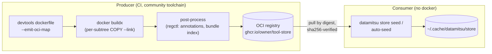

# OCI Bundles

An OCI bundle packages the datamitsu tool store as a standard OCI image: one layer per store subtree (a binary, a runtime, a runtime-managed app), annotated so datamitsu can pull exactly the pieces it needs — **without docker or podman**. The bundle is a cache accelerator and an airgap seed, not a replacement for resolution: whatever is in the bundle is taken from it, whatever is not gets downloaded the usual way.



## Declaring a bundle

The config gains a top-level [`oci` key](/docs/reference/configuration-api#oci-bundle-oci):

```javascript
function getConfig(input) {
  return {
    ...input,
    oci: {
      ref: "ghcr.io/owner/tool-store",
      digest: "sha256:6c3c624b58dbbcd3c0dd82b4c53f04194d1247c6eebdaab7c610cf7d66709b3b",
    },
  };
}
```

The digest is mandatory — a tag never pins content. The declaration chains through config layers as a scalar (last writer wins, `{...input}` inherits), so a wrapper config can ship it and a project config keeps it automatically.

## How seeding works

Two paths use the same machinery:

- **Auto-seed (demand-driven).** Before `check`/`fix`/`lint` pre-install, `install`, and `init`, datamitsu computes the store paths the current operation needs (tools plus their runtime dependencies — the runtime of a runtime app, the shared CPython for uv apps, the pnpm runtime for node apps) and pulls **only those layers**. A bundle of 50 tools costs a project that needs 3 of them one cached manifest GET plus 3–5 blob downloads. If everything is already in the store, no network request is made at all.
- **`datamitsu store seed` (full pull).** Pulls every annotated layer — the airgap workflow. A completed full pull writes a marker inside the store, so repeating it is a no-op; `store clear` removes the marker together with the content.

Multi-platform bundles are a single OCI index. os/arch are matched via the standard platform fields; **libc** (glibc vs musl) via the `com.datamitsu.libc` descriptor annotation inside the digest-verified index bytes. When libc detection fails (e.g. distroless hosts), datamitsu refuses to guess — set `DATAMITSU_LIBC=glibc` or `DATAMITSU_LIBC=musl`.

A bundle entry missing for your platform is a degradation, not a failure: datamitsu warns and falls back to direct downloads.

## Trust model

The bundle is **not a trust boundary by itself**:

- Every manifest body and blob is verified against its SHA-256 descriptor **before** extraction — not a single unverified byte enters the chain. Trusting `oci.digest` is equivalent to trusting the config source that declares it (same as the per-binary `hash` fields today).
- Single-file binaries and JVM jars are **re-hashed after extraction against the published SHA-256 from the config** — a bundle whose content was swapped relative to the config fails hard.
- Runtime app directories (uv/node/go) have no published content hash (they are built, not downloaded); their integrity rests on the digest chain plus the mandatory lockfiles.
- Each layer may only write into the single store subtree it declares (`com.datamitsu.subtree`); content outside it — including hardlinks pointing elsewhere — fails the pull loudly.
- `oci.signer` will pin the publisher identity via sigstore verification at pull time (planned; a set `signer` currently fails the seed rather than silently skipping the check).

## Offline mode

`DATAMITSU_OFFLINE` is a full "don't touch the network" switch, **orthogonal** to bundles: it never auto-pulls; the store must be seeded beforehand — `store seed` while online, [`store import`](/docs/reference/cli-commands#store-import) from an OCI layout directory, or a volume mount. With a seeded store, tools resolve with zero network; a miss fails with a clear message instead of a hanging download.

```bash
# online machine
datamitsu store seed

# air-gapped machine (same store, e.g. copied or mounted)
DATAMITSU_OFFLINE=1 datamitsu check
```

Both the offline switch and the seeding state are introspectable:

```bash
datamitsu config runtime | jq '.offline, .noOci, .libc'
datamitsu store status
```

## Kill switches

- `--no-oci` (any command) or `DATAMITSU_NO_OCI=1` — disable bundle seeding entirely; tools download directly as before.
- Bundles change **where bytes come from**, never which versions run: tool resolution and cache keys are identical with and without a bundle.

## Producing a bundle

Bundle production deliberately reuses the community toolchain instead of reimplementing a registry client push:

1. `datamitsu devtools dockerfile --emit-oci-map map.json` generates the multi-stage Dockerfile (whose final stage already emits one `COPY --link` layer per store subtree) plus the layer→subtree map.
2. `docker buildx` builds and pushes the image(s) per platform/libc.
3. A CI post-process (regctl/crane) writes the `com.datamitsu.subtree` layer annotations and the `com.datamitsu.store-root` manifest annotation from `map.json`, assembles the bundle index with libc descriptor annotations, tags it (untagged indexes are vulnerable to registry cleanup), and optionally signs it with cosign.

A mapping mistake in step 3 is not a security hole: the consumer's per-subtree write-allowlist validates layer content against the declared subtree and fails loudly at pull time.
