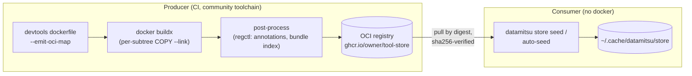

# OCI Bundles

An OCI bundle packages the datamitsu tool store as a standard OCI image: one layer per store subtree (a binary, a runtime, a runtime-managed app, or a WASM output-parser module), annotated so datamitsu can pull exactly the pieces it needs — **without docker or podman**. The bundle is a cache accelerator and an airgap seed, not a replacement for resolution: whatever is in the bundle is taken from it, whatever is not gets downloaded the usual way.

WASM output-parser modules (the `parsers` config entity) ship as their own `.parsers/<module>` layers, materialized in the build by a `devtools parsers prefetch` stage and re-verified against their published SHA-256. So in an airgapped deployment a tool's `outputParser` resolves from the bundle instead of reaching out to the GitHub Release. A parser entry can also pin a registry artifact of its own, independently of any bundle — see [Mirroring everything](#mirroring-everything).



## Declaring a bundle

The config gains a top-level [`oci` key](/docs/reference/configuration-api#oci-bundle-oci):

```javascript
function getConfig(input) {
  return {
    ...input,
    oci: {
      ref: "ghcr.io/owner/tool-store",
      digest: "sha256:6c3c624b58dbbcd3c0dd82b4c53f04194d1247c6eebdaab7c610cf7d66709b3b",
    },
  };
}
```

The digest is mandatory — a tag never pins content. The declaration chains through config layers as a scalar (last writer wins, `{...input}` inherits), so a wrapper config can ship it and a project config keeps it automatically.

## How seeding works

Two paths use the same machinery:

- **Auto-seed (demand-driven).** Before `check`/`fix`/`lint` pre-install, `install`, and `init`, datamitsu computes the store paths the current operation needs (tools plus their runtime dependencies — the runtime of a runtime app, the shared CPython for uv apps, the pnpm runtime for node apps) and pulls **only those layers**. A bundle of 50 tools costs a project that needs 3 of them one cached manifest GET plus 3–5 blob downloads. If everything is already in the store, no network request is made at all.
- **`datamitsu store seed` (full pull).** Pulls every annotated layer — the airgap workflow. A completed full pull writes a marker inside the store, so repeating it is a no-op; `store clear` removes the marker together with the content.

Multi-platform bundles are a single OCI index. os/arch are matched via the standard platform fields; **libc** (glibc vs musl) via the `com.datamitsu.libc` descriptor annotation inside the digest-verified index bytes. When libc detection fails (e.g. distroless hosts), datamitsu refuses to guess — set `DATAMITSU_LIBC=glibc` or `DATAMITSU_LIBC=musl`.

A bundle entry missing for your platform is a degradation, not a failure: datamitsu warns and falls back to direct downloads.

### Slow links and retries

Blob downloads have **no overall timeout** — a 400 MiB layer on a 1 Mbps VPN is a healthy download that simply takes a while. Instead, each attempt is watched for **progress**: if no data arrives for 2 minutes, the attempt is aborted with a clear `stalled: no data received` error and retried (up to 4 attempts with exponential backoff). Registry metadata requests (manifests, auth token handshake) carry small bodies and keep a flat 120-second deadline.

The store commands also work without a usable git context (no `git` binary, `dubious ownership` errors in containers): they operate on the global store, so a broken project repo only skips the project-level config with a warning instead of failing the command.

## Trust model

The bundle is **not a trust boundary by itself**:

- Every manifest body and blob is verified against its SHA-256 descriptor **before** extraction — not a single unverified byte enters the chain. Trusting `oci.digest` is equivalent to trusting the config source that declares it (same as the per-binary `hash` fields today).
- Single-file binaries and JVM jars are **re-hashed after extraction against the published SHA-256 from the config** — a bundle whose content was swapped relative to the config fails hard.
- Runtime app directories (uv/node/go) have no published content hash (they are built, not downloaded); their integrity rests on the digest chain plus the mandatory lockfiles.
- Each layer may only write into the single store subtree it declares (`com.datamitsu.subtree`); content outside it — including hardlinks pointing elsewhere — fails the pull loudly.
- `oci.signer` is **rejected at config load** — on the bundle's `oci` and on a parser's `oci` alike. This build carries no sigstore dependency and verifies **no signatures at all**, so a config that pins a signer would assert a guarantee the binary does not deliver; a loud error before any network beats silent non-verification. Integrity rests on the digest chain and the mandatory hashes above. (Breaking change: a config that set `signer` used to load and fail later, at seed time.)

## Offline mode

`DATAMITSU_OFFLINE` is a full "don't touch the network" switch, **orthogonal** to bundles: it never auto-pulls; the store must be seeded beforehand — `store seed` while online, [`store import`](/docs/reference/cli-commands#store-import) from an OCI layout directory, or a volume mount. With a seeded store, tools resolve with zero network; a miss fails with a clear message instead of a hanging download.

```bash
# online machine
datamitsu store seed

# air-gapped machine (same store, e.g. copied or mounted)
DATAMITSU_OFFLINE=1 datamitsu check
```

Both the offline switch and the seeding state are introspectable:

```bash
datamitsu config runtime | jq '.offline, .noOci, .libc'
datamitsu store status
```

## Mirroring everything

A parser module can be pinned to a registry as well: a `parsers` entry declares either an https `url` **or** an [`oci` reference](/docs/reference/configuration-api#output-parsers-parsers), never both, never a fallback from one to the other. That closes the last gap in "mirror one registry and everything works" — the bundle carries the binaries, the runtimes and the runtime-managed apps, and the parser artifact carries the WASM module that otherwise comes from a GitHub Release.

A bundle and a parser `oci` pin are complements rather than competitors. A module is stored at `{store}/.parsers/{name}/{key}`, and that key is derived from its SHA-256 alone — so for a given entry a bundle-seeded module and a registry-pulled one are the same directory: whichever arrives first satisfies the other. A module already on disk is re-hashed against the declared SHA-256 on every use and discarded if it no longer matches, whatever put it there.

Start by asking the config what it pins. [`store refs`](/docs/reference/cli-commands#store-refs) reads the effective config and makes no registry request, so it runs from inside a firewall:

```bash
datamitsu store refs --oci-only
# ghcr.io/datamitsu/datamitsu-parsers@sha256:8f0e…
# ghcr.io/owner/tool-store@sha256:6c3c…
```

Copy both with the community toolchain (`crane`, `regctl` and `skopeo` all do this; `crane` shown here). Tag the mirrored copies — an untagged manifest is a garbage-collection target, and a collected artifact fails every pinned config:

```bash
crane copy ghcr.io/owner/tool-store@sha256:6c3c… harbor.corp/dm/tool-store:mirror
crane copy ghcr.io/datamitsu/datamitsu-parsers@sha256:8f0e… harbor.corp/dm/datamitsu-parsers:mirror
```

A copy moves manifest and blob bytes verbatim, so **every digest survives the move unchanged**. Only the host segment of each reference is edited; `digest` and `hash` stay exactly as published, and both references keep pointing at the same bytes as before:

```javascript
function getConfig(input) {
  return {
    ...input,
    oci: { ...input.oci, ref: "harbor.corp/dm/tool-store" },
    parsers: {
      ...input.parsers,
      core: {
        ...input.parsers.core,
        oci: { ...input.parsers.core.oci, ref: "harbor.corp/dm/datamitsu-parsers" },
      },
    },
  };
}
```

Both spreads assume the inherited config already pins the parser to a registry. If it declares a `url` instead, **replace** the entry's source rather than spreading `oci` alongside it: the two sources are mutually exclusive and an entry carrying both fails at config load.

Move both keys or neither. A half-mirrored config still resolves its tools, so the mistake is easy to miss: a parser that cannot be fetched is only logged as a warning and the tool's output degrades to raw text.

```javascript
// BAD: the bundle is mirrored, the parser is not — a host behind the firewall
// loses structured diagnostics and the run only warns about it
oci: { ...input.oci, ref: "harbor.corp/dm/tool-store" },

// GOOD: both references move to the mirror, digests and hashes untouched
oci: { ...input.oci, ref: "harbor.corp/dm/tool-store" },
parsers: {
  ...input.parsers,
  core: { ...input.parsers.core, oci: { ...input.parsers.core.oci, ref: "harbor.corp/dm/datamitsu-parsers" } },
},
```

The mirror is not a trust boundary either. A parser artifact's single layer must have digest `sha256:` + the parser's mandatory `hash`, so a manifest that points at different content is rejected **before one payload byte is requested**; the bytes are hashed again while streaming and once more on the file on disk. A registry that rewrites manifests while proxying them changes their digest and fails the pull closed instead of serving something unexpected.

:::warning Limitations of a mirrored registry
datamitsu can authenticate to exactly one registry: **GHCR**, using `GITHUB_TOKEN`, and only when the configured `ref` host is `ghcr.io` — the token is never attached to any other host. There is no docker `config.json`, no credential helper, no user/password, no custom CA bundle. A Harbor, Artifactory or Nexus mirror must therefore allow **anonymous pull** of the mirrored repositories; an authenticated private mirror is not supported yet.

GHCR is also the only channel for the parser artifact today — unlike the datamitsu container images, it is not published to Docker Hub.
:::

## Kill switches

- `--no-oci` (any command) or `DATAMITSU_NO_OCI=1` — disable bundle seeding entirely; tools download directly as before. It switches off an accelerator, so it does **not** disable a parser that declares an `oci` source: that registry is the only route to those bytes. `DATAMITSU_OFFLINE` remains the hard network gate.
- Bundles change **where bytes come from**, never which versions run: tool resolution and cache keys are identical with and without a bundle.

## Producing a bundle

Bundle production deliberately reuses the community toolchain instead of reimplementing a registry client push:

1. `datamitsu devtools dockerfile --emit-oci-map map.json` generates the multi-stage Dockerfile (whose final stage already emits one `COPY --link` layer per store subtree) plus the layer→subtree map.
2. `docker buildx` builds and pushes the image(s) per platform/libc.
3. A CI post-process (regctl/crane) writes the `com.datamitsu.subtree` layer annotations and the `com.datamitsu.store-root` manifest annotation from `map.json`, assembles the bundle index with libc descriptor annotations, tags it (untagged indexes are vulnerable to registry cleanup), and optionally signs it with cosign.

A mapping mistake in step 3 is not a security hole: the consumer's per-subtree write-allowlist validates layer content against the declared subtree and fails loudly at pull time.
