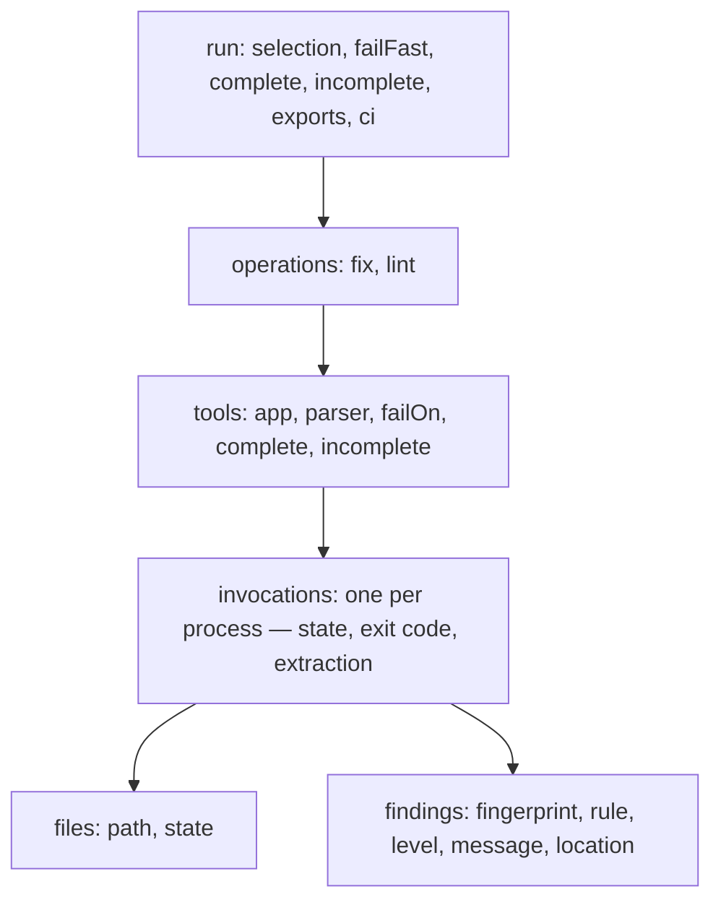

# Reports

A report is the record of one `fix`, `lint` or `check` run: which tools ran, on
which files, what they found, and how sure datamitsu is that the list is
complete. Every report format is written from that one record, so two formats of
one run never disagree, and a report is written after a run that failed as well
as after one that passed — the run that fails is the one a pipeline needs to
read.

```bash
datamitsu lint --report json=out/run.json
```

`json` writes datamitsu's own document, `datamitsu.report/1`, which carries
everything the record holds; `markdown` writes the same run for a person — the
tools, the findings the terminal would show and what the run left out; `sarif`
writes it for GitHub code scanning ([Code scanning](#code-scanning)). The flags,
the variable twins and the exit codes are in the
[CLI reference](../reference/cli-commands.md#reports).

## What a report holds



- **The run** — what it was asked to cover (`selection`: the whole repository,
  a subdirectory, named files, a `--tools` filter), whether fail-fast was on,
  whether the run is complete, every report it was asked for with its
  status, and the CI job it ran in (`ci`: the `vendor` — empty outside CI —
  and the commit, ref, base branch and pull request number the vendor names,
  as [`facts().ci`](../reference/configuration-api.md#platform-information)
  reads them).
- **Operations** — `fix` and `lint` in the order they ran; `check` writes one
  document holding both. An operation the run never reached is listed with
  `ran: false`. Each lists the tools the planner skipped, with the reason, and
  the tasks the run stopped.
- **Tools** — the app a tool ran as configured (name, kind, pinned version),
  its output parser and the version of the module that read its output, the
  threshold its findings were judged by (`failOn`), and whether that threshold
  was enforced.
- **Invocations** — one per process a task planned: its state (`ran`,
  `cancelled`, `not-started`, `setup-failed`), its exit code, whether and how
  its output was read into findings, the files it answered for and the findings
  it reported. The files a cache answered appear as one `cached` or
  `verdict-hit` invocation of their task.
- **Findings** — the rule, the level, whether it is at or above the threshold
  (`reported`), whether it failed its tool (`gates`) and whether the terminal
  shows it (`shown`, which the annotations, `markdown` and `--output agent`
  follow), the message, where it is — the path relative to the repository
  root, 1-based rows and columns with an exclusive end — and its fingerprint.

Everything is sorted, so one run gives one document byte for byte, and the time
it is stamped with comes from `SOURCE_DATE_EPOCH` when that is set.

## What a report never contains

- **No command line and no environment.** An app is named by its name, kind and
  pinned version; the arguments a tool ran with and the variables it saw stay
  out. (`--explain=json`, a plan for debugging on your own machine, keeps the
  arguments.)
- **No secret the environment names.** Before a report is written, the value of
  every variable — in the environment, and in every app's and operation's `env`
  — whose name contains `TOKEN`, `SECRET`, `PASSWORD` or `CREDENTIAL`, or ends
  in `_KEY`, and that is at least 8 characters long, is replaced by `***`
  wherever it appears. This is best effort: a secret a tool prints that no
  variable holds is not caught.
- **No output of a security tool.** A failed invocation keeps the last 4 KiB of
  its output in the own JSON (`outputTail`), without colour codes and masked —
  except for a tool whose parser module puts it in the `security` category,
  whose output is never kept, nor that of a tool whose parser the run could not
  describe — its module did not load, or does not list it — which may be one.
- **Nothing from a cache.** A report is never stored and never replayed; each is
  written from the run that produced it.

The same holds for the JSON-L stream's events. Under `--verbose` the stream
carries datamitsu's debug log lines too, as `log` events, with what a tool
printed and the arguments it ran with withheld; the console keeps them for the
person who ran the command.

A tool that exits non-zero without a finding its parser could read is not
listed as clean: it gets one `synthetic` finding of level `error` and no
location — `tsc exited 2 without parsable findings`, or
`gitleaks failed (exit 1); output withheld for a security tool` — whose message
carries none of the tool's output.

## How complete a report is

A report that lists no finding for a tool means "clean" only when the tool
covered what the report claims. Every tool is judged on three facts, and each
one that fails adds a reason to its `incomplete` list:

| Fact       | Complete when                                                                                        | Reasons                                                                                  |
| ---------- | ---------------------------------------------------------------------------------------------------- | ---------------------------------------------------------------------------------------- |
| scope      | the run covered the whole repository and every task its whole unit                                   | `narrowed-selection`, `partial-unit`                                                     |
| execution  | every planned task ran to the end                                                                    | `cancelled`, `not-started`, `setup-failed`, `platform-skip`                              |
| extraction | every output was read into findings by a parser, or a cache replayed a pass its parser read as clean | `no-extraction`, `parser-unavailable`, `parse-failed`, `truncated`, `unparsed-cache-hit` |

A complete result in one project says nothing about the projects a narrowed run
left out, which is why scope needs the whole repository. A tool without an output
parser is never complete: its exit code says whether it passed, not what it
found.

The run is `complete` when every tool is, every operation ran, and the run left
nothing out: a narrowed selection, a `--tools` filter (the tools it left out are
listed as `selection.excludedTools`; the selected tools can still be complete),
a tool that could not be narrowed, an operation that did not run. A tool
disabled with `skip: true` counts against nothing.

Two rules keep a report from claiming more than it holds:

- **A narrowed run is refused.** A report that lists findings, asked for from
  a run narrowed before it starts — files named, a subdirectory, `--file-scoped`,
  `--tools` — would read as the findings of the repository. The run exits 2
  before anything runs. `--allow-partial` writes it anyway, with every reason in
  the document; it never makes the run complete. `sarif` is written: it leaves
  out every tool whose completeness is not established instead of listing it
  ([Code scanning](#code-scanning)).
- **A report turns fail-fast off.** A run that stopped at the first failing tool
  could not list every finding, so a report runs everything to the end, and a
  report together with an explicit `--fail-fast=true` is refused.

A report left on its path by an earlier run is not deleted: it is the user's
file. A run that is refused, or whose report could not be written, leaves it
there, so a pipeline that uploads the report whatever the outcome removes it
first — then an old report cannot pass for the new one — and fails on the exit
code of the run:

```yaml
- run: rm -f out/run.json
- run: datamitsu lint --report json=out/run.json
- if: always()
  uses: actions/upload-artifact@v4
  with:
    name: datamitsu-report
    path: out/run.json
    if-no-files-found: warn
```

The job fails on the lint step's exit code, and the upload step runs anyway. A
tool failure (1) outranks a report that could not be written (5), so a missing
file on a failed step is reported by the upload, and by the step's own
`error: report json: …` line.

## In GitHub Actions

CI runs `lint`: `fix` and `check` change the working tree, which a pipeline has
no one to review. A job that annotates a pull request, keeps every finding and
fails on the exit code of the run:

```yaml
jobs:
  lint:
    runs-on: ubuntu-latest
    permissions:
      contents: read
    steps:
      - uses: actions/checkout@v5
        with:
          fetch-depth: 2
      - run: rm -f out/run.json
      - run: datamitsu lint --fail-fast=false --report json=out/run.json
      - if: always()
        uses: actions/upload-artifact@v4
        with:
          name: datamitsu-report
          path: out/run.json
          if-no-files-found: warn
```

- **Annotations need nothing.** In a GitHub Actions job the run prints its
  findings as workflow commands, which GitHub shows in the Checks tab and on the
  changed lines of the pull request
  ([GitHub annotations](../reference/cli-commands.md#github-annotations)).
  GitHub keeps ten of each type per step: the findings in the files the pull
  request touched come first, then one per file, and a notice counts the rest
  and names where they are. Several datamitsu commands in one step
  share those ten.
- **The step summary holds the rest.** The run appends its `markdown` report
  to the job's summary page, as much of it as fits in the 1 MiB GitHub takes
  from a step; `json` holds everything.
- **`fetch-depth: 2`** fetches the base branch's tip, the first parent of the
  merge commit a `pull_request` checks out, which is how the run learns which
  files the pull request touched. Without it the order is the same, less that
  priority, and one `info` line says so.
- **`--fail-fast=false`** runs every tool, so the annotations and the report
  cover the whole repository; the report turns fail-fast off by itself.
- **`if: always()`** uploads the report of the run that failed, which is the one
  worth reading; `rm -f` first keeps an old report from passing for the new one.

A tool's own output never becomes an annotation: the run prints it inside a
`::stop-commands::` region, and a tool that would print its own workflow
commands when it sees `GITHUB_ACTIONS` does not see it
([Tool Environment](../reference/tool-environment.md)). The problem matchers of
`actions/setup-go` and `actions/setup-node` still read every line; the only
ones that can match what the run prints are `go` and `eslint-compact`, on a
tool's raw output in their formats, which GitHub then annotates without a
location.

### Code scanning

`--report sarif=<path>` writes the run in SARIF 2.1.0, which GitHub code
scanning keeps as alerts: it shows a finding on the pull request that brings it
in, and closes the alert once a later upload of the tool no longer holds it.

```yaml
jobs:
  lint:
    runs-on: ubuntu-latest
    permissions:
      contents: read
      security-events: write
    steps:
      - uses: actions/checkout@v5
        with:
          fetch-depth: 2
      - run: rm -rf sarif
      - run: datamitsu lint --fail-fast=false --report sarif=sarif/
      - if: always() && hashFiles('sarif/*.sarif') != ''
        uses: github/codeql-action/upload-sarif@v4
        with:
          sarif_file: sarif
```

- **One run per tool, of `lint`.** A file holds one run per tool of the lint
  operation — `check` writes its lint, a `fix` run its fix — because GitHub
  rejects a file with two runs of one tool in one category.
- **A tool that did not cover everything is left out.** An alert is closed when
  the next upload of its tool does not hold it, so a tool whose completeness is
  not established ([How complete a report is](#how-complete-a-report-is)) is
  not written at all, and its alerts stay as they were. The run says so on
  stderr, one line per tool, and the own JSON records it in the report's
  `exports` entry (`omitted`). For the same reason a narrowed run is written
  rather than refused: every tool in it is incomplete, so its file holds no run
  and changes no alert. A tool with more than 25 000 results is left out too:
  GitHub would keep the 5 000 most severe and close the alerts of the rest.
- **Twenty tools per file.** GitHub reads at most twenty runs from one file. A
  path that ends in `/` names a directory: `datamitsu-1.sarif`,
  `datamitsu-2.sarif` and so on, twenty tools each, sorted by name, and the
  `datamitsu-<n>.sarif` files an earlier run left there that this one did not
  write are removed. `upload-sarif` takes the directory. A file, or `-`, for a
  run that plans more than twenty tools exits 2 before anything runs. GitHub
  refuses an upload of more than 10 MB gzipped.
- **The category is in the file.** Every run is written under the category
  `datamitsu` (`automationDetails.id` `datamitsu/`). The upload action's
  `category` input does not change a file that already names one, so a job
  that uploads more than once — a matrix — names its own:
  `--report "sarif=sarif/?category=lint-${{ matrix.os }}"`. Uploads in one
  category replace each other's alerts tool by tool.
- **Findings keep their alerts.** A result's
  `partialFingerprints.primaryLocationLineHash` is the finding's
  [fingerprint](#fingerprints), the key GitHub matches alerts on from one upload
  to the next; two tools never share one. Columns count code points
  (`columnKind: unicodeCodePoints`) and are left out where the report could not
  convert them.
- **What else a run holds.** `ruleId` is the finding's rule, or
  `<tool>/unknown` without one, each rule listed once with its documentation
  link; the tool's app version and official URL; one `invocations` entry per
  process. A finding without a file, and the `synthetic` finding of a tool that
  failed without a parsable one, are notifications of their invocation: code
  scanning shows a result only at a location. A file outside the repository is
  an absolute `file://` URI.

Before turning it on:

- The job needs `security-events: write`. A pull request from a fork gets a
  read-only token and cannot upload.
- A private repository needs GitHub's code scanning licence.
- A tool that is never uploaded again — removed from the configuration,
  renamed (the run is named by the tool's key in the configuration), or skipped
  by a condition — keeps its alerts open. Deleting its analyses
  (`DELETE /repos/{owner}/{repo}/code-scanning/analyses/{id}?confirm_delete`)
  removes them, and their history with them.
- `rm -rf` before the run and `hashFiles` on the upload keep a file an earlier
  step left from passing for this run's: a run refused before it starts
  (exit 2) writes nothing. `if: always()` uploads the file of a run whose tools
  failed, which is the one worth reading.

## Fingerprints

Every finding carries a `fingerprint`, 64 hexadecimal characters that identify
it across runs, so that a service tracking alerts can tell a finding that stayed
from one that was fixed and one that is new:

```text
fingerprint = sha256("dmfp1" NUL tool NUL rule NUL path NUL lineHash NUL ordinal)
lineHash    = sha256(the finding's first line, without trailing whitespace)
ordinal     = position among the tool's findings with the same rule on the same line
```

- **A line inserted above a finding moves its row, not its fingerprint:** the
  line's text is hashed, not its number.
- **A reworded message changes nothing:** the message is not an input.
- **Two findings of one rule on one line stay two:** the ordinal counts them by
  column, across every process of the tool, so how a tool's work was split into
  processes does not change it. A finding two processes both reported is listed
  once.
- **Two tools never share one:** the tool comes first.
- **Paths are relative to the repository root with `/`**, so one finding has one
  fingerprint on Windows and elsewhere.

When the file cannot be read — it was deleted, or lies outside the repository,
which is never read — the row stands in for the line, and `fingerprintBasis` says `row` instead of
`line`; a finding without a file rests on nothing (`none`). The fingerprint is
SHA-256 rather than a faster hash because it is not an internal key: another
system stores it and compares it with the next upload's.

The columns of a finding are the ones its tool printed, in the unit its parser
declares (`unit`: `utf-8`, `utf-16` or `utf-32`). While the file is still on
disk they are converted into code points (`chars`), UTF-8 bytes (`bytes`) and
UTF-16 units (`utf16`), so a report rendered later needs no source. `precision`
is `exact`; `ascii` when no unit was declared but the line is ASCII, where every
unit counts alike; or `unknown` when there was nothing to convert from, and a
consumer that needs another unit then leaves the column out.

A report settles a finding's ordinal once its tool has finished, across all
of the tool's processes. The fingerprint a finding has while its own process is
judged — before the threshold decides — is counted within that process; the two
agree whenever one process reports the findings of a line, which is every tool
that runs once per file and every tool whose findings name the files it was
given.

## Rendering a report later

`datamitsu report render` reads a run's own JSON and writes it in a format,
offline, through the same renderers and the same completeness rule:

```bash
datamitsu report render --input out/run.json --format json --output -
```

The document holds everything a renderer needs, so this works on another
machine and after the checkout changed. A document of a narrowed run is refused
for a format that lists findings unless `--allow-partial`, as the run would have
been, and a document without its completeness fields is read as incomplete.

## Findings as they happen

Under `--log-format jsonl` the same findings arrive as `diagnostic` events, one
per finding, once its tool has finished — by default those at or above the
operation's `failOn`, every one with `--events diagnostics=all`. Each carries
the finding's fingerprint, the same one the report holds. See
[Run events](../reference/cli-commands.md#run-events).
