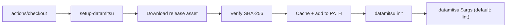

# Use in GitHub Actions

The official [`datamitsu/setup-datamitsu`](https://github.com/datamitsu/setup-datamitsu)
action installs the datamitsu CLI, provisions the managed tools your config
declares, and runs datamitsu — in a single step. It carries no configuration of
its own: it reads the datamitsu config already in your repository.

## Quick Start

```yaml
name: CI
on: [push, pull_request]

jobs:
  lint:
    runs-on: ubuntu-latest
    steps:
      - uses: actions/checkout@v4
      - uses: datamitsu/setup-datamitsu@v0.1.13
```

Those two steps install datamitsu `0.1.13` (replace with the
[latest release](https://github.com/datamitsu/datamitsu/releases/latest)) and
run `datamitsu init` to provision the tools your config declares
(golangci-lint, lefthook, …). By default the action then runs `datamitsu lint`;
override the command with the `args` input (or set `args: ""` to install and
initialize only).

## How It Works



The release binary is downloaded from datamitsu's GitHub Releases, its SHA-256 is
verified against the hash baked into the action's tag, and the verified binary is
stored in the runner tool cache (reused on later runs) and added to `PATH`.

The `datamitsu init` step runs unless `init: "false"`. The final step runs
`datamitsu $args` — `lint` by default — and is skipped entirely when `args` is
empty, leaving just the CLI on `PATH`.

## Inputs

| Input  | Default | Description                                                                                 |
| ------ | ------- | ------------------------------------------------------------------------------------------- |
| `args` | `lint`  | Arguments passed to `datamitsu` after setup. An empty string installs and initializes only. |
| `init` | `true`  | Run `datamitsu init` after install to provision managed tools.                              |

## Outputs

| Output    | Description                               |
| --------- | ----------------------------------------- |
| `version` | The datamitsu version that was installed. |

## Examples

### Run a different command

```yaml
- uses: actions/checkout@v4
- uses: datamitsu/setup-datamitsu@v0.1.13
  with:
    args: "exec golangci-lint run ./..."
```

### Install only, run datamitsu yourself

```yaml
- uses: actions/checkout@v4
- uses: datamitsu/setup-datamitsu@v0.1.13
  with:
    args: ""
- run: datamitsu check
```

### Set up the CLI without provisioning tools

```yaml
- uses: datamitsu/setup-datamitsu@v0.1.13
  with:
    args: ""
    init: "false"
```

## Versioning and Integrity

Each action tag pins **one** datamitsu version: `@v0.1.13` installs datamitsu
`0.1.13`. The SHA-256 hashes of every release binary are baked into that tag and
verified on download — a missing or mismatched hash fails the run.

:::tip Pin a full version, not a moving tag
Because each tag carries its own baked hashes, pin a full version (`@v0.1.13`) or
a commit SHA — **not** a moving major tag (`@v0`). A moving tag would silently
swap the verified binary and skip update notifications.
:::

Keep the action current with [Dependabot](https://docs.github.com/code-security/dependabot):

```yaml
# .github/dependabot.yml
version: 2
updates:
  - package-ecosystem: "github-actions"
    directory: "/"
    schedule:
      interval: "weekly"
```

Dependabot opens a pull request whenever a new datamitsu version is released, so
upgrading is a one-line change.

:::note Version floor still applies
The datamitsu binary independently enforces the minimum version your config
requires (`getMinVersion()`). If you pin an action version older than your config
demands, datamitsu fails fast with a clear error — so the action and your config
stay consistent.
:::

## See Also

- [Installation](/docs/getting-started/installation) — install datamitsu locally
- [Maintain a wrapper](/docs/how-to/maintain-wrapper) — devtools workflows for wrapper maintainers
- [Use in Alpine Linux](/docs/how-to/use-in-alpine) — musl/libc handling in containers
